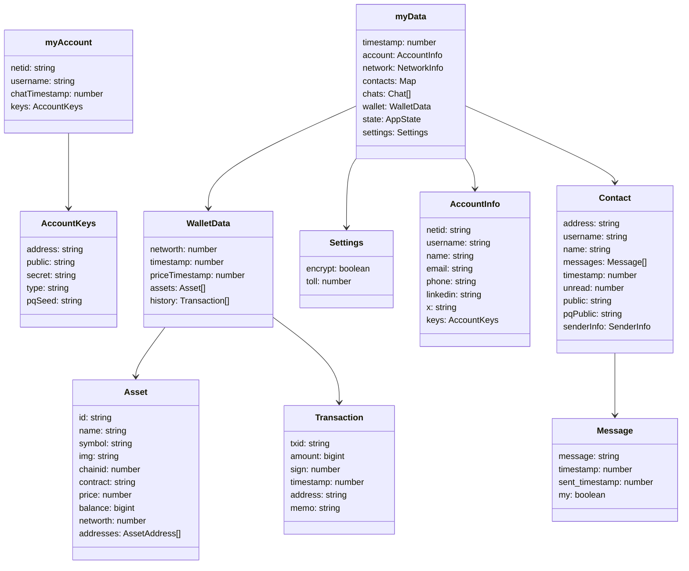

## Core Data Objects

This initial diagram shows:

1. `myAccount`: The core user account object containing authentication and identity info
2. `myData`: The main data store containing all user data including:
   - Account information
   - Contacts and their messages
   - Chat history
   - Wallet data