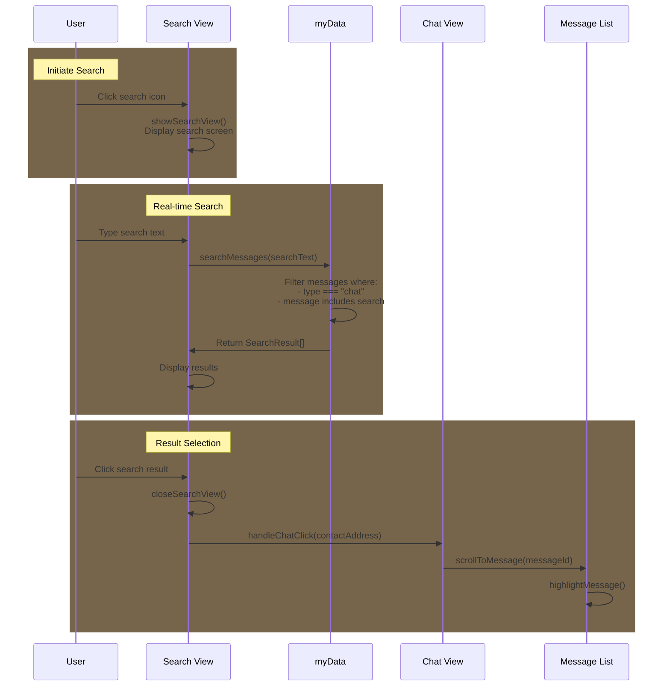

## Chat Search Implementation

Key Points:

- Search Interface:

  - Search input field at top of view
  - Real-time search as user types
  - Results grouped by chat thread
  - Shows message preview and timestamp

- Data Access:
  - Searches through myData.contacts messages
  - Uses existing message data structures
  - No need for additional storage



## Pseudo Implementation

```javascript
// Interface defining the structure of a search result
// Maps to our existing data structures in CoreDataStructures.md
interface SearchResult {
    contactAddress: string    // Address of the contact
    username: string         // Display name from Contact
    messageId: number        // Position in messages array for scrolling
    messageText: string      // Full message content
    timestamp: number        // For sorting and display
    preview: string         // Truncated message for result list
}

function searchMessages(searchText: string): SearchResult[] {
    const results: SearchResult[] = [];
    // Convert to lowercase once instead of in each iteration
    const searchLower = searchText.toLowerCase();

    // Option 1: Sequential search through contacts and messages
    for (const [address, contact] of myData.contacts) {
        // For each contact, search through their message history
        contact.messages.forEach((msg, index) => {
            // Only search text messages (skip transactions)
            // Case-insensitive search using pre-lowercased search text
            if (msg.type === "chat" && msg.message.toLowerCase().includes(searchLower)) {
                results.push({
                    contactAddress: address,
                    username: contact.username,
                    messageId: index,        // Store index for scrolling to message
                    messageText: msg.message, // Full message for context
                    timestamp: msg.timestamp,
                    preview: truncateMessage(msg.message)
                });
            }
        });
    }

    /* Option 2: Parallel Processing (if needed for large datasets)
    await Promise.all(Array.from(myData.contacts).map(async ([address, contact]) => {
        // Process each contact's messages in parallel
        const matches = contact.messages.filter((msg, index) => {
            if (msg.type === "chat" && msg.message.toLowerCase().includes(searchLower)) {
                results.push({
                    contactAddress: address,
                    username: contact.username,
                    messageId: index,
                    messageText: msg.message,
                    timestamp: msg.timestamp,
                    preview: truncateMessage(msg.message)
                });
                return true;
            }
            return false;
        });
    }));
    */

    // Sort results by timestamp, newest first
    return results.sort((a, b) => b.timestamp - a.timestamp);
}

// Utility function to create preview text
function truncateMessage(message: string): string {
    const MAX_PREVIEW_LENGTH = 50;
    return message.length > MAX_PREVIEW_LENGTH
        ? message.substring(0, MAX_PREVIEW_LENGTH) + '...'
        : message;
}

// UI Event Handlers
function showSearchView() {
    // Hide all other screens first
    document.querySelectorAll('.app-screen').forEach(screen => {
        screen.classList.remove('active');
    });

    // Show and initialize search view
    document.getElementById('searchView').classList.add('active');
    document.getElementById('messageSearch').focus(); // Auto-focus input
    document.getElementById('newChatButton').classList.remove('visible');
}

function closeSearchView() {
    // Clean up and return to chats view
    switchView('chats');

    // Clear search state
    document.getElementById('messageSearch').value = '';
    document.getElementById('searchResults').innerHTML = '';
}

// Initialize search functionality
function initializeSearch() {
    const searchButton = document.getElementById('search');

    // Show search button only on Chats view
    document.addEventListener('viewChange', (event) => {
        if (event.detail.view === 'chats') {
            searchButton.style.display = 'block';
        } else {
            searchButton.style.display = 'none';
        }
    });

    // Handle search button click
    searchButton.addEventListener('click', () => {
        if (getCurrentView() === 'chats') {
            showSearchView();
        }
    });
}

// Add debouncing utility at the top with other utilities
function debounce(func, wait) {
    let timeout;
    return function executedFunction(...args) {
        const later = () => {
            clearTimeout(timeout);
            func(...args);
        };
        clearTimeout(timeout);
        timeout = setTimeout(later, wait);
    };
}

// Keep but enhance with debouncing and empty state
const handleSearchInput = debounce((event) => {
    const searchText = event.target.value;
    if (searchText.length < 2) {
        // Clear results if search is too short
        document.getElementById('searchResults').innerHTML = '';
        return;
    }

    const results = searchMessages(searchText);
    if (results.length === 0) {
        displayEmptyState();
    } else {
        displaySearchResults(results);
    }
}, 300);  // 300ms delay

// Add these new functions
function displayEmptyState() {
    const searchResults = document.getElementById('searchResults');
    searchResults.innerHTML = `
        <div class="no-results">
            <p>No messages found</p>
            <p class="suggestion">Try different keywords</p>
        </div>
    `;
}

const MAX_RECENT_SEARCHES = 5;
function saveRecentSearch(searchText) {
    const recent = JSON.parse(localStorage.getItem('recentSearches') || '[]');
    recent.unshift(searchText);
    localStorage.setItem('recentSearches',
        JSON.stringify([...new Set(recent)].slice(0, MAX_RECENT_SEARCHES))
    );
}

// Keep but enhance with error handling
function handleSearchResult(result: SearchResult) {
    try {
        // Close search view and return to chats
        closeSearchView();

        // Open the specific chat using existing chat handler
        handleChatClick(result.contactAddress);

        // Add timeout to ensure chat is loaded before scrolling
        setTimeout(() => {
            const messageFound = scrollToMessage(result.messageId);
            if (!messageFound) {
                console.error('Message not found');
            }
        }, 100);
    } catch (error) {
        console.error('Error handling search result:', error);
    }
}

// Optional: Add visual feedback for the found message
function highlightMessage(messageId) {
    const messageElement = document.querySelector(`[data-message-id="${messageId}"]`);
    if (messageElement) {
        messageElement.classList.add('highlighted');
        // Remove highlight after a delay
        setTimeout(() => {
            messageElement.classList.remove('highlighted');
        }, 2000);
    }
}
```

## Search Interface Layout

```ascii
+---------------------------+
|        LIBERDUS          |
+---------------------------+
|   🔍 Search messages...   |
+---------------------------+
|                          |
| Recent Chats             |
|                          |
| +----------------------+ |
| | John Doe            | |
| | "Hey, about the..." | |
| | Yesterday, 2:30 PM  | |
| +----------------------+ |
|                          |
| +----------------------+ |
| | Alice Smith         | |
| | "Let me check the..."| |
| | Today, 9:15 AM      | |
| +----------------------+ |
|                          |
| +----------------------+ |
| | Bob Wilson          | |
| | "The meeting is..." | |
| | Today, 10:45 AM     | |
| +----------------------+ |
|                          |
+---------------------------+
```

## Updated UI Implementation

```html
<!-- Search View Structure -->
<div id="searchView" class="view app-screen">
  <div class="search-header">
    <button class="back-button" onclick="closeSearchView()">&larr;</button>
    <div class="search-input-container">
      <input
        type="text"
        id="messageSearch"
        placeholder="Search messages..."
        oninput="handleSearchInput(event)"
        autofocus
      />
    </div>
  </div>

  <div id="searchResults" class="chat-list">
    <!-- Results use same styling as chat list -->
  </div>
</div>

<!-- Updated JavaScript Implementation -->
<script>
  function showSearchView() {
    // Hide all screens (similar to switchView)
    document.querySelectorAll(".app-screen").forEach((screen) => {
      screen.classList.remove("active");
    });

    // Show search view
    document.getElementById("searchView").classList.add("active");

    // Focus search input
    document.getElementById("messageSearch").focus();

    // Hide new chat button (like other views do)
    document.getElementById("newChatButton").classList.remove("visible");
  }

  function closeSearchView() {
    // Switch back to chats view
    switchView("chats");

    // Clear search input and results
    document.getElementById("messageSearch").value = "";
    document.getElementById("searchResults").innerHTML = "";
  }

  function initializeSearch() {
    const searchButton = document.getElementById("search");

    // Only show search button on Chats page
    document.addEventListener("viewChange", (event) => {
      if (event.detail.view === "chats") {
        searchButton.style.display = "block";
      } else {
        searchButton.style.display = "none";
      }
    });

    // Add click handler
    searchButton.addEventListener("click", () => {
      if (getCurrentView() === "chats") {
        showSearchView();
      }
    });
  }
</script>
```

## CSS Implementation

```css
/* Search View Styles */
#searchView {
  display: none;
  flex-direction: column;
  height: 100%;
  background: var(--background-color);
}

#searchView.active {
  display: flex;
}

/* Search Header Styles */
.search-header {
  display: flex;
  align-items: center;
  padding: 10px;
  background: var(--header-background);
  border-bottom: 1px solid var(--border-color);
}

.back-button {
  background: none;
  border: none;
  font-size: 24px;
  color: var(--text-color);
  padding: 5px 15px;
  cursor: pointer;
}

.back-button:hover {
  opacity: 0.8;
}

.search-input-container {
  flex: 1;
  margin: 0 10px;
}

#messageSearch {
  width: 100%;
  padding: 8px 12px;
  border-radius: 20px;
  border: 1px solid var(--border-color);
  background: var(--input-background);
  color: var(--text-color);
  font-size: 16px;
}

#messageSearch:focus {
  outline: none;
  border-color: var(--accent-color);
}

/* Search Results Styles */
#searchResults {
  flex: 1;
  overflow-y: auto;
  padding: 10px;
}

.search-result {
  display: flex;
  flex-direction: column;
  padding: 12px;
  border-bottom: 1px solid var(--border-color);
  cursor: pointer;
  transition: background-color 0.2s;
}

.search-result:hover {
  background-color: var(--hover-background);
}

.contact-name {
  font-weight: bold;
  margin-bottom: 4px;
  color: var(--text-color);
}

.message-preview {
  color: var(--secondary-text-color);
  font-size: 14px;
  margin-bottom: 4px;
}

.timestamp {
  color: var(--tertiary-text-color);
  font-size: 12px;
}

/* Message Highlight Animation */
.highlighted {
  animation: highlight-fade 2s ease-out;
}

@keyframes highlight-fade {
  0% {
    background-color: var(--highlight-color);
  }
  100% {
    background-color: transparent;
  }
}

/* Empty State */
.no-results {
  text-align: center;
  padding: 20px;
  color: var(--secondary-text-color);
  font-size: 14px;
}

/* Loading State */
.search-loading {
  text-align: center;
  padding: 20px;
  color: var(--secondary-text-color);
}

.search-loading::after {
  content: "...";
  animation: loading-dots 1.5s infinite;
}

@keyframes loading-dots {
  0% {
    content: ".";
  }
  33% {
    content: "..";
  }
  66% {
    content: "...";
  }
}
```

## Additional Considerations

1. Performance Optimizations:

```javascript
// Add debouncing to prevent excessive searches while typing
function debounce(func, wait) {
  let timeout;
  return function executedFunction(...args) {
    const later = () => {
      clearTimeout(timeout);
      func(...args);
    };
    clearTimeout(timeout);
    timeout = setTimeout(later, wait);
  };
}

const debouncedSearch = debounce(handleSearchInput, 300);
```

2. Error States:

```javascript
function handleSearchResult(result: SearchResult) {
  try {
    closeSearchView();
    handleChatClick(result.contactAddress);

    // Add timeout to ensure chat is loaded
    setTimeout(() => {
      const messageFound = scrollToMessage(result.messageId);
      if (!messageFound) {
        console.error("Message not found");
        // Could show toast notification
      }
    }, 100);
  } catch (error) {
    console.error("Error handling search result:", error);
    // Show error to user
  }
}
```

3. User Experience Enhancements:

```javascript
// Save recent searches
const MAX_RECENT_SEARCHES = 5;
function saveRecentSearch(searchText) {
  const recent = JSON.parse(localStorage.getItem("recentSearches") || "[]");
  recent.unshift(searchText);
  localStorage.setItem(
    "recentSearches",
    JSON.stringify([...new Set(recent)].slice(0, MAX_RECENT_SEARCHES))
  );
}

// Show empty state
function displayEmptyState() {
  const searchResults = document.getElementById("searchResults");
  searchResults.innerHTML = `
        <div class="no-results">
            <p>No messages found</p>
            <p class="suggestion">Try different keywords</p>
        </div>
    `;
}
```

4. Accessibility Considerations:

```html
<!-- Add ARIA labels and roles -->
<input
  type="text"
  id="messageSearch"
  aria-label="Search messages"
  role="searchbox"
  placeholder="Search messages..."
/>

<div id="searchResults" role="list" aria-live="polite">
  <!-- Results here -->
</div>
```

5. Search Filters (Future Enhancement):

```typescript
interface SearchFilters {
  dateRange?: { start: Date; end: Date };
  contactFilter?: string[];
  messageTypes?: ("text" | "media")[];
}

function searchMessages(
  searchText: string,
  filters?: SearchFilters
): SearchResult[] {
  // Implementation with filters
}
```
