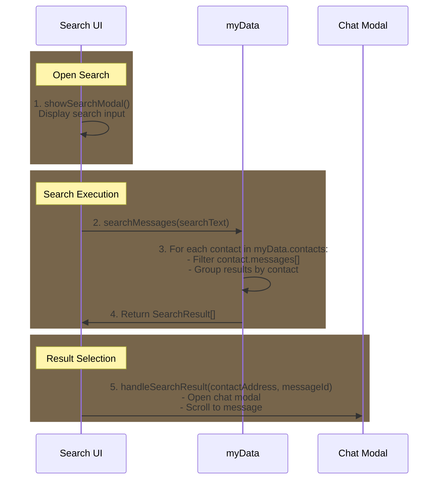

## Chat Search Implementation

Key Points:

- Search Interface:

  - Search input field at top of view
  - Real-time search as user types
  - Results grouped by chat thread
  - Shows message preview and timestamp

- Data Access:
  - Searches through myData.contacts messages
  - Uses existing message data structures
  - No need for additional storage



## Pseudo Implementation

```javascript
// Interface defining the structure of a search result
// Maps to our existing data structures in CoreDataStructures.md
interface SearchResult {
    contactAddress: string    // Address of the contact
    username: string         // Display name from Contact
    messageId: number        // Position in messages array for scrolling
    messageText: string      // Full message content
    timestamp: number        // For sorting and display
    preview: string         // Truncated message for result list
}

function searchMessages(searchText: string): SearchResult[] {
    const results: SearchResult[] = [];
    // Convert to lowercase once instead of in each iteration
    const searchLower = searchText.toLowerCase();

    // Option 1: Sequential search through contacts and messages
    for (const [address, contact] of myData.contacts) {
        // For each contact, search through their message history
        contact.messages.forEach((msg, index) => {
            // Only search text messages (skip transactions)
            // Case-insensitive search using pre-lowercased search text
            if (msg.type === "chat" && msg.message.toLowerCase().includes(searchLower)) {
                results.push({
                    contactAddress: address,
                    username: contact.username,
                    messageId: index,        // Store index for scrolling to message
                    messageText: msg.message, // Full message for context
                    timestamp: msg.timestamp,
                    preview: truncateMessage(msg.message)
                });
            }
        });
    }

    /* Option 2: Parallel Processing (if needed for large datasets)
    await Promise.all(Array.from(myData.contacts).map(async ([address, contact]) => {
        // Process each contact's messages in parallel
        const matches = contact.messages.filter((msg, index) => {
            if (msg.type === "chat" && msg.message.toLowerCase().includes(searchLower)) {
                results.push({
                    contactAddress: address,
                    username: contact.username,
                    messageId: index,
                    messageText: msg.message,
                    timestamp: msg.timestamp,
                    preview: truncateMessage(msg.message)
                });
                return true;
            }
            return false;
        });
    }));
    */

    // Sort results by timestamp, newest first
    return results.sort((a, b) => b.timestamp - a.timestamp);
}

// Utility function to create preview text
function truncateMessage(message: string): string {
    const MAX_PREVIEW_LENGTH = 50;
    return message.length > MAX_PREVIEW_LENGTH
        ? message.substring(0, MAX_PREVIEW_LENGTH) + '...'
        : message;
}

// UI Event Handlers
function showSearchView() {
    // Hide all other screens first
    document.querySelectorAll('.app-screen').forEach(screen => {
        screen.classList.remove('active');
    });

    // Show and initialize search view
    document.getElementById('searchView').classList.add('active');
    document.getElementById('messageSearch').focus(); // Auto-focus input
    document.getElementById('newChatButton').classList.remove('visible');
}

function closeSearchView() {
    // Clean up and return to chats view
    switchView('chats');

    // Clear search state
    document.getElementById('messageSearch').value = '';
    document.getElementById('searchResults').innerHTML = '';
}

// Initialize search functionality
function initializeSearch() {
    const searchButton = document.getElementById('search');

    // Show search button only on Chats view
    document.addEventListener('viewChange', (event) => {
        if (event.detail.view === 'chats') {
            searchButton.style.display = 'block';
        } else {
            searchButton.style.display = 'none';
        }
    });

    // Handle search button click
    searchButton.addEventListener('click', () => {
        if (getCurrentView() === 'chats') {
            showSearchView();
        }
    });
}

// Real-time search handler (consider adding debounce)
function handleSearchInput(event) {
    const searchText = event.target.value;
    if (searchText.length < 2) {
        // Clear results if search is too short
        document.getElementById('searchResults').innerHTML = '';
        return;
    }

    const results = searchMessages(searchText);
    displaySearchResults(results);
}

// Handler for when a user clicks a search result
function handleSearchResult(result: SearchResult) {
    // Close search view and return to chats
    closeSearchView();

    // Open the specific chat using existing chat handler
    handleChatClick(result.contactAddress);

    // After chat is loaded, scroll to the specific message
    scrollToMessage(result.messageId);
}
```

## Search Interface Layout

```ascii
+---------------------------+
|        LIBERDUS          |
+---------------------------+
|   🔍 Search messages...   |
+---------------------------+
|                          |
| Recent Chats             |
|                          |
| +----------------------+ |
| | John Doe            | |
| | "Hey, about the..." | |
| | Yesterday, 2:30 PM  | |
| +----------------------+ |
|                          |
| +----------------------+ |
| | Alice Smith         | |
| | "Let me check the..."| |
| | Today, 9:15 AM      | |
| +----------------------+ |
|                          |
| +----------------------+ |
| | Bob Wilson          | |
| | "The meeting is..." | |
| | Today, 10:45 AM     | |
| +----------------------+ |
|                          |
+---------------------------+
```

## Updated UI Implementation

```html
<!-- Search View Structure -->
<div id="searchView" class="view app-screen">
  <div class="search-header">
    <button class="back-button" onclick="closeSearchView()">&larr;</button>
    <div class="search-input-container">
      <input
        type="text"
        id="messageSearch"
        placeholder="Search messages..."
        oninput="handleSearchInput(event)"
        autofocus
      />
    </div>
  </div>

  <div id="searchResults" class="chat-list">
    <!-- Results use same styling as chat list -->
  </div>
</div>

<!-- Updated JavaScript Implementation -->
<script>
  function showSearchView() {
    // Hide all screens (similar to switchView)
    document.querySelectorAll(".app-screen").forEach((screen) => {
      screen.classList.remove("active");
    });

    // Show search view
    document.getElementById("searchView").classList.add("active");

    // Focus search input
    document.getElementById("messageSearch").focus();

    // Hide new chat button (like other views do)
    document.getElementById("newChatButton").classList.remove("visible");
  }

  function closeSearchView() {
    // Switch back to chats view
    switchView("chats");

    // Clear search input and results
    document.getElementById("messageSearch").value = "";
    document.getElementById("searchResults").innerHTML = "";
  }

  function initializeSearch() {
    const searchButton = document.getElementById("search");

    // Only show search button on Chats page
    document.addEventListener("viewChange", (event) => {
      if (event.detail.view === "chats") {
        searchButton.style.display = "block";
      } else {
        searchButton.style.display = "none";
      }
    });

    // Add click handler
    searchButton.addEventListener("click", () => {
      if (getCurrentView() === "chats") {
        showSearchView();
      }
    });
  }
</script>
```
