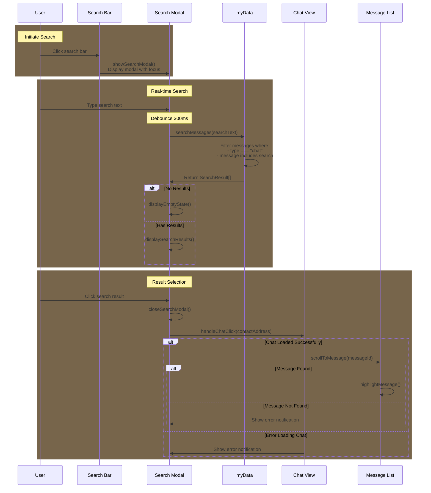

## Chat Search Implementation

Key Points:

- Search Interface:

  - Search modal with input field
  - Real-time search as user types
  - Results grouped by chat thread
  - Shows message preview and timestamp

- Data Access:
  - Searches through myData.contacts messages
  - Uses existing message data structures
  - No need for additional storage



## Pseudo Implementation

```javascript
// Interface defining the structure of a search result
interface SearchResult {
    contactAddress: string    // Address of the contact
    username: string         // Display name from Contact
    messageId: number        // Position in messages array for scrolling
    messageText: string      // Full message content
    timestamp: number        // For sorting and display
    preview: string         // Truncated message for result list
}

// Core search functionality
function searchMessages(searchText: string): SearchResult[] {
    const results: SearchResult[] = [];
    const searchLower = searchText.toLowerCase();

    // Sequential search through contacts and messages
    for (const [address, contact] of myData.contacts) {
        contact.messages.forEach((msg, index) => {
            if (msg.type === "chat" && msg.message.toLowerCase().includes(searchLower)) {
                results.push({
                    contactAddress: address,
                    username: contact.username,
                    messageId: index,
                    messageText: msg.message,
                    timestamp: msg.timestamp,
                    preview: truncateMessage(msg.message)
                });
            }
        });
    }

    // Messages are already in timestamp order in the contacts array
    // No need to sort again
    return results;
}

// Utility function
function truncateMessage(message: string): string {
    const MAX_PREVIEW_LENGTH = 50;
    return message.length > MAX_PREVIEW_LENGTH
        ? message.substring(0, MAX_PREVIEW_LENGTH) + '...'
        : message;
}

// Modal Event Handlers
function showSearchModal() {
    // Hide any other active modals first
    document.querySelectorAll('.modal').forEach(modal => {
        modal.style.display = 'none';
    });

    // Show search modal
    const searchModal = document.getElementById('searchModal');
    searchModal.style.display = 'flex';

    // Focus search input
    document.getElementById('messageSearch').focus();
}

function closeSearchModal() {
    // Hide search modal
    document.getElementById('searchModal').style.display = 'none';

    // Clear search state
    document.getElementById('messageSearch').value = '';
    document.getElementById('searchResults').innerHTML = '';
}

// Initialize search functionality
function initializeSearch() {
    const searchButton = document.getElementById('search');
    const backButton = document.getElementById('closeSearchModal');

    // Handle search button click
    searchButton.addEventListener('click', showSearchModal);

    // Handle back button click
    backButton.addEventListener('click', closeSearchModal);
}

// Debounced search input handler
const handleSearchInput = debounce((event) => {
    const searchText = event.target.value;
    if (searchText.length < 2) {
        displayEmptyState();
        return;
    }

    const results = searchMessages(searchText);
    if (results.length === 0) {
        displayEmptyState();
    } else {
        displaySearchResults(results);
        saveRecentSearch(searchText);
    }
}, 300);

// UI feedback functions
function displayEmptyState() {
    const searchResults = document.getElementById('searchResults');
    searchResults.innerHTML = `
        <div class="no-results">
            <p>No messages found</p>
            <p class="suggestion">Try different keywords</p>
        </div>
    `;
}

// Recent searches handling
const MAX_RECENT_SEARCHES = 5;
function saveRecentSearch(searchText) {
    const recent = JSON.parse(localStorage.getItem('recentSearches') || '[]');
    recent.unshift(searchText);
    localStorage.setItem('recentSearches',
        JSON.stringify([...new Set(recent)].slice(0, MAX_RECENT_SEARCHES))
    );
}

// Result handling with error management
function handleSearchResult(result: SearchResult) {
    try {
        closeSearchModal();
        handleChatClick(result.contactAddress);

        // Add timeout to ensure chat is loaded
        setTimeout(() => {
            const messageFound = scrollToMessage(result.messageId);
            if (!messageFound) {
                console.error('Message not found');
            } else {
                highlightMessage(result.messageId);
            }
        }, 100);
    } catch (error) {
        console.error('Error handling search result:', error);
    }
}

// Visual feedback for found message
function highlightMessage(messageId) {
    const messageElement = document.querySelector(`[data-message-id="${messageId}"]`);
    if (messageElement) {
        messageElement.classList.add('highlighted');
        setTimeout(() => {
            messageElement.classList.remove('highlighted');
        }, 2000);
    }
}
```

## Search Interface Layout

```ascii
+---------------------------+
|   ←   Search Messages    |
+---------------------------+
|   🔍 Search messages...   |
+---------------------------+
|                          |
| Recent Results           |
|                          |
| +----------------------+ |
| | John Doe            | |
| | "Hey, about the..." | |
| | Yesterday, 2:30 PM  | |
| +----------------------+ |
|                          |
| +----------------------+ |
| | Alice Smith         | |
| | "Let me check the..."| |
| | Today, 9:15 AM      | |
| +----------------------+ |
|                          |
| +----------------------+ |
| | Bob Wilson          | |
| | "The meeting is..." | |
| | Today, 10:45 AM     | |
| +----------------------+ |
|                          |
+---------------------------+
```

## Updated UI Implementation

```html
<!-- Search Modal -->
<div class="modal" id="searchModal">
  <div class="modal-header">
    <button class="back-button" id="closeSearchModal"></button>
    <div class="modal-title">Search Messages</div>
  </div>
  <div class="form-container">
    <input
      type="text"
      id="messageSearch"
      class="form-control"
      placeholder="Search messages..."
      oninput="handleSearchInput(event)"
      autofocus
    />
    <div id="searchResults" class="chat-list">
      <!-- Results will be populated here -->
    </div>
  </div>
</div>
```

## CSS Implementation

```css
/* Modal is already styled in main CSS, only need search-specific styles */

/* Search Results Styles */
#searchResults {
  flex: 1;
  overflow-y: auto;
  padding: 10px;
}

.search-result {
  display: flex;
  flex-direction: column;
  padding: 12px;
  border-bottom: 1px solid var(--border-color);
  cursor: pointer;
  transition: background-color 0.2s;
}

.search-result:hover {
  background-color: var(--hover-background);
}

.contact-name {
  font-weight: bold;
  margin-bottom: 4px;
  color: var(--text-color);
}

.message-preview {
  color: var(--secondary-text-color);
  font-size: 14px;
  margin-bottom: 4px;
}

.timestamp {
  color: var(--tertiary-text-color);
  font-size: 12px;
}

/* Message Highlight Animation */
.highlighted {
  animation: highlight-fade 2s ease-out;
}

@keyframes highlight-fade {
  0% {
    background-color: var(--highlight-color);
  }
  100% {
    background-color: transparent;
  }
}

/* Empty State */
.no-results {
  text-align: center;
  padding: 20px;
  color: var(--secondary-text-color);
  font-size: 14px;
}

/* Loading State */
.search-loading {
  text-align: center;
  padding: 20px;
  color: var(--secondary-text-color);
}

.search-loading::after {
  content: "...";
  animation: loading-dots 1.5s infinite;
}

@keyframes loading-dots {
  0% {
    content: ".";
  }
  33% {
    content: "..";
  }
  66% {
    content: "...";
  }
}
```

## Additional Considerations

1. Performance Optimizations:

```javascript
// Add debouncing to prevent excessive searches while typing
function debounce(func, wait) {
  let timeout;
  return function executedFunction(...args) {
    const later = () => {
      clearTimeout(timeout);
      func(...args);
    };
    clearTimeout(timeout);
    timeout = setTimeout(later, wait);
  };
}

const debouncedSearch = debounce(handleSearchInput, 300);
```

2. Error States:

```javascript
function handleSearchResult(result: SearchResult) {
  try {
    closeSearchModal();
    handleChatClick(result.contactAddress);

    // Add timeout to ensure chat is loaded
    setTimeout(() => {
      const messageFound = scrollToMessage(result.messageId);
      if (!messageFound) {
        console.error("Message not found");
        // Could show toast notification
      }
    }, 100);
  } catch (error) {
    console.error("Error handling search result:", error);
    // Show error to user
  }
}
```

3. User Experience Enhancements:

```javascript
// Save recent searches
const MAX_RECENT_SEARCHES = 5;
function saveRecentSearch(searchText) {
  const recent = JSON.parse(localStorage.getItem("recentSearches") || "[]");
  recent.unshift(searchText);
  localStorage.setItem(
    "recentSearches",
    JSON.stringify([...new Set(recent)].slice(0, MAX_RECENT_SEARCHES))
  );
}

// Show empty state
function displayEmptyState() {
  const searchResults = document.getElementById("searchResults");
  searchResults.innerHTML = `
        <div class="no-results">
            <p>No messages found</p>
            <p class="suggestion">Try different keywords</p>
        </div>
    `;
}
```

4. Accessibility Considerations:

```html
<!-- Add ARIA labels and roles -->
<input
  type="text"
  id="messageSearch"
  aria-label="Search messages"
  role="searchbox"
  placeholder="Search messages..."
/>

<div id="searchResults" role="list" aria-live="polite">
  <!-- Results here -->
</div>
```

5. Search Filters (Future Enhancement):

```typescript
interface SearchFilters {
  dateRange?: { start: Date; end: Date };
  contactFilter?: string[];
  messageTypes?: ("text" | "media")[];
}

function searchMessages(
  searchText: string,
  filters?: SearchFilters
): SearchResult[] {
  // Implementation with filters
}
```

6. Transition Animations (Future Enhancement):

```css
/* Smooth transition between search bar and modal */
.search-bar {
  transition: all 0.3s ease-out;
}

.search-modal-enter {
  animation: modalEnter 0.3s ease-out;
}

@keyframes modalEnter {
  from {
    transform: translateY(-20px);
    opacity: 0;
  }
  to {
    transform: translateY(0);
    opacity: 1;
  }
}

/* Position tracking for seamless transition */
.search-bar.transitioning {
  position: fixed;
  width: 100%;
  z-index: 1000;
}
```

```javascript
// Enhanced modal transition
function showSearchModal() {
  const searchBar = document.querySelector(".search-bar");
  const searchModal = document.getElementById("searchModal");
  const rect = searchBar.getBoundingClientRect();

  // Store position for animation
  searchBar.style.top = `${rect.top}px`;
  searchBar.classList.add("transitioning");

  // Trigger animation
  searchModal.classList.add("search-modal-enter");

  // Cleanup after animation
  setTimeout(() => {
    searchBar.classList.remove("transitioning");
    searchModal.style.display = "flex";
  }, 300);
}
```

## Updated Header and Search Implementation

1. HTML Structure (modify existing header):

```html
<header class="header" id="header">
  <div id="logo"></div>
  <div class="app-name">Liberdus</div>
  <div class="header-icons">
    <!-- Remove search button -->
    <button class="icon-button" id="toggleMenu"></button>
  </div>
</header>

<!-- Add persistent search bar below header -->
<div class="search-bar-container" id="searchBarContainer">
  <div class="search-bar">
    <span class="search-icon">🔍</span>
    <input
      type="text"
      id="searchBarInput"
      placeholder="Search messages..."
      readonly
    />
  </div>
</div>

<!-- Search Modal (shown when search bar is clicked) -->
<div class="modal" id="searchModal">
  <div class="modal-header">
    <button class="back-button" id="closeSearchModal"></button>
    <div class="modal-title">Search Messages</div>
  </div>
  <div class="form-container">
    <input
      type="text"
      id="messageSearch"
      class="form-control"
      placeholder="Search messages..."
      oninput="handleSearchInput(event)"
      autofocus
    />
    <div id="searchResults" class="chat-list">
      <!-- Results will be populated here -->
    </div>
  </div>
</div>
```

2. Additional CSS:

```css
.search-bar-container {
  display: none; /* Hidden by default */
  padding: 8px 16px;
  background: var(--background-color);
  border-bottom: 1px solid var(--border-color);
}

.search-bar-container.visible {
  display: block;
}

.search-bar {
  display: flex;
  align-items: center;
  padding: 8px 12px;
  background: var(--input-background);
  border: 1px solid var(--border-color);
  border-radius: 8px;
  cursor: pointer;
}

.search-bar:hover {
  background: var(--hover-background);
}

.search-icon {
  margin-right: 8px;
  color: var(--secondary-text-color);
}

#searchBarInput {
  border: none;
  background: transparent;
  width: 100%;
  color: var(--text-color);
  cursor: pointer;
}

#searchBarInput:focus {
  outline: none;
}
```

3. Update CSS Variables:

```css
:root {
  /* ... existing variables ... */
  --search-height: 56px; /* Height of search container */
}
```

4. Update JavaScript for view management:

```javascript
function switchView(view) {
  // ... existing view switching code ...

  // Toggle search bar visibility
  const searchBarContainer = document.getElementById("searchBarContainer");

  if (view === "chats" || view === "contacts") {
    searchBarContainer.classList.add("visible");
  } else {
    searchBarContainer.classList.remove("visible");
  }
}

// Initialize search functionality
function initializeSearch() {
  const searchBar = document.querySelector(".search-bar");
  const searchBarInput = document.getElementById("searchBarInput");
  const closeButton = document.getElementById("closeSearchModal");

  // Show modal when search bar is clicked
  searchBar.addEventListener("click", () => {
    showSearchModal();
    // Focus the modal's search input
    document.getElementById("messageSearch").focus();
  });

  // Handle back button click
  closeButton.addEventListener("click", closeSearchModal);
}
```
