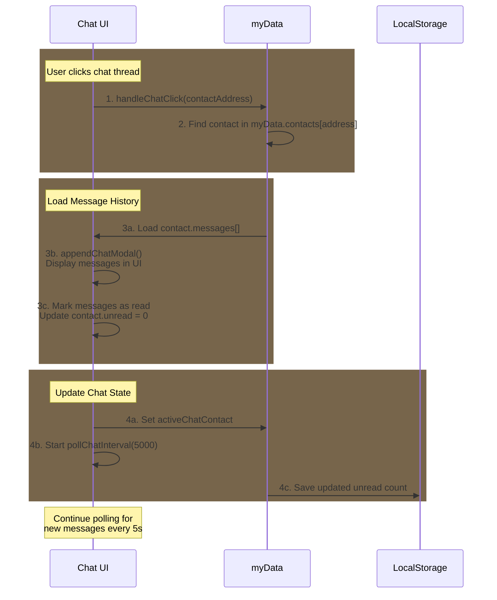
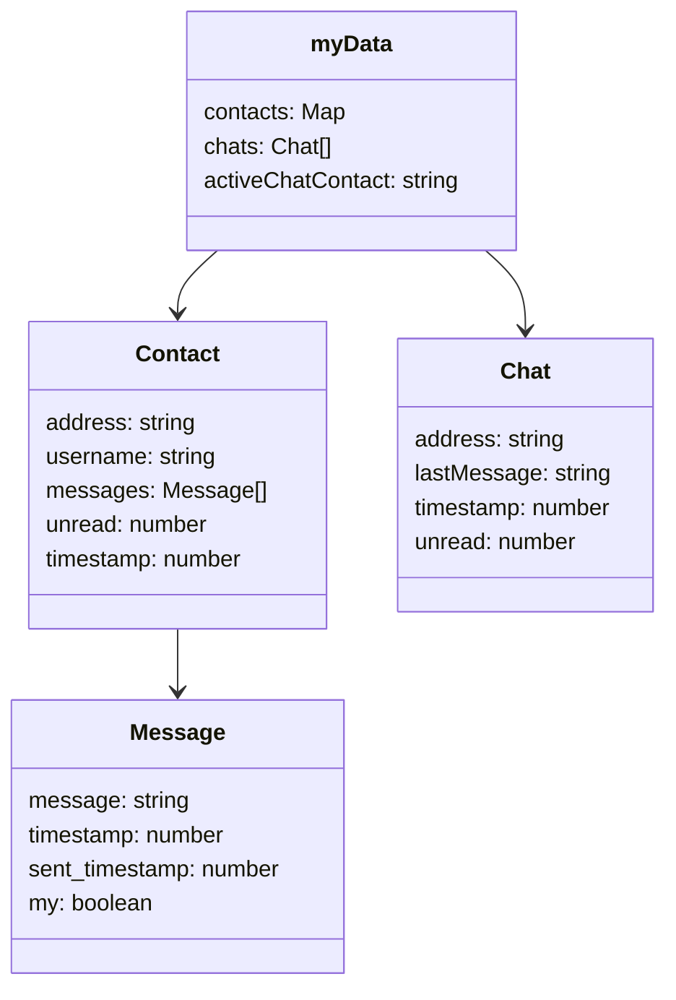

## Chat Thread Retrieval Flow

Key Points:

- Chat List Structure:

  - Stored in myData.chats array
  - Each chat entry contains latest message and contact info
  - Sorted by most recent message timestamp

- Contact Messages:

  - Full message history stored in contact.messages array
  - Includes both chat messages and payment transactions
  - Each message has timestamp and sender info

- Thread Loading:
  - When chat opened, loads messages from contact object
  - Updates UI with message history
  - Starts more frequent polling (5s intervals)

## Chat Data Structure

