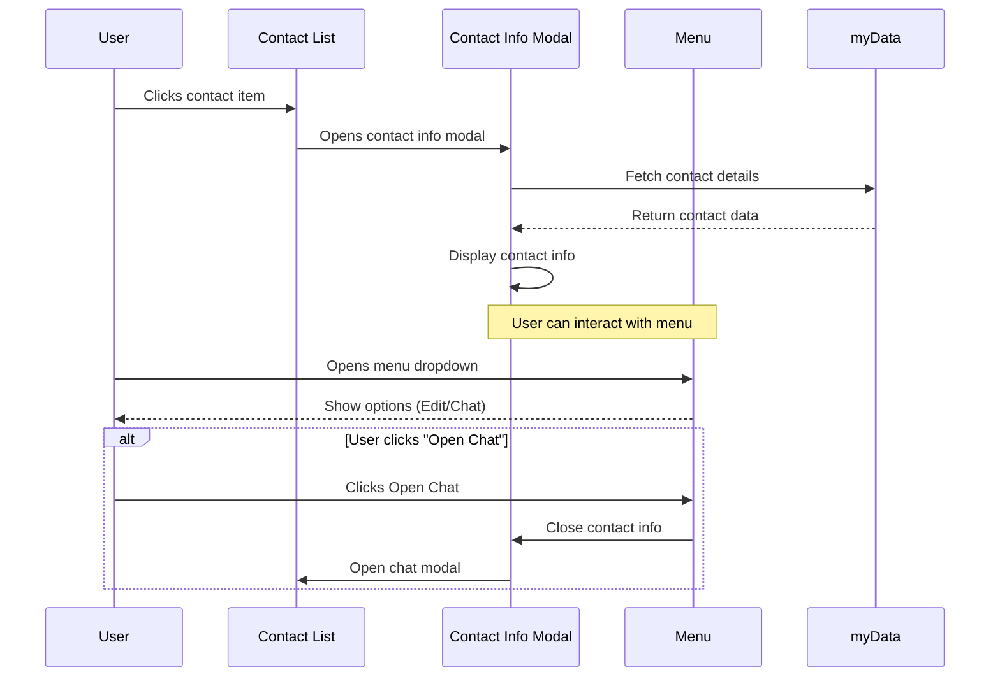

# Contact Info Opening Flow

This document describes the flow for opening contact information from the contacts list.

## UI Layout

```ascii
Before (Contacts List):              After (Contact Info):
+-------------------------+         +-------------------------+
|       Contacts         |         |    Contact Info     [⋮] | <- Menu button
+-------------------------+         +-------------------------+
| ┌─────────────────────┐|         | Username: john         |
| │ [Avatar]  john     ││         | Name: Not provided      |
| │ 0x1234...5678      ││         | Email: Not provided     |
| └─────────────────────┘|         | Phone: Not provided     |
| ┌─────────────────────┐|         | LinkedIn: Not provided  |
| │ [Avatar]  bob      ││         | X: Not provided         |
| │ 0x9876...4321      ││         |                         |
| └─────────────────────┘|         |                         |
+-------------------------+         +-------------------------+

Menu Dropdown:
+------------------+
| ✏️ Edit          |
| 💬 Open Chat     |
+------------------+
```

## Implementation Flow



## Menu Implementation

The menu button in the top-right corner of the contact info modal provides these actions:

- Edit Contact (future implementation)
- Open Chat

## Event Flow

1. User clicks a contact in the contacts list
2. Contact info modal opens showing contact details
3. User can:
   - View contact information
   - Use menu to open chat
   - Close modal to return to contacts list
