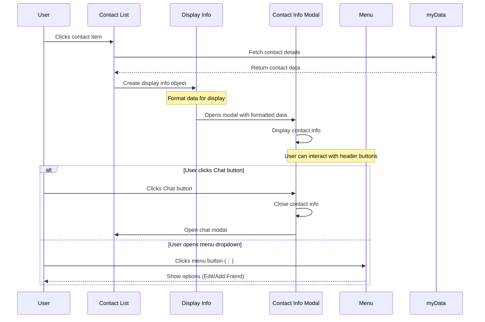

# Contact Info Opening Flow

This document describes the flow for opening contact information from the contacts list.

## UI Layout

```ascii
Before (Contacts List):              After (Contact Info):
+-------------------------+         +-------------------------+
|       Contacts         |         |    Contact Info   [💬][⋮]| <- Chat & Menu buttons
+-------------------------+         +-------------------------+
| ┌─────────────────────┐|         | Username: john         |
| │ [Avatar]  john     ││         | Name: Not provided      |
| │ 0x1234...5678      ││         | Email: Not provided     |
| └─────────────────────┘|         | Phone: Not provided     |
| ┌─────────────────────┐|         | LinkedIn: Not provided  |
| │ [Avatar]  bob      ││         | X: Not provided         |
| │ 0x9876...4321      ││         |                         |
| └─────────────────────┘|         |                         |
+-------------------------+         +-------------------------+

Menu Dropdown:
+------------------+
| ✏️ Edit          |
| 👥 Add Friend    |
+------------------+
```

## Implementation Flow



## Data Flow

1. Contact data structure:

```javascript
contact = {
  address: "0x1234...5678",
  username: "john",
  senderInfo: {
    username: "john",
    name: "John Doe",
    email: "john@example.com",
    phone: "123-456-7890",
    linkedin: "/johndoe",
    x: "@johndoe",
  },
};
```

2. Display info structure:

```javascript
displayInfo = {
  username: "john", // from senderInfo.username || contact.username || shortened address
  name: "John Doe", // from contact.name || senderInfo.name || 'Not provided'
  email: "john@example.com", // from senderInfo.email || 'Not provided'
  phone: "123-456-7890", // from senderInfo.phone || 'Not provided'
  linkedin: "/johndoe", // from senderInfo.linkedin || 'Not provided'
  x: "@johndoe", // from senderInfo.x || 'Not provided'
  address: "0x1234...5678", // Required for chat functionality
};
```

## Event Flow

1. User clicks a contact in the contacts list
2. System creates a displayInfo object with formatted data
3. Contact info modal opens showing:
   - Back button (←)
   - Modal title "Contact Info"
   - Chat button (💬)
   - Menu button (⋮)
4. User can:
   - View contact information
   - Click chat button to open chat directly
   - Use menu dropdown to:
     - Edit contact info
     - Add as friend
   - Close modal to return to contacts list

## Header Actions

1. Chat Button:

   - Direct access to open chat with contact
   - Uses contact's address from displayInfo
   - Closes contact info modal before opening chat

2. Menu Dropdown:
   - Opens a compact dropdown menu
   - Edit option with pencil icon
   - Add Friend option with person-plus icon
   - Green styling for Add Friend option
   - Closes when clicking outside

## Data Handling

- Contact data is retrieved from myData.contacts
- Display info is created before opening the modal
- The modal only handles displaying the pre-formatted data
- Data fallbacks are handled during displayInfo creation
- Contact address is now included in displayInfo for chat functionality
