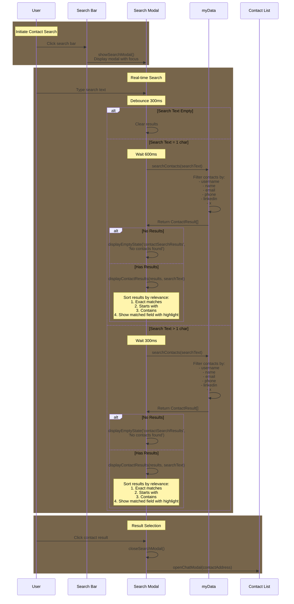

# Contact Search Implementation Flow

Last edited: 2025-02-19 17:04:00
# This document outlines the implementation flow for the contact search feature in the app.



## Reusable Functions from Chat Search

- `debounce(func, waitFn)`: Controls function execution frequency
- `displayEmptyState()`: Shows "no results found" UI
- `displayLoadingState()`: Shows loading indicator
- `initializeSearch()`: Sets up search event listeners
- Modal control functions:
  - `closeSearchModal()`
  - Event listeners for modal open/close
- Basic UI utilities:
  - `generateIdenticon(address)`
  - `formatTime(timestamp)`

## Considerations After Implementation

### Should be Refactored for Reusability

1. Search Function Architecture:

```javascript
function search(searchText, options) {
  // options = {
  //   dataSource: 'messages' | 'contacts',
  //   searchFields: ['message' | 'username' | 'email' etc],
  //   sortFunction: (a, b) => {...},
  //   highlightMatches: boolean
  // }
}
```

2. Result Display Components:

```javascript
function displaySearchResults(results, displayOptions) {
  // displayOptions = {
  //   itemTemplate: (item) => HTML,
  //   containerClass: string,
  //   onItemClick: (item) => void
  // }
}
```

3. Result Handling Strategy:

```javascript
const resultHandlers = {
  messages: handleMessageResult,
  contacts: handleContactResult,
};
```

### Keep Separate

1. Contact-specific search logic:

   - Field prioritization (username > email > other fields)
   - Exact/partial match scoring
   - Contact-specific result formatting

2. Contact-specific UI:

   - Contact card templates
   - Contact highlight behavior
   - Contact list scroll behavior

3. Contact data structure handling:
   - Contact validation
   - Contact field normalization
   - Contact-specific error handling

### Contact Info Display Handling

1. Handle missing senderInfo gracefully:

```javascript
function getContactDisplayInfo(contact, address) {
  // Provide default info structure when senderInfo is missing
  return (
    contact.senderInfo || {
      username: contact.username || address,
      name: "",
      email: "",
      phone: "",
      linkedin: "",
      x: "",
    }
  );
}
```

2. Consistent contact info display:

   - Use same info structure across chat/search/contact views
   - Fallback to address when username unavailable
   - Show placeholder text for empty fields
   - Handle undefined/null values safely

3. Contact verification:
   - Verify username matches contact address
   - Mark unverified contact info
   - Allow manual verification
   - Cache verification status

## Implementation Pseudocode

```javascript
// Inside App.js DOMContentLoaded event listener
document.addEventListener("DOMContentLoaded", async () => {
  // ... existing code ...

  // Add contact search functionality
  const contactSearchInput = document.getElementById("contactSearchInput");
  const contactSearch = document.getElementById("contactSearch");
  const contactSearchModal = document.getElementById("contactSearchModal");

  // Close contact search modal
  document
    .getElementById("closeContactSearchModal")
    .addEventListener("click", () => {
      contactSearchModal.classList.remove("active");
      contactSearch.value = "";
      document.getElementById("contactSearchResults").innerHTML = "";
    });

  // Handle contact search input with debounce
  contactSearch.addEventListener(
    "input",
    debounce((e) => {
      const searchText = e.target.value.trim();

      // Just clear results if empty
      if (!searchText) {
        document.getElementById("contactSearchResults").innerHTML = "";
        return;
      }

      // For single character, wait longer
      if (searchText.length === 1) {
        document.getElementById("contactSearchResults").innerHTML = "";
        setTimeout(() => {
          const results = searchContacts(searchText);
          if (results.length === 0) {
            displayEmptyState();
          } else {
            displayContactResults(results);
          }
        }, 600);
        return;
      }

      // For multiple characters, proceed with normal search
      const results = searchContacts(searchText);
      if (results.length === 0) {
        displayEmptyState();
      } else {
        displayContactResults(results);
      }
    }, 300)
  );

  initializeContactSearch();
});

// Contact search functions
function searchContacts(searchText) {
  if (!searchText || !myData?.contacts) return [];

  const results = [];
  const searchLower = searchText.toLowerCase();

  // Search through all contacts
  Object.entries(myData.contacts).forEach(([address, contact]) => {
    // Fields to search through
    const searchFields = [
      contact.username,
      contact.name,
      contact.email,
      contact.phone,
      contact.linkedin,
      contact.x,
    ].filter(Boolean); // Remove null/undefined values

    // Check if any field matches
    const matches = searchFields.some((field) =>
      field.toLowerCase().includes(searchLower)
    );

    if (matches) {
      // Determine match type for sorting
      const exactMatch = searchFields.some(
        (field) => field.toLowerCase() === searchLower
      );
      const startsWithMatch = searchFields.some((field) =>
        field.toLowerCase().startsWith(searchLower)
      );

      results.push({
        contactAddress: address,
        contact: contact,
        matchType: exactMatch ? 1 : startsWithMatch ? 2 : 3,
      });
    }
  });

  // Sort by match type (exact > starts with > contains)
  return results.sort((a, b) => a.matchType - b.matchType);
}

function displayContactResults(results, searchText) {
  const searchResults = document.getElementById("contactSearchResults");
  const resultsList = document.createElement("ul");
  resultsList.className = "contact-list";

  results.forEach(async (result) => {
    const resultElement = document.createElement("li");
    resultElement.className = "contact-item search-result-item";

    const identicon = await generateIdenticon(result.contactAddress);

    resultElement.innerHTML = `
            <div class="contact-avatar">
                ${identicon}
            </div>
            <div class="contact-content">
                <div class="contact-header">
                    <div class="contact-name">${
                      result.contact.username || result.contactAddress
                    }</div>
                </div>
                <div class="contact-details">
                    ${
                      result.contact.name
                        ? `<div>${result.contact.name}</div>`
                        : ""
                    }
                    ${
                      result.contact.email
                        ? `<div>${result.contact.email}</div>`
                        : ""
                    }
                </div>
            </div>
        `;

    resultElement.addEventListener("click", () => {
      handleContactResultClick(result, searchText);
    });

    resultsList.appendChild(resultElement);
  });

  searchResults.innerHTML = "";
  searchResults.appendChild(resultsList);
}

function handleContactResultClick(result, searchText) {
  try {
    // Close search modal
    document.getElementById("contactSearchModal").classList.remove("active");

    // Open chat modal
    openChatModal(result.contactAddress);

    // Highlight matched field
    const matchedField = searchText.toLowerCase();
    const contactElements = document.querySelectorAll(".contact-item");
    contactElements.forEach((element) => {
      const text = element.textContent.toLowerCase();
      if (text.includes(matchedField)) {
        element.classList.add("highlighted");
        setTimeout(() => element.classList.remove("highlighted"), 2000);
      }
    });
  } catch (error) {
    console.error("Error handling contact result:", error);
  }
}

function initializeContactSearch() {
  const contactSearchInput = document.getElementById("contactSearchInput");
  const contactSearch = document.getElementById("contactSearch");
  const contactSearchModal = document.getElementById("contactSearchModal");

  // Connect search input to modal input
  contactSearchInput.addEventListener("click", () => {
    contactSearchModal.classList.add("active");
    contactSearch.focus();
  });
}
```

The key differences from chat search implementation:

1. Searches through contact fields (username, name, email, etc.) instead of messages
2. Different result display format focusing on contact information
3. Simplified sorting (no message-specific sorting logic)
4. Contact-specific highlight and scroll behavior
5. Uses the Contact data structure from core-data-structures.md

This implementation maintains the same UX patterns (debouncing, loading states, etc.) while adapting the search logic for contacts.

# Contacts Search Implementation Checklist

## HTML Structure

- [x] Add persistent search bar to contacts view
- [x] Create contact search modal with results container
- [x] Add empty state for no results
- [x] Add loading state for search in progress
- [x] Add close button for search modal

## CSS Updates

- [x] Reuse existing search bar styles from chat search
- [x] Reuse existing search modal and transitions
- [x] Style contact search results list
- [x] Reuse animations for modal open/close
- [x] Style empty and loading states
- [x] Style highlighted matching text

## JavaScript Implementation

- [x] Add search bar click handler to open modal
- [x] Implement real-time search as user types
- [x] Add debounce to search input (reuse existing)
- [x] Create contact results rendering logic
- [x] Handle empty states and loading states
- [x] Implement modal close behavior
- [x] Add single character delay for better UX
- [x] Clear results when search is empty
- [x] Add identicon generation for contacts

## Search Logic

- [x] Create contact search function
- [x] Add field prioritization (username > name > email)
- [x] Implement exact/partial match scoring
- [x] Add highlight matching text in results
- [x] Sort results by match relevance
- [x] Handle contact-specific data display
- [x] Add support for additional fields (phone, linkedin, x)
- [x] Show which field matched in results

## Data Integration

- [x] Access myData.contacts for search
- [x] Handle contact field validation
- [x] Implement contact result click behavior
- [x] Add scroll and highlight for selected contact
- [x] Show contact info on result click
- [x] Close modal after selection

#Implemented code as of 2025-02-19 17:04:00
```bash
git diff 4225051286353fb7c40bd57d1820576669f6865b c7d53ffeeeea9728dde8260a73064b7675925c58 > changes.diff
```
