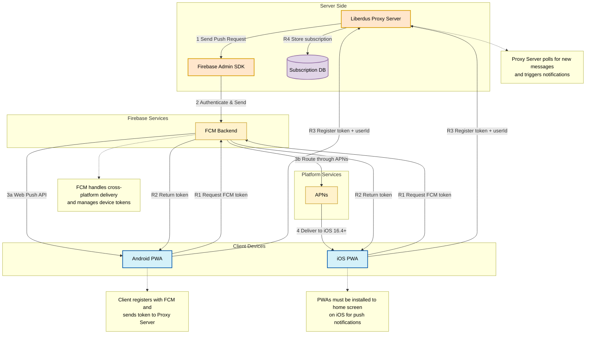
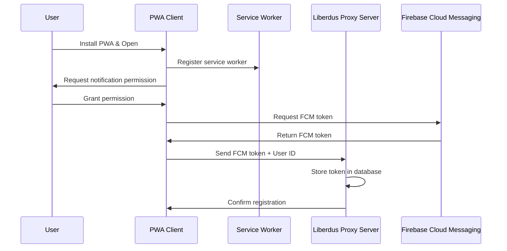
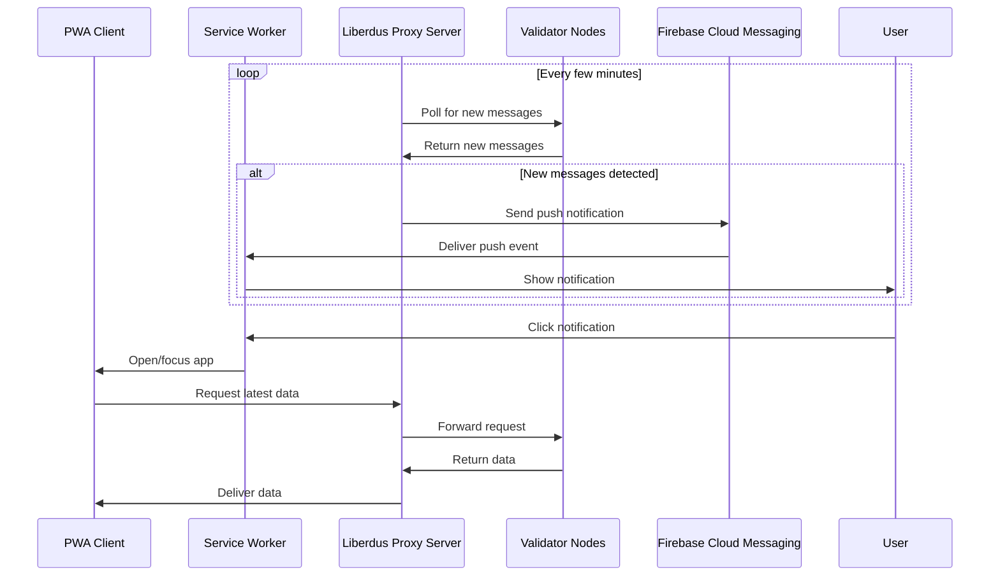
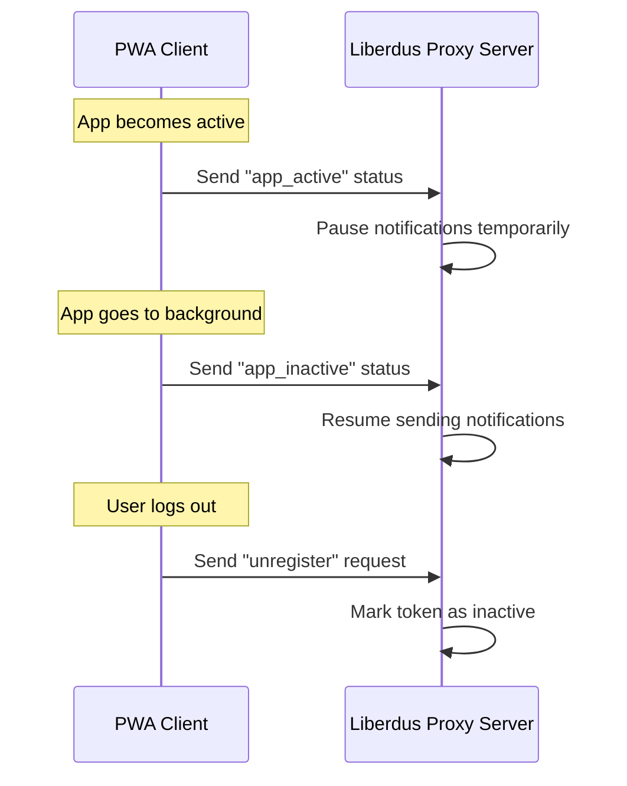

# Firebase Cloud Messaging (FCM) Setup Guide for PWAs

This guide provides step-by-step instructions for setting up Firebase Cloud Messaging (FCM) to enable push notifications in Progressive Web Apps (PWAs) for the Liberdus system, supporting both Android and iOS platforms.

## What is Firebase Cloud Messaging?

Firebase Cloud Messaging (FCM) is a cross-platform messaging solution that lets you reliably send notifications at no cost. FCM can be used to:

- Notify users about new messages or content
- Send notification messages that appear in the notification tray
- Send data messages that are handled by your application code
- Target messages to individual devices, groups, or topic subscribers
- Send messages with payloads up to 4KB

## Architecture Overview for PWAs



## Client-Proxy Registration Flow

The client registration process with the Liberdus Proxy Server follows these key steps:

1. **Request Permission**: Client requests notification permission from user
2. **Generate FCM Token**: Upon permission grant, client requests FCM token
3. **Register with Proxy**: Client sends FCM token and user ID to proxy server
   ```
   POST /api/push/register
   { "token": "FCM_TOKEN", "userId": "USER_ID" }
   ```
4. **Status Updates**: Client notifies proxy of app state changes
   ```
   POST /api/push/status
   { "token": "FCM_TOKEN", "status": "active|inactive", "userId": "USER_ID" }
   ```
5. **Token Refresh**: Client sends updated token when FCM refreshes it
   ```
   PUT /api/push/update
   { "oldToken": "OLD_TOKEN", "newToken": "NEW_TOKEN", "userId": "USER_ID" }
   ```
6. **Unregister**: Client notifies proxy on logout or opt-out
   ```
   POST /api/push/unregister
   { "token": "FCM_TOKEN", "userId": "USER_ID" }
   ```

The proxy server stores these tokens in a database and uses them to target notifications to specific users when new messages are detected during polling.

## Platform Support

- **Android**: Full support for push notifications in PWAs through the Web Push API
- **iOS**: Supported on iOS 16.4+ for home screen installed PWAs only
- **Desktop**: Supported on all major browsers (Chrome, Edge, Firefox, etc.)

## Interaction Between App, Service Worker, and Liberdus Proxy Server

The interaction between your PWA, the service worker, and the Liberdus Proxy Server is crucial for the push notification system to work properly. Here's how these components interact:

### 1. Registration Flow



1. **Service Worker Registration**:

   - When the PWA loads, it registers the Firebase messaging service worker
   - The service worker is installed and activated in the background

2. **Permission Request**:

   - The app requests notification permission from the user
   - This must be triggered by a user action (like clicking a button)

3. **Token Generation**:

   - After permission is granted, the app requests an FCM token
   - This token uniquely identifies the device/browser combination

4. **Token Registration with Proxy Server**:
   - The app sends the FCM token to the Liberdus Proxy Server
   - The server stores this token along with the user's ID in its database
   - This mapping allows the server to know which token to use when sending notifications to a specific user

### 2. Background Polling and Notification Flow



1. **Background Polling**:

   - The Liberdus Proxy Server periodically polls Validator Nodes for new messages
   - This happens on the server side, not in the client app
   - The polling interval can be configured (typically every few minutes)

2. **Message Detection**:

   - When new messages are detected, the server prepares to send notifications
   - The server determines which users should receive notifications based on the message content

3. **Notification Sending**:

   - The server uses the stored FCM tokens to send notifications through Firebase
   - It includes relevant data in the notification payload (e.g., message count, sender info)

4. **Service Worker Handling**:

   - The push event is received by the service worker
   - For background notifications, the service worker displays the notification
   - For foreground notifications, the app can handle them directly

5. **User Interaction**:
   - When a user clicks the notification, the service worker handles the click
   - The service worker can open the app or focus an existing window
   - It can also pass data from the notification to the app

### 3. App Status Updates



1. **Activity Status Updates**:

   - When the app becomes active (foreground), it notifies the Proxy Server
   - This allows the server to avoid sending redundant notifications
   - When the app goes to background, it updates the server accordingly

2. **Token Management**:

   - The app should send token updates to the server when the FCM token refreshes
   - This happens occasionally as determined by Firebase
   - The app should also notify the server when a user logs out

3. **Subscription Management**:
   - Users can opt out of notifications through app settings
   - The app should update the server about user preferences
   - The server respects these preferences when sending notifications

### 4. API Endpoints on Liberdus Proxy Server

The Liberdus Proxy Server should expose these endpoints for the PWA to interact with:

1. **Token Registration**:

   ```
   POST /api/push/register
   Body: { token: "FCM_TOKEN", userId: "USER_ID" }
   ```

2. **Token Update**:

   ```
   PUT /api/push/update
   Body: { oldToken: "OLD_FCM_TOKEN", newToken: "NEW_FCM_TOKEN", userId: "USER_ID" }
   ```

3. **Status Update**:

   ```
   POST /api/push/status
   Body: { token: "FCM_TOKEN", status: "active|inactive", userId: "USER_ID" }
   ```

4. **Unregister Token**:

   ```
   POST /api/push/unregister
   Body: { token: "FCM_TOKEN", userId: "USER_ID" }
   ```

5. **Update Preferences**:
   ```
   POST /api/push/preferences
   Body: { userId: "USER_ID", enabled: true|false, topics: ["general", "chat"] }
   ```

## Setup Process

### 1. Create a Firebase Project

1. Go to the [Firebase Console](https://console.firebase.google.com/)
2. Click "Add project" and follow the setup wizard
3. Enter a project name (e.g., "Liberdus Push Notifications")
4. Choose whether to enable Google Analytics (recommended)
5. Accept the terms and click "Create Project"

### 2. Register Your Web App

1. In the Firebase Console, click "Add app" and select the Web platform (</> icon)
2. Enter a nickname for your app (e.g., "Liberdus PWA")
3. Optionally enable Firebase Hosting if you plan to host your PWA there
4. Click "Register app"
5. Copy the Firebase configuration object that appears - you'll need this later

### 3. Server-Side Setup (Liberdus Proxy Server)

#### Install Firebase Admin SDK

For a Node.js server:

```bash
npm install firebase-admin
```

For a Rust server, use the Firebase REST API with a crate like `reqwest`:

```bash
cargo add reqwest
cargo add serde
cargo add serde_json
```

#### Initialize Firebase Admin SDK

For Node.js:

```javascript
const admin = require("firebase-admin");
const serviceAccount = require("./path/to/serviceAccountKey.json");

admin.initializeApp({
  credential: admin.credential.cert(serviceAccount),
});
```

For Rust (using HTTP API):

```rust
use reqwest::Client;
use serde_json::json;

async fn send_fcm_message(
    client: &Client,
    server_key: &str,
    token: &str,
    title: &str,
    body: &str,
) -> Result<(), Box<dyn std::error::Error>> {
    let url = "https://fcm.googleapis.com/fcm/send";

    let payload = json!({
        "to": token,
        "notification": {
            "title": title,
            "body": body
        }
    });

    let response = client
        .post(url)
        .header("Authorization", format!("key={}", server_key))
        .header("Content-Type", "application/json")
        .json(&payload)
        .send()
        .await?;

    println!("FCM Response: {:?}", response.status());

    Ok(())
}
```

### 4. PWA Client-Side Setup

#### 1. Add Firebase to your PWA

Add the Firebase SDK to your web app's HTML:

```html
<!-- Firebase App (the core Firebase SDK) -->
<script src="https://www.gstatic.com/firebasejs/9.22.0/firebase-app-compat.js"></script>
<!-- Firebase Messaging -->
<script src="https://www.gstatic.com/firebasejs/9.22.0/firebase-messaging-compat.js"></script>

<script>
  // Your Firebase configuration object
  const firebaseConfig = {
    apiKey: "YOUR_API_KEY",
    authDomain: "YOUR_AUTH_DOMAIN",
    projectId: "YOUR_PROJECT_ID",
    storageBucket: "YOUR_STORAGE_BUCKET",
    messagingSenderId: "YOUR_MESSAGING_SENDER_ID",
    appId: "YOUR_APP_ID",
  };

  // Initialize Firebase
  firebase.initializeApp(firebaseConfig);
</script>
```

#### 2. Create a Service Worker for Push Notifications

Create a file named `firebase-messaging-sw.js` at the root of your web app:

```javascript
// Firebase messaging service worker
importScripts(
  "https://www.gstatic.com/firebasejs/9.22.0/firebase-app-compat.js"
);
importScripts(
  "https://www.gstatic.com/firebasejs/9.22.0/firebase-messaging-compat.js"
);

firebase.initializeApp({
  apiKey: "YOUR_API_KEY",
  authDomain: "YOUR_AUTH_DOMAIN",
  projectId: "YOUR_PROJECT_ID",
  storageBucket: "YOUR_STORAGE_BUCKET",
  messagingSenderId: "YOUR_MESSAGING_SENDER_ID",
  appId: "YOUR_APP_ID",
});

const messaging = firebase.messaging();

// Handle background messages
messaging.onBackgroundMessage((payload) => {
  console.log("Received background message:", payload);

  const notificationTitle = payload.notification.title || "New Message";
  const notificationOptions = {
    body: payload.notification.body || "You have a new message",
    icon: "/images/icon-192x192.png",
    badge: "/images/badge-72x72.png",
    data: payload.data,
  };

  self.registration.showNotification(notificationTitle, notificationOptions);
});
```

#### 3. Request Permission and Get FCM Token

Add this JavaScript to your main application code:

```javascript
// Request permission and get FCM token
async function requestNotificationPermission() {
  try {
    // Check if service worker is supported
    if (!("serviceWorker" in navigator)) {
      throw new Error("Service workers are not supported in this browser");
    }

    // Check if FCM is supported
    if (!firebase.messaging.isSupported()) {
      throw new Error(
        "Firebase Cloud Messaging is not supported in this browser"
      );
    }

    const messaging = firebase.messaging();

    // Request permission
    const permission = await Notification.requestPermission();
    if (permission !== "granted") {
      throw new Error("Notification permission denied");
    }

    // Get registration token
    const currentToken = await messaging.getToken({
      vapidKey: "YOUR_VAPID_PUBLIC_KEY",
    });

    if (currentToken) {
      console.log("FCM registration token:", currentToken);

      // Send the token to your server
      await sendTokenToServer(currentToken);

      return currentToken;
    } else {
      console.log("No registration token available");
      throw new Error("No registration token available");
    }
  } catch (error) {
    console.error("Error requesting notification permission:", error);
    return null;
  }
}

// Send token to server
async function sendTokenToServer(token) {
  try {
    const response = await fetch("/api/push/register", {
      method: "POST",
      headers: {
        "Content-Type": "application/json",
      },
      body: JSON.stringify({
        token: token,
        userId: "USER_ID", // Replace with actual user ID
      }),
    });

    if (!response.ok) {
      throw new Error("Failed to register token with server");
    }

    console.log("Token registered with server successfully");
    return true;
  } catch (error) {
    console.error("Error registering token with server:", error);
    return false;
  }
}

// Handle foreground messages
function setupForegroundNotifications() {
  const messaging = firebase.messaging();

  messaging.onMessage((payload) => {
    console.log("Received foreground message:", payload);

    // Display notification manually for foreground messages
    if (Notification.permission === "granted") {
      const notificationTitle = payload.notification.title || "New Message";
      const notificationOptions = {
        body: payload.notification.body || "You have a new message",
        icon: "/images/icon-192x192.png",
        badge: "/images/badge-72x72.png",
        data: payload.data,
      };

      new Notification(notificationTitle, notificationOptions);
    }
  });
}

// Initialize notifications when the page loads
document.addEventListener("DOMContentLoaded", () => {
  // Setup button to request permission
  const notificationButton = document.getElementById("enable-notifications");
  if (notificationButton) {
    notificationButton.addEventListener("click", requestNotificationPermission);
  }

  // Setup foreground notifications
  if (firebase.messaging.isSupported()) {
    setupForegroundNotifications();
  }
});
```

#### 4. Generate VAPID Keys

VAPID (Voluntary Application Server Identification) keys are required for web push notifications:

1. Install the web-push library:

   ```bash
   npm install web-push -g
   ```

2. Generate VAPID keys:

   ```bash
   web-push generate-vapid-keys
   ```

3. Save both the public and private keys securely
4. Use the public key in your client code and the private key on your server

### 5. Sending Push Notifications

#### From Liberdus Proxy Server

```javascript
// Send to a specific device
async function sendPushNotification(token, title, body, data = {}) {
  try {
    const message = {
      token: token,
      notification: {
        title: title,
        body: body,
      },
      data: data,
      webpush: {
        headers: {
          Urgency: "high",
        },
        notification: {
          icon: "/images/icon-192x192.png",
          badge: "/images/badge-72x72.png",
          actions: [
            {
              action: "view",
              title: "View",
            },
          ],
        },
        fcm_options: {
          link: "https://your-app-url.com/chat",
        },
      },
    };

    const response = await admin.messaging().send(message);
    console.log("Successfully sent message:", response);
    return response;
  } catch (error) {
    console.error("Error sending message:", error);
    throw error;
  }
}

// Send to a topic
async function sendTopicNotification(topic, title, body, data = {}) {
  try {
    const message = {
      topic: topic,
      notification: {
        title: title,
        body: body,
      },
      data: data,
      webpush: {
        notification: {
          icon: "/images/icon-192x192.png",
          badge: "/images/badge-72x72.png",
        },
      },
    };

    const response = await admin.messaging().send(message);
    console.log("Successfully sent message to topic:", response);
    return response;
  } catch (error) {
    console.error("Error sending message to topic:", error);
    throw error;
  }
}
```

### 6. Testing Push Notifications

1. Use the Firebase Console to send test messages:

   - Go to your Firebase project
   - Select "Cloud Messaging" from the left menu
   - Click "Send your first message"
   - Configure the notification and target devices
   - Send the test message

2. Use the Firebase Admin SDK to send test messages from your server:

```javascript
// Test sending a notification
const token = "DEVICE_FCM_TOKEN";
sendPushNotification(
  token,
  "Test Notification",
  "This is a test notification from Liberdus"
);
```

3. Test using cURL:

```bash
curl -X POST -H "Authorization: key=YOUR_SERVER_KEY" \
  -H "Content-Type: application/json" \
  -d '{
    "to": "DEVICE_FCM_TOKEN",
    "notification": {
      "title": "Test Notification",
      "body": "This is a test notification from Liberdus"
    }
  }' \
  https://fcm.googleapis.com/fcm/send
```

## Platform-Specific Considerations

### Android PWA:

- Push notifications work reliably on Android through Chrome and other Chromium-based browsers
- Users need to grant notification permissions
- The PWA should be installed to the home screen for the best experience
- Works even when the PWA is not currently open

### iOS PWA (iOS 16.4+):

- Push notifications are **only supported on iOS 16.4 and later**
- The PWA **must be installed to the home screen** - this is a strict requirement
- Users must explicitly grant notification permissions
- Safari is the only browser that supports PWA push notifications on iOS
- The implementation uses the same Web Push API but is routed through APNs

## Advanced Features

### Topic Messaging

Subscribe users to topics for broadcast messages:

```javascript
// Client-side
function subscribeToTopic(topic) {
  const messaging = firebase.messaging();

  messaging
    .subscribeToTopic(topic)
    .then(() => {
      console.log(`Subscribed to topic: ${topic}`);
    })
    .catch((error) => {
      console.error(`Error subscribing to topic: ${topic}`, error);
    });
}

// Server-side
admin.messaging().sendToTopic("news", {
  notification: {
    title: "Breaking News",
    body: "Check out the latest updates!",
  },
});
```

### Notification Click Actions

Handle notification clicks in your service worker:

```javascript
// In firebase-messaging-sw.js
self.addEventListener("notificationclick", (event) => {
  event.notification.close();

  // Get the action (if any)
  const action = event.action;

  // Get any data attached to the notification
  const data = event.notification.data;

  // Determine which URL to open based on the action or data
  let url = "/";
  if (action === "view" && data && data.chatId) {
    url = `/chat/${data.chatId}`;
  }

  // Open or focus the client
  event.waitUntil(
    clients.matchAll({ type: "window" }).then((clientList) => {
      // Try to find an existing window and focus it
      for (const client of clientList) {
        if (client.url.includes(self.registration.scope) && "focus" in client) {
          client.postMessage({ type: "NOTIFICATION_CLICK", data: data });
          return client.focus();
        }
      }

      // If no window is open, open a new one
      if (clients.openWindow) {
        return clients.openWindow(url);
      }
    })
  );
});
```

### Data-Only Messages

Send silent data messages for background processing:

```javascript
// Server-side
const message = {
  token: deviceToken,
  data: {
    type: "sync_request",
    timestamp: Date.now().toString(),
  },
};

admin.messaging().send(message);
```

## Troubleshooting

### Common Issues

1. **Notifications not showing on iOS**:

   - Ensure you're using iOS 16.4 or later
   - Verify the PWA is installed to the home screen (required)
   - Check that notification permissions are granted
   - Verify the PWA is using HTTPS

2. **Notifications not showing on Android**:

   - Check that notification permissions are granted
   - Verify the service worker is registered correctly
   - Ensure the Firebase configuration is correct
   - Check if the device has Google Play Services

3. **Token registration issues**:
   - Ensure network connectivity
   - Check Firebase initialization
   - Verify the VAPID key is correct
   - Make sure the service worker is registered properly

### Debugging Tips

1. Use the browser console to check for errors
2. Verify service worker registration with `navigator.serviceWorker.getRegistrations()`
3. Test token generation separately from notification sending
4. Use Firebase Console to send test messages
5. Check browser compatibility (especially for iOS)

## Security Considerations

1. **Store server keys securely**:

   - Never include FCM server keys or VAPID private keys in client-side code
   - Use environment variables or secret management

2. **Validate message sources**:

   - Implement authentication for your notification API
   - Validate message content before sending

3. **Protect user tokens**:
   - Store FCM tokens securely
   - Implement token rotation when needed
   - Use HTTPS for all communication

## Resources

- [Firebase Cloud Messaging Documentation](https://firebase.google.com/docs/cloud-messaging)
- [Web Push Notifications Guide](https://developers.google.com/web/fundamentals/push-notifications)
- [FCM for Web (JavaScript)](https://firebase.google.com/docs/cloud-messaging/js/client)
- [iOS Web Push Notifications](https://webkit.org/blog/13878/web-push-for-web-apps-on-ios-and-ipados/)
- [PWA on iOS Requirements](https://firt.dev/ios-14.5/#web-push-still-not-available)
