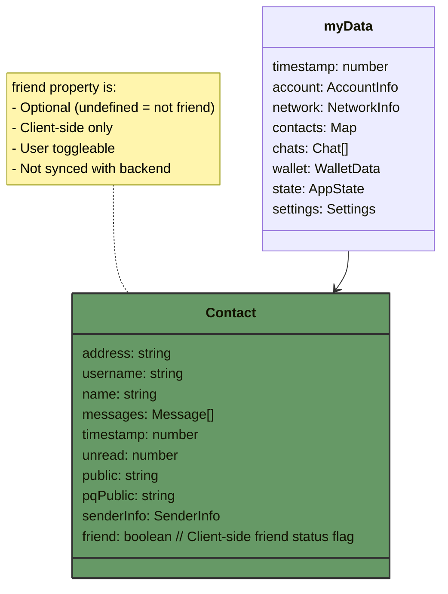
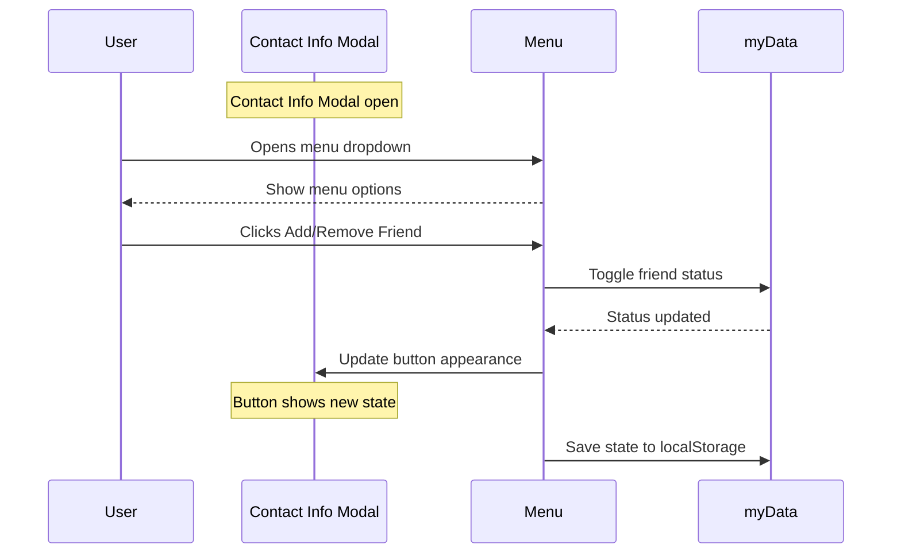
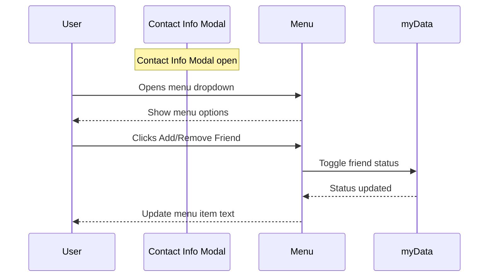

data_structures_flow/friended-flow.md

# Friend Status Flow

This document describes the data structure and flow for marking contacts as friends. This is a client-side only feature that does not affect the backend.

## Data Structure



## Implementation Details

### Contact Info Modal

The friend status is managed through the ContactInfoModalManager class:

```typescript
class ContactInfoModalManager {
  currentContactAddress: string | null; // Tracks current contact being viewed

  // Updates friend button appearance based on status
  updateFriendButton(isFriend: boolean) {
    // Updates text: "Add Friend" ↔ "Remove Friend"
    // Updates icon: plus sign ↔ minus sign
    // Updates colors: green ↔ red
  }
}
```

### Visual States

The friend toggle button has two states:

1. Add Friend (Default):

   - Text: "Add Friend"
   - Icon: Person with plus sign
   - Color: Green (--success-color)
   - Hover: Light green background

2. Remove Friend:
   - Text: "Remove Friend"
   - Icon: Person with minus sign
   - Color: Red (--danger-color)
   - Hover: Light red background

### CSS Implementation

```css
/* Base friend button styles */
.dropdown-item.add-friend {
  color: var(--success-color);
}

/* Remove friend state */
.dropdown-item.add-friend.removing {
  color: var(--danger-color);
}

/* Icons for both states */
.dropdown-icon.add-friend-icon {
  /* Person with plus icon */
}
.dropdown-icon.add-friend-icon.removing {
  /* Person with minus icon */
}
```

### State Management

1. Friend status is stored in contact data:

```javascript
myData.contacts[address].friend = boolean;
```

2. Status is persisted via localStorage:

```javascript
saveState(); // Called after toggling friend status
```

3. Status is loaded when opening contact info:

```javascript
open(displayInfo) {
    const contact = myData.contacts[displayInfo.address];
    this.updateFriendButton(contact.friend || false);
}
```

### Event Flow



### Security and Privacy

- Friend status is client-side only
- Not transmitted to backend or other users
- Persists across sessions via localStorage
- Cleared when account is removed

## Implementation Flow



## Menu Implementation

Add friend option to the contact info modal menu:

```html
<div class="modal-menu-dropdown">
  <button class="menu-item" id="toggleFriend">
    <span class="menu-icon">❤️</span>
    <span class="menu-text">Add Friend</span>
  </button>
  <button class="menu-item" id="openChat">
    <span class="menu-icon">💬</span>
    <span class="menu-text">Open Chat</span>
  </button>
</div>
```

## Event Handling

The event listener should be added when opening the contact info modal:

```typescript
function setupContactInfoMenu(contactAddress) {
  const toggleFriendItem = document.getElementById("toggleFriend");
  const contact = myData.contacts[contactAddress];
  const isFriend = contact?.friend ?? false;

  // Update menu item text based on current status
  toggleFriendItem.querySelector(".menu-text").textContent = isFriend
    ? "Remove Friend"
    : "Add Friend";

  // Add click handler
  toggleFriendItem.addEventListener("click", () => {
    contact.friend = !contact.friend;
    toggleFriendItem.querySelector(".menu-text").textContent = contact.friend
      ? "Remove Friend"
      : "Add Friend";
  });
}
```

## Usage

To check if a contact is marked as friend:

```typescript
const isFriend = myData.contacts[address]?.friend ?? false;
```
