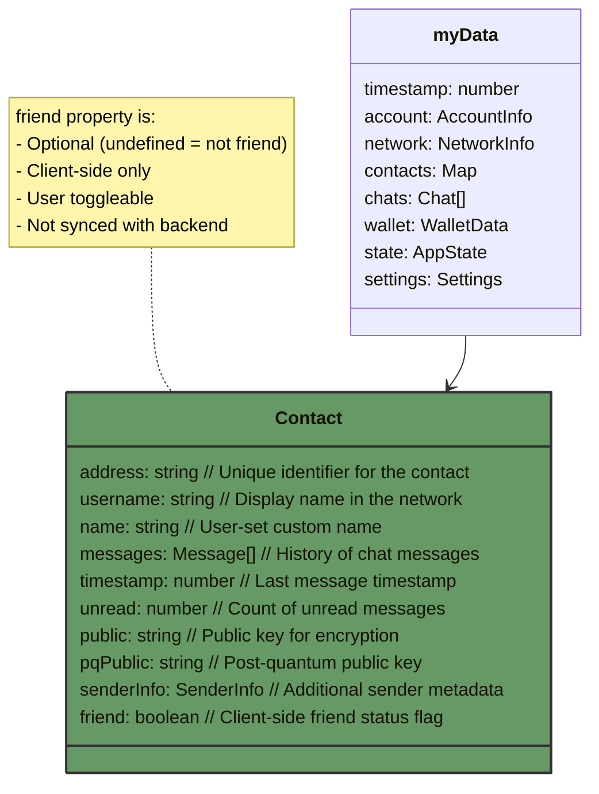
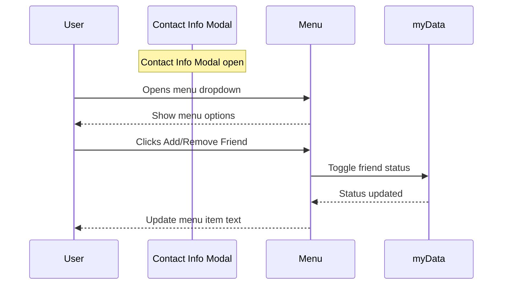

data_structures_flow/friended-flow.md

# Friend Status Flow

This document describes the data structure and flow for marking contacts as friends. This is a client-side only feature that does not affect the backend.

## Data Structure



## Implementation Flow



## Implementation Details

The friend status is stored in the contact data structure:

```typescript
interface ContactData {
  name: string;
  address: string;
  friend?: boolean; // Optional boolean flag to mark contact as friend
  // ... other existing contact properties
}
```

The `friend` property is:

- Optional (undefined means not friended)
- Boolean (true indicates the contact is marked as a friend)
- Client-side only (not synchronized with the backend)
- Can be toggled by the user at any time

## Menu Implementation

Add friend option to the contact info modal menu:

```html
<div class="modal-menu-dropdown">
  <button class="menu-item" id="toggleFriend">
    <span class="menu-icon">❤️</span>
    <span class="menu-text">Add Friend</span>
  </button>
  <button class="menu-item" id="openChat">
    <span class="menu-icon">💬</span>
    <span class="menu-text">Open Chat</span>
  </button>
</div>
```

## Event Handling

The event listener should be added when opening the contact info modal:

```typescript
function setupContactInfoMenu(contactAddress) {
  const toggleFriendItem = document.getElementById("toggleFriend");
  const contact = myData.contacts[contactAddress];
  const isFriend = contact?.friend ?? false;

  // Update menu item text based on current status
  toggleFriendItem.querySelector(".menu-text").textContent = isFriend
    ? "Remove Friend"
    : "Add Friend";

  // Add click handler
  toggleFriendItem.addEventListener("click", () => {
    contact.friend = !contact.friend;
    toggleFriendItem.querySelector(".menu-text").textContent = contact.friend
      ? "Remove Friend"
      : "Add Friend";
  });
}
```

## Usage

To check if a contact is marked as friend:

```typescript
const isFriend = myData.contacts[address]?.friend ?? false;
```

