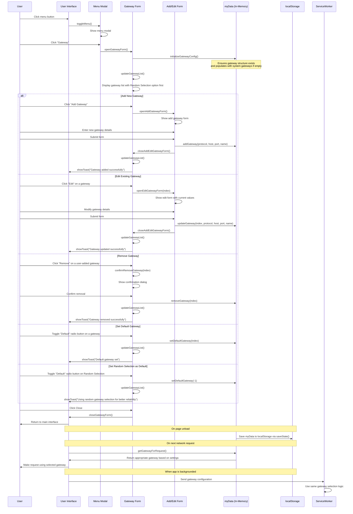

# Gateway Menu Flow

## Overview

This document describes the flow for accessing and configuring Gateway server settings through the menu in the Liberdus application.

## Current Menu Implementation

The menu in Liberdus is implemented as a modal that appears when the user clicks the menu button in the header. The menu contains various options for account management, exporting data, accessing network tools, and more.

The Gateway menu item is now active in the HTML:

```html
<li class="menu-item" id="openNetwork">Gateway</li>
```

## Current Gateway Selection Mechanism

The application now uses a smart gateway selection mechanism that allows users to choose between random selection (for better reliability) or a specific default gateway. This is implemented through the `getGatewayForRequest()` function:

```javascript
// Function to get the gateway to use for a request
function getGatewayForRequest() {
  // Check if myData exists
  if (!myData) {
    // Fall back to global network if available
    if (typeof network !== "undefined" && network?.gateways?.length) {
      return network.gateways[
        Math.floor(Math.random() * network.gateways.length)
      ];
    }
    console.error("No myData or network available");
    return null;
  }

  // Initialize if needed
  initializeGatewayConfig();

  // If we have a default gateway set, use it
  if (
    myData.network.defaultGatewayIndex >= 0 &&
    myData.network.defaultGatewayIndex < myData.network.gateways.length
  ) {
    return myData.network.gateways[myData.network.defaultGatewayIndex];
  }

  // Otherwise use random selection
  return myData.network.gateways[
    Math.floor(Math.random() * myData.network.gateways.length)
  ];
}
```

This selection mechanism provides several advantages over the previous random-only approach:

1. **User Control**: Users can now specify which gateway to use as their default
2. **Reliability Option**: Random selection is still available and recommended for better reliability
3. **Persistence**: The user's gateway preference is stored and persists across sessions
4. **Fallback Mechanism**: If no default is set or myData is not available, it falls back to random selection

## Existing Storage Structure

The application already stores account data in localStorage with a key format of `username_netid`. This data includes a `network` property with a `gateways` array:

```javascript
// Example localStorage entry with key: td10_2f4b9f72089bbfce9f89d3d8e76086daab6ae6f416887c809aab26abb6e5703b
{
    "account": {
        // account details...
    },
    "network": {
        "gateways": []  // Currently empty, but we can use this for gateway storage
    },
    // other properties...
}
```

## Proposed Gateway Management Approach

Based on the application's needs and existing storage structure, we propose the following approach for gateway management:

1. **Maintain Random Selection as Default**:

   - Continue to use random gateway selection as the default behavior
   - This provides basic load balancing and failover capabilities

2. **Add Default Gateway Option**:

   - Allow users to optionally set a preferred default gateway
   - When a default gateway is set, use it instead of random selection
   - If the default gateway fails, fall back to random selection from other gateways

3. **Gateway Management**:

   - Allow users to add custom gateways to the list
   - Users can edit or remove gateways they have added
   - Prevent removal of the system's original gateway to ensure at least one reliable gateway is always available
   - Clearly distinguish between system gateways and user-added gateways

4. **Enhanced Gateway Configuration**:
   - Each gateway entry should include protocol, host, port, and a user-friendly name
   - Add a "default" flag to indicate the user's preferred gateway
   - Add a "system" flag to protect system-provided gateways from deletion

### Storage Approach

We will use the existing storage structure in the application:

1. **Use Existing network.gateways Array in localStorage**:

   - Store gateway configurations in the `network.gateways` array that already exists in the account data
   - Add a `defaultGatewayIndex` property to the `network` object to track the default gateway
   - This is sufficient for gateway configuration and doesn't require IndexedDB storage

2. **Integration with Existing Code**:
   - Load the default gateways from the global `network` object on first run
   - Save user-configured gateways to the account's `network.gateways` array in localStorage
   - When loading, merge the system gateways with any user-configured gateways

### Gateway Configuration Structure

The enhanced gateway configuration structure would look like:

```javascript
// In myData.network
myData.network = {
  gateways: [
    {
      protocol: "https",
      host: "test.liberdus.com",
      port: 3030,
      name: "Liberdus Test Server",
      isSystem: true,
      isDefault: false,
    },
    {
      protocol: "https",
      host: "custom.example.com",
      port: 3030,
      name: "My Custom Server",
      isSystem: false,
      isDefault: true,
    },
  ],
  defaultGatewayIndex: 1, // Index of the default gateway, or -1 if using random selection
};
```

### Sequence Diagram for Gateway Menu Flow



## Implementation Steps for Gateway Menu Feature

1. **Add Gateway Menu Item**:

   - Uncomment or add the Gateway menu item in the menu list in index.html

   ```html
   <li class="menu-item" id="openNetwork">Gateway</li>
   ```

2. **Create Gateway Form Modal**:

   - Add a new modal for Gateway configuration in index.html
   - Include a list view to display all configured gateways
   - Show protocol, host, port, and name for each gateway
   - Include "Edit" and "Remove" buttons for each gateway (disable Remove for system gateways)
   - Add a "Use as Default" toggle for each gateway
   - Include an "Add Gateway" button at the bottom of the list

3. **Create Add/Edit Gateway Form**:

   - Create a form with fields for:
     - Protocol (dropdown with http/https)
     - Host (text input)
     - Port (number input)
     - Name (text input for user-friendly identification)
   - Include validation for all fields
   - Add Save and Cancel buttons

4. **Implement Event Handlers**:

   - Add event listener for the Gateway menu item
   - Implement openGatewayForm() function to display the gateway list
   - Implement functions for adding, editing, and removing gateways
   - Add handler for setting the default gateway

5. **Update Gateway Selection Logic**:

   - Create a getGatewayForRequest() function that:
     - Checks myData.network for gateway configuration
     - Uses the default gateway if set
     - Falls back to random selection if no default is set
   - Update all places in the code that select a gateway to use this function

6. **Add Initialization**:
   - Initialize myData.network.gateways with system gateways if empty
   - Set up myData.network.defaultGatewayIndex if not already defined

## Managing Multiple Gateways

The application is designed to support multiple gateways and randomly selects one when making requests. Here are the best practices for managing multiple gateways:

### UI Design for Multiple Gateways

1. **Gateway List View**:

   - Display all configured gateways in a list
   - Show protocol, host, port, and name for each gateway
   - Include buttons to edit or remove each gateway (where applicable)
   - Add a toggle or radio button to set a gateway as default
   - Add a button to add a new gateway

2. **Add/Edit Gateway Form**:
   - Use the same form for adding and editing gateways
   - Include fields for protocol, host, port, and name
   - Validate inputs before saving

### Implementation Approach

1. **Adding a New Gateway**:

   - When a user submits the form with new gateway details, append the new gateway to myData.network.gateways
   - Set `isSystem` to false for user-added gateways
   - Update the UI to reflect the new gateway in the list

2. **Editing an Existing Gateway**:

   - When a user selects a gateway to edit, populate the form with its current values
   - On save, update the corresponding gateway in myData.network.gateways
   - Update the UI to reflect the changes

3. **Removing a Gateway**:

   - Only allow removal of non-system gateways
   - When a user clicks the remove button for a gateway, confirm the action
   - On confirmation, remove the gateway from myData.network.gateways
   - If the removed gateway was the default, reset to random selection
   - Update the UI to reflect the removal

4. **Setting a Default Gateway**:

   - When a user toggles "Use as Default" for a gateway:
     - Set `isDefault` to true for the selected gateway
     - Set `isDefault` to false for all other gateways
     - Update `defaultGatewayIndex` in myData.network
   - To revert to random selection, provide a "Use Random Selection" option

5. **Initialization**:
   - On application startup, initialize myData.network if needed
   - If myData.network.gateways is empty, populate with system gateways from the global network object
   - Use this configuration for gateway selection

### Example Code for Enhanced Gateway Management

```javascript
// Function to initialize the gateway configuration
function initializeGatewayConfig() {
  // Ensure network property exists
  if (!myData.network) {
    myData.network = {};
  }

  // Ensure gateways array exists
  if (!myData.network.gateways) {
    myData.network.gateways = [];
  }

  // Ensure defaultGatewayIndex property exists
  if (myData.network.defaultGatewayIndex === undefined) {
    myData.network.defaultGatewayIndex = -1; // -1 means use random selection
  }

  // If no gateways, initialize with system gateways
  if (myData.network.gateways.length === 0) {
    // Add system gateways from the global network object
    if (network && network.gateways) {
      network.gateways.forEach((gateway) => {
        myData.network.gateways.push({
          protocol: gateway.protocol,
          host: gateway.host,
          port: gateway.port,
          name: `${gateway.host} (System)`,
          isSystem: true,
          isDefault: false,
        });
      });
    }
  }
}

// Function to open the gateway form
function openGatewayForm() {
  // Close menu modal
  document.getElementById("menuModal").classList.remove("active");

  // Initialize gateway configuration if needed
  initializeGatewayConfig();

  // Show gateway modal
  document.getElementById("gatewayModal").classList.add("active");

  // Populate gateway list
  updateGatewayList();
}

// Function to close the gateway form
function closeGatewayForm() {
  document.getElementById("gatewayModal").classList.remove("active");
}

// Function to update the gateway list display
function updateGatewayList() {
  const gatewayList = document.getElementById("gatewayList");

  // Clear existing list
  gatewayList.innerHTML = "";

  // If no gateways, show empty state
  if (myData.network.gateways.length === 0) {
    gatewayList.innerHTML = `
      <div class="empty-state">
        <div style="font-weight: bold; margin-bottom: 0.5rem">No Gateways</div>
        <div>Add a gateway to get started</div>
      </div>`;
    return;
  }

  // Add each gateway to the list
  myData.network.gateways.forEach((gateway, index) => {
    const isDefault = index === myData.network.defaultGatewayIndex;
    const canRemove = !gateway.isSystem;

    const gatewayItem = document.createElement("div");
    gatewayItem.className = "gateway-item";
    gatewayItem.innerHTML = `
      <div class="gateway-info">
        <div class="gateway-name">${gateway.name}</div>
        <div class="gateway-url">${gateway.protocol}://${gateway.host}:${
      gateway.port
    }</div>
        ${gateway.isSystem ? '<span class="system-badge">System</span>' : ""}
      </div>
      <div class="gateway-actions">
        <label class="default-toggle">
          <input type="radio" name="defaultGateway" ${
            isDefault ? "checked" : ""
          }>
          <span>Default</span>
        </label>
        <button class="edit-button">Edit</button>
        <button class="remove-button" ${
          !canRemove ? "disabled" : ""
        }>Remove</button>
      </div>
    `;

    // Add event listeners
    const defaultToggle = gatewayItem.querySelector('input[type="radio"]');
    defaultToggle.addEventListener("change", () => {
      if (defaultToggle.checked) {
        setDefaultGateway(index);
      }
    });

    const editButton = gatewayItem.querySelector(".edit-button");
    editButton.addEventListener("click", () => {
      openEditGatewayForm(index);
    });

    const removeButton = gatewayItem.querySelector(".remove-button");
    if (canRemove) {
      removeButton.addEventListener("click", () => {
        confirmRemoveGateway(index);
      });
    }

    gatewayList.appendChild(gatewayItem);
  });

  // Add "Use Random Selection" option
  const randomOption = document.createElement("div");
  randomOption.className = "gateway-item random-option";
  randomOption.innerHTML = `
    <div class="gateway-info">
      <div class="gateway-name">Random Selection</div>
      <div class="gateway-url">Use random gateway for each request</div>
    </div>
    <div class="gateway-actions">
      <label class="default-toggle">
        <input type="radio" name="defaultGateway" ${
          myData.network.defaultGatewayIndex === -1 ? "checked" : ""
        }>
        <span>Default</span>
      </label>
    </div>
  `;

  // Add event listener for random selection
  const randomToggle = randomOption.querySelector('input[type="radio"]');
  randomToggle.addEventListener("change", () => {
    if (randomToggle.checked) {
      setDefaultGateway(-1);
    }
  });

  gatewayList.appendChild(randomOption);
}

// Function to add a new gateway
function addGateway(protocol, host, port, name) {
  // Initialize if needed
  initializeGatewayConfig();

  // Add the new gateway
  myData.network.gateways.push({
    protocol,
    host,
    port,
    name,
    isSystem: false,
    isDefault: false,
  });

  // Update the UI
  updateGatewayList();

  // Show success message
  showToast("Gateway added successfully");
}

// Function to update an existing gateway
function updateGateway(index, protocol, host, port, name) {
  // Check if index is valid
  if (index >= 0 && index < myData.network.gateways.length) {
    const gateway = myData.network.gateways[index];

    // Update gateway properties
    gateway.protocol = protocol;
    gateway.host = host;
    gateway.port = port;
    gateway.name = name;

    // Update the UI
    updateGatewayList();

    // Show success message
    showToast("Gateway updated successfully");
  }
}

// Function to remove a gateway
function removeGateway(index) {
  // Check if index is valid
  if (index >= 0 && index < myData.network.gateways.length) {
    const gateway = myData.network.gateways[index];

    // Only allow removing non-system gateways
    if (!gateway.isSystem) {
      // If this was the default gateway, reset to random selection
      if (myData.network.defaultGatewayIndex === index) {
        myData.network.defaultGatewayIndex = -1;
      } else if (myData.network.defaultGatewayIndex > index) {
        // Adjust default gateway index if needed
        myData.network.defaultGatewayIndex--;
      }

      // Remove the gateway
      myData.network.gateways.splice(index, 1);

      // Update the UI
      updateGatewayList();

      // Show success message
      showToast("Gateway removed successfully");
    }
  }
}

// Function to set the default gateway
function setDefaultGateway(index) {
  // Reset all gateways to non-default
  myData.network.gateways.forEach((gateway) => {
    gateway.isDefault = false;
  });

  // Set the new default gateway index
  myData.network.defaultGatewayIndex = index;

  // If setting a specific gateway as default, mark it
  if (index >= 0 && index < myData.network.gateways.length) {
    myData.network.gateways[index].isDefault = true;
  }

  // Update the UI
  updateGatewayList();

  // Show success message
  const message =
    index === -1 ? "Using random gateway selection" : "Default gateway set";
  showToast(message);
}

// Function to get the gateway to use for a request
function getGatewayForRequest() {
  // Check if myData exists
  if (!myData) {
    // Fall back to global network if available
    if (typeof network !== "undefined" && network?.gateways?.length) {
      return network.gateways[
        Math.floor(Math.random() * network.gateways.length)
      ];
    }
    console.error("No myData or network available");
    return null;
  }

  // Initialize if needed
  initializeGatewayConfig();

  // If we have a default gateway set, use it
  if (
    myData.network.defaultGatewayIndex >= 0 &&
    myData.network.defaultGatewayIndex < myData.network.gateways.length
  ) {
    return myData.network.gateways[myData.network.defaultGatewayIndex];
  }

  // Otherwise use random selection
  return myData.network.gateways[
    Math.floor(Math.random() * myData.network.gateways.length)
  ];
}

// Function to handle the gateway form submission
function handleGatewayFormSubmit(event) {
  event.preventDefault();

  // Get form data
  const formData = {
    protocol: document.getElementById("gatewayProtocol").value,
    host: document.getElementById("gatewayHost").value,
    port: parseInt(document.getElementById("gatewayPort").value),
    name: document.getElementById("gatewayName").value,
  };

  // Get the edit index (if editing)
  const editIndex = parseInt(document.getElementById("gatewayEditIndex").value);

  if (editIndex >= 0) {
    // Update existing gateway
    updateGateway(
      editIndex,
      formData.protocol,
      formData.host,
      formData.port,
      formData.name
    );
  } else {
    // Add new gateway
    addGateway(formData.protocol, formData.host, formData.port, formData.name);
  }

  // Close the form
  closeAddEditGatewayForm();
}

// Replace all instances of random gateway selection with getGatewayForRequest()
// For example, instead of:
// const randomGateway = network.gateways[Math.floor(Math.random() * network.gateways.length)];
// Use:
// const gateway = getGatewayForRequest();
```

## Implementation Status

The Gateway management feature has been fully implemented with the following components:

### HTML Implementation

- [x] Added Gateway Modal to index.html
- [x] Added Gateway Add/Edit Form Modal to index.html

### CSS Implementation

- [x] Added Gateway List Styles to styles.css
- [x] Added styling for the Random Selection option to make it visually distinct

### JavaScript Implementation

- [x] Added Event Listeners for Gateway Menu Item and related buttons
- [x] Implemented Gateway Form Functions
  - [x] `openGatewayForm()` - Opens the gateway modal and displays the list
  - [x] `closeGatewayForm()` - Closes the gateway modal
  - [x] `updateGatewayList()` - Renders the gateway list in the UI with Random Selection first
- [x] Implemented Add/Edit Gateway Form Functions
  - [x] `openAddGatewayForm()` - Opens the form for adding a new gateway
  - [x] `openEditGatewayForm(index)` - Opens the form for editing an existing gateway
  - [x] `closeAddEditGatewayForm()` - Closes the add/edit form
  - [x] `handleGatewayForm(event)` - Handles the form submission
- [x] Implemented Gateway Management Functions
  - [x] `initializeGatewayConfig()` - Sets up the network structure if it doesn't exist
  - [x] `addGateway(protocol, host, port, name)` - Adds a new gateway
  - [x] `updateGateway(index, protocol, host, port, name)` - Updates an existing gateway
  - [x] `removeGateway(index)` - Removes a gateway
  - [x] `confirmRemoveGateway(index)` - Shows confirmation before removing
  - [x] `setDefaultGateway(index)` - Sets the default gateway with improved messaging
- [x] Implemented Gateway Selection Function
  - [x] `getGatewayForRequest()` - Gets the appropriate gateway for a request with fallbacks
- [x] Updated Existing Code to Use New Gateway Selection
  - [x] Replaced all instances of random gateway selection with `getGatewayForRequest()`
  - [x] Added proper error handling for cases where no gateway is available
- [x] Added Service Worker Integration
  - [x] Updated `setupAppStateManagement()` to send gateway configuration to service worker

### New User Experience

- [x] Updated `newDataRecord()` to initialize gateway configuration for new users
- [x] Set random selection as the default for new users for better reliability
- [x] Added clear visual indication that random selection is recommended

### Testing Checklist

- [ ] Test Adding a Gateway
  - [ ] Verify the gateway is added to myData.network.gateways
  - [ ] Verify the UI is updated to show the new gateway
- [ ] Test Editing a Gateway
  - [ ] Verify the gateway properties are updated in myData.network.gateways
  - [ ] Verify the UI is updated to show the changes
- [ ] Test Removing a Gateway
  - [ ] Verify the gateway is removed from myData.network.gateways
  - [ ] Verify the UI is updated to remove the gateway
  - [ ] Verify system gateways cannot be removed
- [ ] Test Setting a Default Gateway
  - [ ] Verify the defaultGatewayIndex is updated in myData.network
  - [ ] Verify the UI shows the correct gateway as default
  - [ ] Verify network requests use the default gateway
- [ ] Test Random Selection
  - [ ] Verify setting defaultGatewayIndex to -1 enables random selection
  - [ ] Verify network requests use random selection when no default is set
  - [ ] Verify the "Recommended" badge is displayed for the Random Selection option
