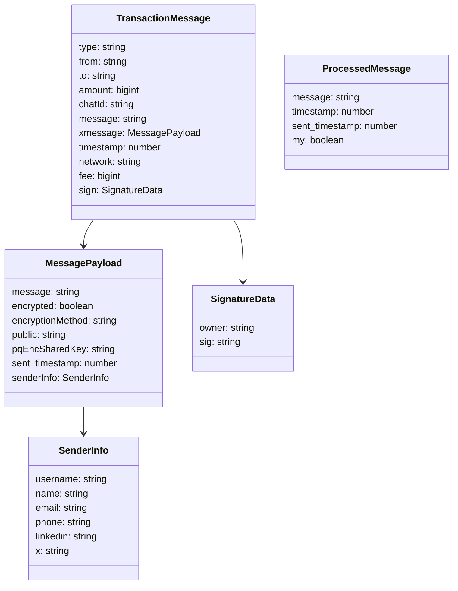
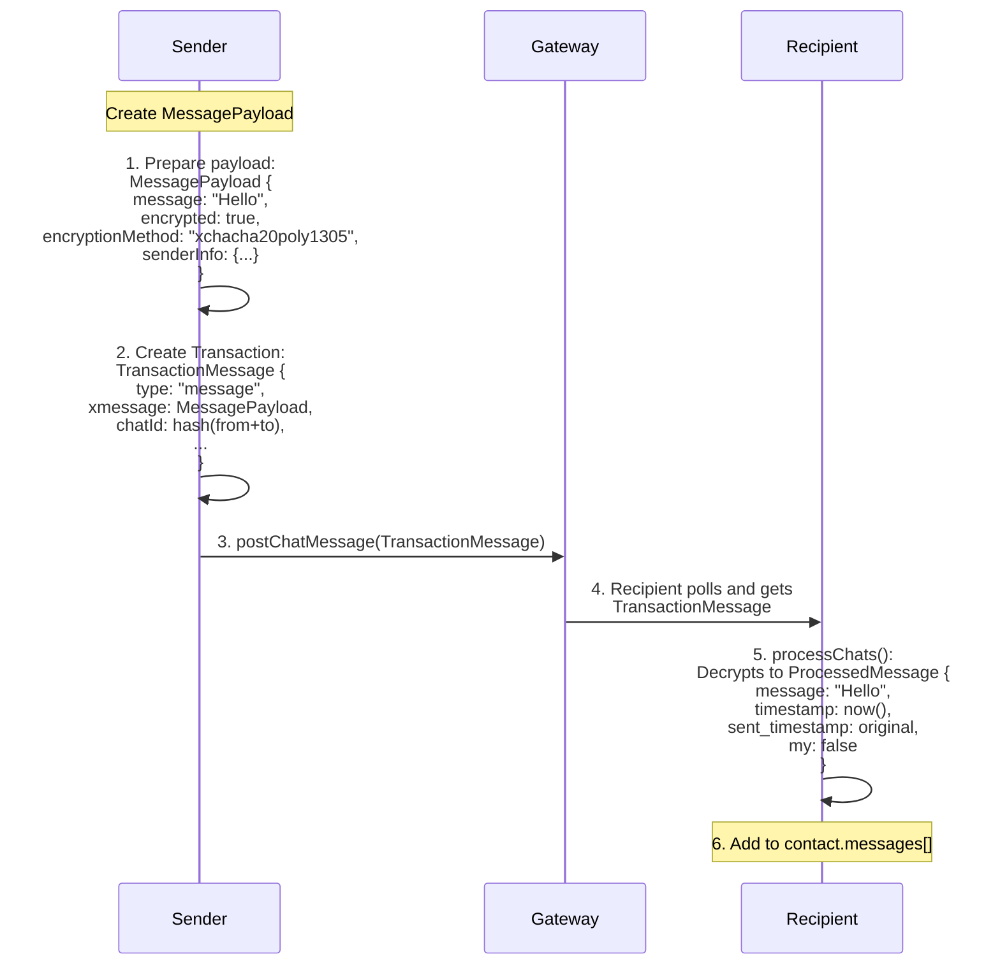
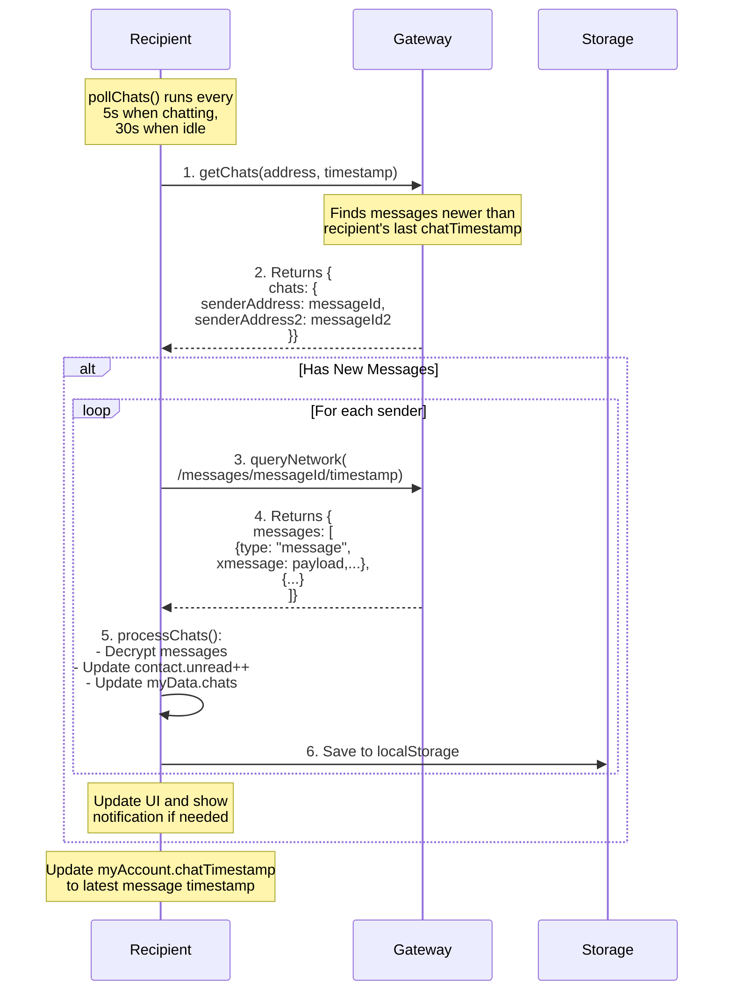
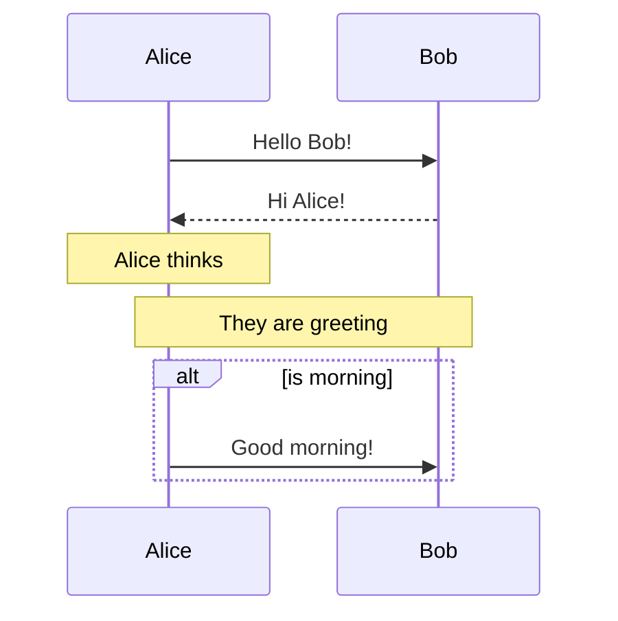

## Message Data Structures

## Message Flow with Data

Key Points:

- Message Creation:

  - Sender creates MessagePayload with encrypted content
  - Wraps payload in TransactionMessage for network transmission
  - Adds toll payment and signatures

- Data Transformation:

  - Raw message → Encrypted MessagePayload → Signed TransactionMessage
  - Network processes transaction and toll payment
  - Recipient decrypts back to ProcessedMessage format

- Storage:
  - Final message stored in recipient's contact.messages array
  - Updates chat list and unread counts
  - Maintains original timestamps for ordering

## Message Discovery Flow

Key Points:

- Polling Strategy:

  - Regular checks for new messages via pollChats()
  - 5-second intervals when actively chatting
  - 30-second intervals when idle
  - Uses chatTimestamp to only fetch new messages

- Two-Step Message Retrieval:

  - Step 1: Get list of new messages by sender
  - Step 2: Fetch full message content for each sender
  - Efficient batching of messages per sender

- Message Processing:
  - Decrypts messages using hybrid encryption
  - Updates contact's unread count
  - Updates chat list order
  - Saves to localStorage for persistence

## Sequence Diagram Example

