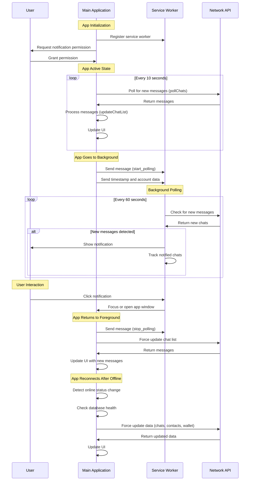

# Current Implementation of Notification Flow

## Sequence Diagram



## Overview

The notification system in the application is designed to alert users about new messages when the app is in the background or closed. The system leverages the Service Worker API to poll for new messages and display notifications to the user.

## Components

### 1. Service Worker (`service-worker.js`)

The service worker acts as a background process that can run even when the main application is closed or in the background. It handles:

- Message polling
- Notification display
- Notification click handling

### 2. Main Application (`app.js`)

The main application handles:

- Service worker registration
- Notification permission requests
- Coordination with the service worker based on app visibility state
- Message processing when the app is active

## Notification Flow

### Service Worker Registration

1. The application registers a service worker during initialization:

   ```javascript
   async function registerServiceWorker() {
     // Register service worker
     const registration = await navigator.serviceWorker.register(
       "./service-worker.js",
       {
         scope: "./",
         updateViaCache: "none",
       }
     );
   }
   ```

2. The service worker is set up to handle various events including installation, activation, and message handling.

### Notification Permission

1. The application requests notification permission from the user:
   ```javascript
   function requestNotificationPermission() {
     if ("Notification" in window && Notification.permission === "default") {
       Notification.requestPermission().then((permission) => {
         console.log("Notification permission result:", permission);
       });
     }
   }
   ```

### App State Management

1. When the app goes to the background (document hidden):

   ```javascript
   document.addEventListener("visibilitychange", async () => {
     if (document.hidden) {
       // App is being hidden/closed
       const timestamp = Date.now().toString();
       localStorage.setItem("appPaused", timestamp);

       // Start polling in service worker
       registration.active?.postMessage({
         type: "start_polling",
         timestamp,
         account: accountData,
       });
     } else {
       // App is becoming visible/open
       localStorage.setItem("appPaused", "0");

       // Stop polling in service worker
       registration.active?.postMessage({ type: "stop_polling" });

       // Update chat list to show any new messages
       await updateChatList("force");
     }
   });
   ```

### Message Polling (Service Worker)

1. The service worker maintains a state object:

   ```javascript
   const state = {
     pollInterval: null,
     timestamp: null,
     account: null,
     lastPollTime: 0,
     notifiedChats: new Set(),
   };
   ```

2. When polling starts:

   ```javascript
   function startPolling() {
     if (state.pollInterval) return;

     console.log("Starting message polling");
     state.pollInterval = setInterval(checkForNewMessages, 60000);
     checkForNewMessages();
   }
   ```

3. The polling function checks for new messages:

   ```javascript
   async function checkForNewMessages() {
     try {
       // Query for new messages
       const url = `${gateway.protocol}://${gateway.host}:${
         gateway.port
       }/account/${paddedAddress}/chats/${
         state.lastPollTime || state.timestamp
       }`;

       const response = await fetch(url);
       const { chats } = await response.json();

       // Track new chats
       const newChats = new Set(
         Object.values(chats).filter(
           (chatId) => !state.notifiedChats.has(chatId)
         )
       );

       if (newChats.size > 0) {
         await showNotification(newChats.size);
         newChats.forEach((chatId) => state.notifiedChats.add(chatId));
         state.lastPollTime = parseInt(state.timestamp);
       }
     } catch (error) {
       console.error("❌ Error checking messages:", error);
     }
   }
   ```

### Notification Display

1. When new messages are detected, the service worker shows a notification:

   ```javascript
   async function showNotification(chatCount) {
     if (self.Notification?.permission !== "granted") {
       return;
     }

     try {
       const notificationText =
         chatCount === 1
           ? "You have new messages in a conversation"
           : `You have new messages in ${chatCount} conversations`;

       await self.registration.showNotification("New Messages", {
         body: notificationText,
         icon: "./liberdus_logo_250.png",
         badge: "./liberdus_logo_250.png",
         tag: "new-messages",
         renotify: true,
       });
     } catch (error) {
       console.error("❌ Error showing notification:", error);
     }
   }
   ```

### Notification Click Handling

1. When a notification is clicked, the service worker handles the event:

   ```javascript
   self.addEventListener("notificationclick", (event) => {
     event.notification.close();

     // Focus existing window or open new one
     event.waitUntil(
       clients.matchAll({ type: "window" }).then((clientList) => {
         // Try to find a client that matches our scope
         for (const client of clientList) {
           if (client.url.startsWith(swScope) && "focus" in client) {
             return client.focus();
           }
         }
         // If no matching client found, open a new window
         if (clients.openWindow) {
           return clients.openWindow(swScope);
         }
       })
     );
   });
   ```

### App Reconnection Handling

1. When the app comes back online after being offline:

   ```javascript
   async function handleConnectivityChange(event) {
     const wasOffline = !isOnline;
     isOnline = navigator.onLine;

     if (isOnline && wasOffline) {
       // We just came back online
       updateUIForConnectivity();
       showToast("You're back online!", 3000, "online");

       // Check database health after reconnection
       const dbHealthy = await checkDatabaseHealth();
       if (!dbHealthy) {
         console.warn(
           "Database appears to be in an unhealthy state, reloading app..."
         );
         showToast(
           "Database issue detected, reloading application...",
           3000,
           "warning"
         );
         setTimeout(() => window.location.reload(), 3000);
         return;
       }

       // Force update data with reconnection handling
       if (myAccount && myAccount.keys) {
         try {
           // Update chats with reconnection handling
           await updateChatList("force");

           // Update contacts with reconnection handling
           await updateContactsList();

           // Update wallet with reconnection handling
           await updateWalletView();
         } catch (error) {
           console.error("Failed to update data on reconnect:", error);
         }
       }
     }
   }
   ```

## Message Processing

1. When the app is active, it polls for messages directly:

   ```javascript
   async function pollChats() {
     if (pollChats.nextPoll < 100) {
       return;
     }
     const now = Date.now();
     if (pollChats.lastPoll + pollChats.nextPoll <= now) {
       updateChatList();
       if (
         document.getElementById("walletScreen").classList.contains("active")
       ) {
         await updateWalletView();
       }
       pollChats.lastPoll = now;
     }
     if (pollChats.timer) {
       clearTimeout(pollChats.timer);
     }
     pollChats.timer = setTimeout(pollChats, pollChats.nextPoll);
   }
   ```

2. The `getChats` function retrieves new messages:

   ```javascript
   async function getChats(keys) {
     const timestamp = myAccount.chatTimestamp || 0;
     const senders = await queryNetwork(
       `/account/${longAddress(keys.address)}/chats/${timestamp}`
     );
     const chatCount = Object.keys(senders.chats).length;

     if (senders && senders.chats && chatCount) {
       await processChats(senders.chats, keys);
     }

     return chatCount;
   }
   ```

## Summary

The notification flow works as follows:

1. When the app is active, it polls for messages directly using `pollChats()` and `getChats()`.
2. When the app goes to the background, it sends a message to the service worker to start polling.
3. The service worker polls for new messages at regular intervals (60 seconds).
4. When new messages are detected, the service worker shows a notification.
5. When a notification is clicked, the service worker focuses or opens the app.
6. When the app becomes active again, it stops the service worker polling and updates the UI with any new messages.
