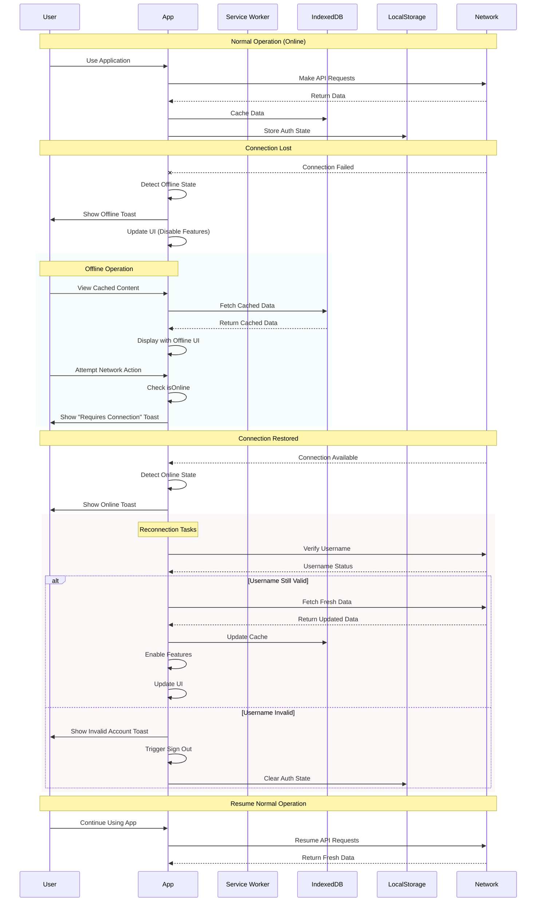
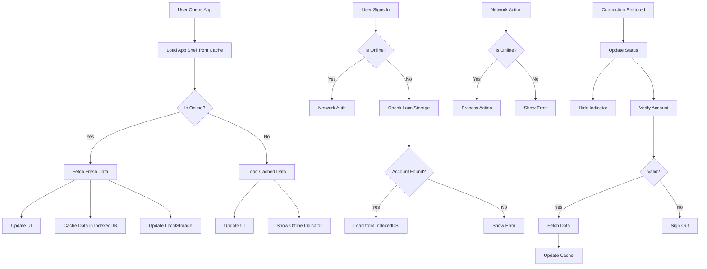
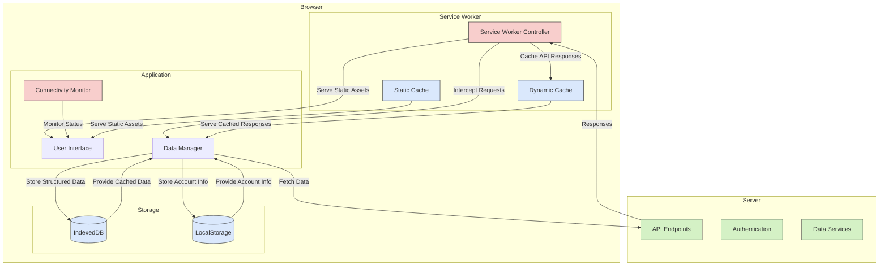
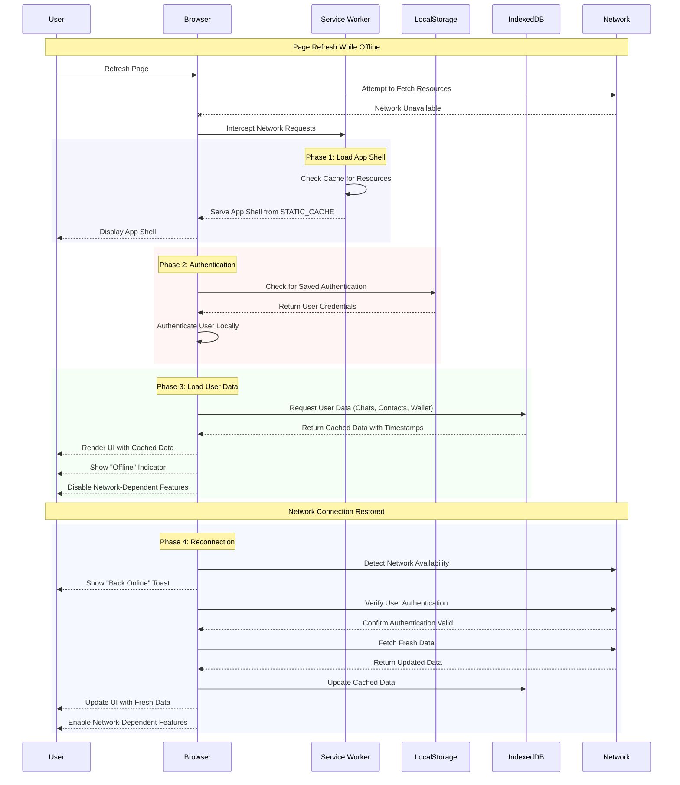

# Offline Functionality Plan

## Overview

This document outlines the comprehensive offline-first strategy for our PWA, ensuring users have a seamless experience regardless of network connectivity. The plan follows best practices from the Offline Cookbook and modern PWA patterns.

Use this diff to see the changes made to the original document:

```
git diff 1c17a4b7346a790091a68bd7f703a3430417e448 5937e5c41450ec79fcf5a3f52c812e5660ecc79e > diff_output.diff
```

## Core Requirements

1. Provide a full offline-first experience with graceful degradation
2. Cache all critical resources for instant loading
3. Enable offline access to user data (chats, contacts, wallet info)
4. Handle dynamic content and API requests appropriately
5. Provide clear feedback about connectivity status and available actions
6. Ensure data consistency between online/offline states
7. Handle page refreshes in offline mode

## Offline Feature Flow



## Implementation Guide

### How Offline Mode Works

When a user goes offline:

1. The app detects the connectivity change through browser events and network checks
2. UI elements that require connectivity are automatically disabled with visual indicators
3. A toast notification informs the user they're offline
4. The app switches to using cached data from IndexedDB
5. Network-dependent actions show tooltips explaining they require connectivity

When a user comes back online:

1. The app verifies connectivity with a network check
2. UI elements are re-enabled
3. A toast notification informs the user they're back online
4. The app verifies the user's account is still valid on the network
5. Cached data is refreshed with the latest from the server

### Key Components

1. **Service Worker**

   - Intercepts network requests
   - Serves cached resources when offline
   - Provides an offline fallback page when needed
   - Manages cache versions and updates

2. **IndexedDB**

   - Stores structured data for offline access
   - Maintains versioning for data consistency
   - Provides fast access to cached user data

3. **Connectivity Detection**

   - Monitors online/offline status
   - Performs periodic connectivity checks
   - Updates UI based on connectivity state

4. **UI Adaptation**
   - Disables network-dependent elements when offline
   - Provides visual feedback about offline state
   - Shows helpful tooltips for disabled actions

### Implementation Details

```javascript
// Global connectivity state
let isOnline = true; // Will be updated by connectivity checks

// Setup connectivity detection
function setupConnectivityDetection() {
  // Listen for browser online/offline events
  window.addEventListener("online", handleConnectivityChange);
  window.addEventListener("offline", handleConnectivityChange);

  // Mark elements that depend on connectivity
  markConnectivityDependentElements();

  // Check initial status (don't trust the browser's initial state)
  checkConnectivity();

  // Periodically check connectivity (every 30 seconds)
  setInterval(checkConnectivity, 30000);
}

// Check connectivity status
async function checkConnectivity() {
  const wasOffline = !isOnline;
  isOnline = await checkOnlineStatus();

  if (isOnline !== wasOffline) {
    // Only trigger change handler if state actually changed
    await handleConnectivityChange({ type: isOnline ? "online" : "offline" });
  }
}

// Mark elements that should be disabled when offline
function markConnectivityDependentElements() {
  // Elements that require network connectivity
  const networkDependentElements = [
    // Chat related
    "#handleSendMessage",
    ".message-input",
    "#newChatButton",

    // Wallet related
    "#openSendModal",
    "#refreshBalance",
    '#sendForm button[type="submit"]',

    // Contact related
    "#chatRecipient",

    // Profile related
    '#accountForm button[type="submit"]',
    '#createAccountForm button[type="submit"]',
    '#importForm button[type="submit"]',
  ];

  // Add data attribute to all network-dependent elements
  networkDependentElements.forEach((selector) => {
    const elements = document.querySelectorAll(selector);
    elements.forEach((element) => {
      element.setAttribute("data-requires-connection", "true");

      // Add tooltip for disabled state
      element.title = "This feature requires an internet connection";

      // Add aria label for accessibility
      element.setAttribute("aria-disabled", !isOnline);
    });
  });
}

// Update UI elements based on connectivity status
function updateUIForConnectivity() {
  const networkDependentElements = document.querySelectorAll(
    "[data-requires-connection]"
  );
  const offlineIndicator = document.getElementById("offlineIndicator");

  // Update offline indicator in header
  if (offlineIndicator) {
    if (!isOnline) {
      offlineIndicator.style.opacity = "1";
      offlineIndicator.style.visibility = "visible";
      offlineIndicator.style.width = "auto";
      offlineIndicator.style.padding = "4px 8px";
      offlineIndicator.style.overflow = "visible";
    } else {
      offlineIndicator.style.opacity = "0";
      offlineIndicator.style.visibility = "hidden";
      offlineIndicator.style.width = "0";
      offlineIndicator.style.padding = "0";
      offlineIndicator.style.overflow = "hidden";
    }
  }

  networkDependentElements.forEach((element) => {
    if (!isOnline) {
      // Disable element
      element.disabled = true;
      element.classList.add("offline-disabled");

      // If it's a form, prevent submission
      if (element.form) {
        element.form.addEventListener("submit", preventOfflineSubmit);
      }
    } else {
      // Enable element
      element.disabled = false;
      element.classList.remove("offline-disabled");

      // Remove form submit prevention
      if (element.form) {
        element.form.removeEventListener("submit", preventOfflineSubmit);
      }
    }

    // Update aria-disabled state
    element.setAttribute("aria-disabled", !isOnline);
  });
}

// Prevent form submissions when offline
function preventOfflineSubmit(event) {
  if (!isOnline) {
    event.preventDefault();
    showToast("This action requires an internet connection", 3000, "error");
  }
}

// Enhanced username availability check with offline support
async function checkUsernameAvailability(username, address) {
  // First check if we're offline
  if (!isOnline) {
    console.log("Checking username availability offline");
    // When offline, check local storage only
    const { netid } = network;
    const existingAccounts = parse(
      localStorage.getItem("accounts") || '{"netids":{}}'
    );
    const netidAccounts = existingAccounts.netids[netid];

    // If we have this username locally and the address matches
    if (
      netidAccounts?.usernames &&
      netidAccounts.usernames[username] &&
      normalizeAddress(netidAccounts.usernames[username].address) ===
        normalizeAddress(address)
    ) {
      console.log("Username found locally and matches address");
      return "mine";
    }

    // If we have the username but address doesn't match
    if (netidAccounts?.usernames && netidAccounts.usernames[username]) {
      console.log("Username found locally but address does not match");
      return "taken";
    }

    // Username not found locally
    console.log("Username not found locally");
    return "available";
  }

  // Online flow - existing implementation
  const randomGateway =
    network.gateways[Math.floor(Math.random() * network.gateways.length)];
  const usernameBytes = utf82bin(normalizeUsername(username));
  const usernameHash = blake.blake2bHex(usernameBytes, myHashKey, 32);
  try {
    const response = await fetch(
      `${randomGateway.protocol}://${randomGateway.host}:${randomGateway.port}/address/${usernameHash}`
    );
    const data = await response.json();
    if (data && data.address) {
      if (
        address &&
        normalizeAddress(data.address) === normalizeAddress(address)
      ) {
        return "mine";
      }
      return "taken";
    }
    if (!data) {
      return "error";
    }
    return "available";
  } catch (error) {
    console.log("Error checking username:", error);
    return "error2";
  }
}
```

## Caching Strategy

### Cache Types

1. **STATIC_CACHE** (v{timestamp})
   - Shell resources (HTML, CSS, JS, images)
   - Font files and icons
   - Manifest and other app metadata
2. **DYNAMIC_CACHE** (v{timestamp})
   - API responses
   - Dynamically loaded content
   - User-specific data

Note: Structured application data (chats, contacts, wallet information) is stored in IndexedDB rather than in a Service Worker cache. This provides better query capabilities and performance for structured data.

### Caching Patterns

1. **Cache First, Network Fallback**

   - Use for: Static assets, app shell, fonts, images
   - Implementation: Check cache → Return if found → Fetch from network if missing
   - Benefits: Fastest possible load time for static content

2. **Stale While Revalidate**

   - Use for: Frequently updated API responses, user profile data
   - Implementation: Return from cache → Fetch update → Cache update for next time
   - Benefits: Quick response while keeping content fresh

3. **Network First, Cache Fallback**

   - Use for: Chat messages, transaction history
   - Implementation: Try network → Use cache if offline → Update cache when online
   - Benefits: Always fresh content when possible, graceful offline fallback

4. **Cache Only**
   - Use for: App shell after initial install
   - Implementation: Serve directly from cache
   - Benefits: Guaranteed offline functionality

### Precaching Strategy

1. **Install Phase**

   ```javascript
   const PRECACHE_URLS = [
     "./",
     "./index.html",
     "./styles.css",
     "./app.js",
     "./manifest.json",
     "./offline.html",
     "./images/logo.png",
     "./liberdus_logo_50.png",
     "./liberdus_logo_250.png",
     "./lib.js",
     "./network.js",
     // Add all critical assets
   ];
   ```

2. **Runtime Caching Rules**

   ```javascript
   // Helper function to determine caching strategy based on request
   function getCacheStrategy(request) {
     const url = new URL(request.url);

     // Static assets - Cache First
     if (
       request.destination === "style" ||
       request.destination === "script" ||
       request.destination === "image" ||
       request.destination === "font" ||
       PRECACHE_URLS.includes(url.pathname)
     ) {
       return "cache-first";
     }

     // API endpoints that should not be cached - Network Only
     if (shouldNotCache(request)) {
       return "network-only";
     }

     // API endpoints - Network First
     if (url.pathname.startsWith("/api/")) {
       return "network-first";
     }

     // HTML navigation - Cache First for offline support
     if (request.mode === "navigate") {
       return "cache-first";
     }

     // Default to network first
     return "network-first";
   }
   ```

## Data Management

### IndexedDB Structure

1. **Chats Store**

   - Key: chatId
   - Value: {chats[], contacts{}, version, lastUpdated}

2. **Contacts Store**

   - Key: address
   - Value: {contacts{}, version, lastUpdated}

3. **Wallet Store**
   - Key: assetId
   - Value: {wallet{}, version, lastUpdated}

### Offline Data Access

1. **Data Storage**

   ```javascript
   // Import database functions
   import { STORES, saveData, getData, getAllData } from "./db.js";

   // Add version information to data before saving
   function addVersion(data) {
     return {
       ...data,
       version: Date.now(),
       lastUpdated: Date.now(),
     };
   }

   // Example of saving chat data
   const chatData = addVersion({
     chatId: myAccount.keys.address,
     chats: myData.chats,
     contacts: myData.contacts,
   });
   await saveData(STORES.CHATS, chatData);
   ```

2. **Data Access Strategy**
   - Cache data in IndexedDB when online
   - Read from IndexedDB when offline
   - Update local data when back online
   - Maintain "last updated" timestamps

## UI/UX Considerations

### Offline Indicators

1. **Toast Notifications**

   - Show toast when going offline: "You're offline. Some features are unavailable."
   - Show toast when coming back online: "You're back online!"

2. **Action-Specific Feedback**

   - Disabled state for offline-incompatible actions
   - Visual indicators for disabled elements
   - Clear error messages for failed operations
   - Tooltips explaining why features are disabled

3. **Visual Styling**

   ```css
   /* Offline indicator in header */
   .offline-indicator {
     background-color: var(--danger-color);
     color: white;
     font-size: 12px;
     font-weight: 600;
     padding: 4px 8px;
     border-radius: 12px;
     opacity: 0;
     visibility: hidden;
     transition: opacity 0.3s ease, width 0.3s ease, padding 0.3s ease;
     animation: pulse 2s infinite;
     /* Keep in the normal flow but with zero width when hidden */
     display: flex;
     align-items: center;
     justify-content: center;
     height: 24px;
     margin-right: 4px;
     width: 0;
     padding: 0;
     overflow: hidden;
   }

   /* Disabled elements styling */
   .offline-disabled {
     opacity: 0.6;
     cursor: not-allowed !important;
     position: relative;
     pointer-events: none;
     background-color: var(--hover-background) !important;
   }

   /* Tooltip for disabled elements */
   .offline-disabled:hover::after {
     content: "Requires internet connection";
     position: absolute;
     bottom: 100%;
     left: 50%;
     transform: translateX(-50%);
     background: rgba(0, 0, 0, 0.8);
     color: white;
     padding: 8px 12px;
     border-radius: 4px;
     font-size: 12px;
     white-space: nowrap;
     z-index: 1000;
     pointer-events: none;
   }
   ```

### Progressive Enhancement

1. **Feature Detection**

   ```javascript
   if ("serviceWorker" in navigator) {
     // Enable PWA features
     await registerServiceWorker();
     setupServiceWorkerMessaging();
     setupAppStateManagement();
     setupConnectivityDetection();
   }
   ```

2. **Graceful Degradation**
   - Fallback content for uncached resources
   - Simplified UI for unsupported features
   - Clear messaging about limited functionality
   - Offline fallback page with helpful information

## Error Handling

### Network Failures

1. **Request Timeouts**

   - Implement appropriate timeout periods
   - Clear feedback about network status

2. **Offline State Management**
   - Global `isOnline` variable to track connectivity
   - Periodic connectivity checks
   - Automatic UI updates based on connectivity

## Progress Update

### Completed Items ✅

1. **Service Worker Setup**

   - ✅ Implemented service worker registration with version management
   - ✅ Added caching strategies for offline access
   - ✅ Implemented update notification system
   - ✅ Added resilient service worker installation that doesn't fail when offline
   - ✅ Added cache cleanup and maintenance
   - ✅ Implemented proper cache versioning

2. **Offline Page**

   - ✅ Created offline.html fallback page
   - ✅ Implemented proper styling matching app's design system
   - ✅ Added clear user feedback about available/unavailable features
   - ✅ Added retry connection button

3. **Connectivity Detection**

   - ✅ Implemented global `isOnline` state variable
   - ✅ Added event listeners for online/offline events
   - ✅ Created `setupConnectivityDetection()` function
   - ✅ Implemented `handleConnectivityChange()` for state updates
   - ✅ Added periodic connectivity checks
   - ✅ Improved online detection with network verification
   - ✅ Added `checkConnectivity()` function for reliable status checks

4. **UI/UX Implementation**

   - ✅ Implemented `markConnectivityDependentElements` function
   - ✅ Added visual feedback for offline-disabled elements
   - ✅ Implemented tooltips for disabled elements
   - ✅ Added form submission prevention when offline
   - ✅ Integrated with toast notification system
   - ✅ Added CSS styles for offline states
   - ✅ Added persistent offline indicator in header
   - ✅ Implemented update notification UI

5. **Data Storage**

   - ✅ Implemented IndexedDB setup with three stores (chats, contacts, wallet)
   - ✅ Added data versioning for consistency tracking
   - ✅ Implemented caching of chat data when online
   - ✅ Implemented caching of contacts data when online
   - ✅ Implemented caching of wallet data when online
   - ✅ Added offline data access for all stores
   - ✅ Added data validation for IndexedDB operations
   - ✅ Implemented error handling for database operations

6. **Component Implementation**

   - ✅ Updated `updateChatList()` to handle offline mode
   - ✅ Updated `updateContactsList()` to handle offline mode
   - ✅ Updated `updateWalletView()` to handle offline mode
   - ✅ Added conditional polling based on connectivity
   - ✅ Improved chat message handling to always include username info

7. **Authentication Improvements**
   - ✅ Enhanced `checkUsernameAvailability()` to support offline sign-in
   - ✅ Added local storage verification for usernames when offline
   - ✅ Implemented `verifyUsernameOnReconnect()` to validate accounts when coming back online
   - ✅ Added graceful sign-out for invalid accounts after reconnection

## Future Work

### High Priority

- [ ] **Data Conflict Resolution**

  - Implement strategies for resolving conflicts between cached and server data
  - Add merge algorithms for data modified while offline
  - Create versioning system to track changes across devices

- [ ] **Enhanced Security**

  - Implement encryption for sensitive cached data
  - Add secure credential storage for offline authentication
  - Implement data sanitization for stored content

- [ ] **Comprehensive Testing**
  - Test service worker installation and updates
  - Verify caching strategies effectiveness
  - Test offline page functionality
  - Validate offline element disabling
  - Test offline data access and sync
  - Test offline sign-in and reconnection verification

### Medium Priority

- [ ] **Background Sync**

  - Implement background sync for pending messages
  - Add offline transaction queue with retry mechanism
  - Create sync status indicators for users

- [ ] **Performance Optimization**
  - Optimize cache storage usage and management
  - Implement performance monitoring for offline operations
  - Add cache pruning for old or infrequently accessed data

### Low Priority

- [ ] **Advanced Offline Features**

  - Implement offline account creation with pending network registration
  - Add offline content prefetching based on user behavior
  - Create offline usage analytics

- [ ] **Edge Case Handling**
  - Handle storage limits and quota exceeded scenarios
  - Implement recovery mechanisms for corrupted cache
  - Add fallbacks for unsupported browsers

## User Experience Guide

### What Users Can Do Offline

- View existing chats and messages
- Access contact information
- Check wallet balances and transaction history
- Navigate between different app sections
- View profile information

### What Users Cannot Do Offline

- Send new messages
- Make transactions
- Add or modify contacts
- Update account information
- Refresh balances

### How Users Are Informed

- Offline indicator in the header shows "Offline" status
- Toast notification appears when connectivity changes
- Network-dependent buttons and inputs are visually disabled
- Tooltips explain why features are unavailable
- Offline fallback page provides clear information when navigating to uncached pages

## Storage Strategy Summary

### Storage Mechanisms Overview

The offline functionality uses three different types of storage mechanisms, each with a specific purpose:

1. **Service Worker Cache** - For static assets and resources
2. **IndexedDB** - For structured application data
3. **LocalStorage** - For account information and authentication

#### Service Worker Cache

The Service Worker manages two main cache types:

- **STATIC_CACHE**: Stores static resources that rarely change

  - HTML, CSS, and JavaScript files
  - Images, fonts, and icons
  - The app shell (core UI components)
  - The offline fallback page

- **DYNAMIC_CACHE**: Stores resources that might change more frequently
  - API responses that are cacheable
  - Dynamically loaded content

The caching strategy varies based on the type of resource:

- **Cache First** is used for static assets (CSS, JS, images) - checks the cache first, falls back to network
- **Network First** is used for API endpoints - tries the network first, falls back to cache if offline
- **Network Only** is used for sensitive data that shouldn't be cached (authentication endpoints)

#### IndexedDB

IndexedDB is used to store structured application data in three main stores:

- **Chats Store**:

  - Key: `chatId` (user's address)
  - Value: Contains chat messages, contacts, version info, and timestamps

- **Contacts Store**:

  - Key: `address` (user's address)
  - Value: Contains contact information, version info, and timestamps

- **Wallet Store**:
  - Key: `assetId` (user's address)
  - Value: Contains wallet data, balances, version info, and timestamps

Each data object stored in IndexedDB includes:

- The actual data (chats, contacts, wallet info)
- A `version` timestamp (when it was created)
- A `lastUpdated` timestamp (when it was last modified)

#### LocalStorage

LocalStorage is primarily used for:

- Storing account information (usernames, addresses)
- Maintaining authentication state
- Storing user preferences

### Storage Interaction Flow



### Storage Decision Matrix

| Data Type                  | Primary Storage      | Backup Storage | Caching Strategy                  | Offline Access  |
| -------------------------- | -------------------- | -------------- | --------------------------------- | --------------- |
| App Shell (HTML, CSS, JS)  | Service Worker Cache | Network        | Cache First                       | Yes             |
| Images & Static Assets     | Service Worker Cache | Network        | Cache First                       | Yes             |
| API Responses              | Dynamic Cache        | IndexedDB      | Network First                     | Yes (if cached) |
| Chat Messages              | IndexedDB            | LocalStorage   | Network First, Cache Update       | Yes             |
| Contact Information        | IndexedDB            | LocalStorage   | Network First, Cache Update       | Yes             |
| Wallet Data                | IndexedDB            | LocalStorage   | Network First, Cache Update       | Yes             |
| Account Information        | LocalStorage         | IndexedDB      | Network First, Local Verification | Yes             |
| Sensitive Data (Passwords) | Memory Only          | None           | Network Only                      | No              |

### Cross-Storage Visualization



### Synergy Between Storage Mechanisms

The combination of Service Worker caches, IndexedDB, and LocalStorage creates a robust offline experience that can survive page refreshes and network interruptions. Each storage mechanism has specific strengths that complement the others:

1. **Service Worker Cache**

   - **Strength**: Intercepts network requests and serves cached resources
   - **Role**: Ensures the application shell and static assets load instantly, even offline
   - **Limitation**: Not suitable for structured data or user-specific content

2. **IndexedDB**

   - **Strength**: Stores large amounts of structured data with query capabilities
   - **Role**: Maintains user data (chats, contacts, wallet) across sessions
   - **Limitation**: More complex API, not ideal for simple key-value pairs

3. **LocalStorage**
   - **Strength**: Simple, synchronous API for small data items
   - **Role**: Stores authentication state and user preferences
   - **Limitation**: Limited storage capacity, no structured data support

When these mechanisms work together:

- **During Page Load**: Service Worker provides the app shell from cache while IndexedDB loads the user's data
- **During Network Interruptions**: UI remains functional with cached data from IndexedDB
- **During Page Refreshes**: Authentication persists via LocalStorage, allowing IndexedDB to reload the correct user data

### Page Refresh and Network Interruption Sequence



### Why This Approach Works

This multi-layered storage approach is necessary because:

1. **No Single Storage Solution** is perfect for all data types:

   - Service Worker caches excel at storing HTTP responses but not structured data
   - IndexedDB provides robust storage for structured data but has a complex API
   - LocalStorage offers simplicity but limited capacity

2. **Resilience Through Redundancy**:

   - If one storage mechanism fails, others can compensate
   - Critical authentication data is available in LocalStorage even if IndexedDB is corrupted

3. **Performance Optimization**:

   - Static assets load instantly from Service Worker cache
   - Structured data queries are efficient through IndexedDB
   - Simple preferences are quickly accessible via LocalStorage

4. **Seamless User Experience**:
   - Users can continue browsing even when offline
   - Authentication persists across page refreshes
   - UI adapts appropriately to connectivity changes

This architecture ensures that users experience minimal disruption during network interruptions or page refreshes, maintaining access to their data and a functional interface regardless of connectivity status.

### Practical Examples

#### Example 1: Offline Sign-In Flow

When a user tries to sign in while offline:

1. The app checks `isOnline` and determines it's offline
2. It retrieves account information from LocalStorage
3. If the username exists and the address matches, sign-in is allowed
4. After sign-in, the app loads cached data from IndexedDB
5. The UI shows that the user is offline and some features are disabled
6. When coming back online, the app verifies the account is still valid on the network

#### Example 2: Viewing Chats Offline

When a user views chats while offline:

1. The app loads the UI from the Service Worker cache
2. It retrieves cached chat data from IndexedDB's Chats Store
3. The UI displays the cached messages with a timestamp of when they were last updated
4. Send message functionality is disabled with visual feedback
5. The user can still navigate between different chats and views

#### Example 3: Page Refresh While Offline

When a user refreshes the page while offline:

1. The browser requests resources from the network
2. The Service Worker intercepts these requests
3. The Service Worker serves cached versions of the resources
4. The app initializes and detects it's offline
5. The app loads cached data from IndexedDB
6. The UI updates to show offline status and disabled features

## References

- [The Offline Cookbook](https://web.dev/articles/offline-cookbook)
- [PWA Documentation](https://web.dev/progressive-web-apps/)
- [IndexedDB Best Practices](https://web.dev/articles/indexeddb-best-practices)
- [Background Sync](https://web.dev/articles/background-sync)
- [Cache API](https://web.dev/articles/cache-api-quick-guide)
