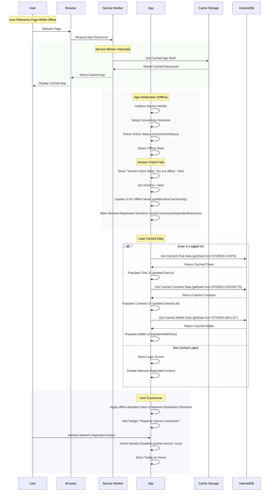
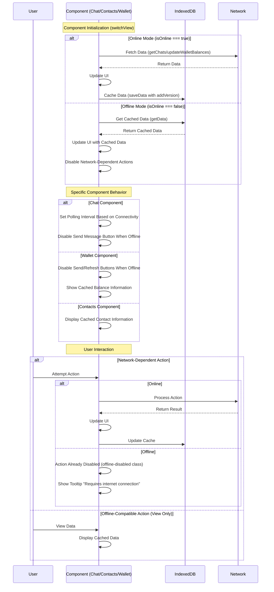

# Offline Functionality Plan

## Overview

This document outlines the comprehensive offline-first strategy for our PWA, ensuring users have a seamless experience regardless of network connectivity. The plan follows best practices from the Offline Cookbook and modern PWA patterns.

## Core Requirements

1. Provide a full offline-first experience with graceful degradation
2. Cache all critical resources for instant loading
3. Enable offline access to user data (chats, contacts, wallet info)
4. Handle dynamic content and API requests appropriately
5. Provide clear feedback about connectivity status and available actions
6. Ensure data consistency between online/offline states
7. Handle page refreshes in offline mode

## Caching Strategy

### Cache Types

1. **STATIC_CACHE** (v{timestamp})
   - Shell resources (HTML, CSS, JS, images)
   - Font files and icons
   - Manifest and other app metadata
2. **DYNAMIC_CACHE** (v{timestamp})

   - API responses
   - Dynamically loaded content
   - User-specific data

3. **DATA_CACHE** (v{timestamp})
   - IndexedDB for structured data
   - Chat history
   - Contact information
   - Wallet data
   - Pending transactions

### Caching Patterns

1. **Cache First, Network Fallback**

   - Use for: Static assets, app shell, fonts, images
   - Implementation: Check cache → Return if found → Fetch from network if missing
   - Benefits: Fastest possible load time for static content

2. **Stale While Revalidate**

   - Use for: Frequently updated API responses, user profile data
   - Implementation: Return from cache → Fetch update → Cache update for next time
   - Benefits: Quick response while keeping content fresh

3. **Network First, Cache Fallback**

   - Use for: Chat messages, transaction history
   - Implementation: Try network → Use cache if offline → Update cache when online
   - Benefits: Always fresh content when possible, graceful offline fallback

4. **Cache Only**
   - Use for: App shell after initial install
   - Implementation: Serve directly from cache
   - Benefits: Guaranteed offline functionality

### Precaching Strategy

1. **Install Phase**

   ```javascript
   const PRECACHE_URLS = [
     "/",
     "/index.html",
     "/styles.css",
     "/app.js",
     "/manifest.json",
     "/offline.html",
     "/images/logo.png",
     // Add all critical assets
   ];
   ```

2. **Runtime Caching Rules**

   ```javascript
   // Network first for API endpoints
   registerRoute(
     ({ url }) => url.pathname.startsWith("/api/"),
     new NetworkFirst()
   );

   // Cache first for static assets
   registerRoute(
     ({ request }) => request.destination === "image",
     new CacheFirst()
   );
   ```

## Data Management

### IndexedDB Structure

1. **Chats Store**

   - Key: chatId
   - Value: {chats[], contacts{}, version, lastUpdated}

2. **Contacts Store**

   - Key: address
   - Value: {contacts{}, version, lastUpdated}

3. **Wallet Store**
   - Key: assetId
   - Value: {wallet{}, version, lastUpdated}

### Offline Data Access

1. **Data Storage**

   ```javascript
   // Import database functions
   import { STORES, saveData, getData, getAllData } from "./db.js";

   // Add version information to data before saving
   function addVersion(data) {
     return {
       ...data,
       version: Date.now(),
       lastUpdated: Date.now(),
     };
   }

   // Example of saving chat data
   const chatData = addVersion({
     chatId: myAccount.keys.address,
     chats: myData.chats,
     contacts: myData.contacts,
   });
   await saveData(STORES.CHATS, chatData);
   ```

2. **Data Access Strategy**
   - Cache data in IndexedDB when online
   - Read from IndexedDB when offline
   - Update local data when back online
   - Maintain "last updated" timestamps

## UI/UX Considerations

### Offline Indicators

1. **Toast Notifications**

   - Show toast when going offline: "You're offline. Some features are unavailable."
   - Show toast when coming back online: "You're back online!"

2. **Action-Specific Feedback**
   - Disabled state for offline-incompatible actions
   - Visual indicators for disabled elements
   - Clear error messages for failed operations

### Progressive Enhancement

1. **Feature Detection**

   ```javascript
   if ("serviceWorker" in navigator) {
     // Enable PWA features
     await registerServiceWorker();
     setupServiceWorkerMessaging();
     setupAppStateManagement();
     setupConnectivityDetection();
   }
   ```

2. **Graceful Degradation**
   - Fallback content for uncached resources
   - Simplified UI for unsupported features
   - Clear messaging about limited functionality

## Error Handling

### Network Failures

1. **Request Timeouts**

   - Implement appropriate timeout periods
   - Clear feedback about network status

2. **Offline State Management**
   - Global `isOnline` variable to track connectivity
   - Periodic connectivity checks
   - Automatic UI updates based on connectivity

## Testing Strategy

### Offline Scenarios

1. **Network Conditions**

   - Complete offline
   - Intermittent connectivity

2. **User Actions**
   - Page load while offline
   - Navigation while offline
   - Form submissions
   - Data synchronization
   - Page refresh

### Test Cases

1. **Installation**

   - [ ] Verify precaching of critical resources
   - [ ] Confirm service worker registration
   - [ ] Check cache storage initialization

2. **Online → Offline Transition**

   - [ ] Test automatic offline detection
   - [ ] Verify UI updates
   - [ ] Confirm cached content accessibility
   - [ ] Check disabled feature handling

3. **Offline → Online Transition**

   - [ ] Test reconnection detection
   - [ ] Verify data synchronization
   - [ ] Check UI restoration

4. **Data Management**
   - [ ] Verify offline data access
   - [ ] Confirm data consistency

## Progress Update

### Completed Items ✅

1. **Service Worker Setup**

   - ✅ Implemented service worker registration with version management
   - ✅ Added caching strategies for offline access
   - ✅ Implemented update notification system
   - ✅ Added resilient service worker installation that doesn't fail when offline

2. **Offline Page**

   - ✅ Created offline.html fallback page
   - ✅ Implemented proper styling matching app's design system
   - ✅ Added clear user feedback about available/unavailable features

3. **Connectivity Detection**

   - ✅ Implemented global `isOnline` state variable
   - ✅ Added event listeners for online/offline events
   - ✅ Created `setupConnectivityDetection()` function
   - ✅ Implemented `handleConnectivityChange()` for state updates
   - ✅ Added periodic connectivity checks
   - ✅ Improved online detection with network verification

4. **UI/UX Implementation**

   - ✅ Implemented `markConnectivityDependentElements` function
   - ✅ Added visual feedback for offline-disabled elements
   - ✅ Implemented tooltips for disabled elements
   - ✅ Added form submission prevention when offline
   - ✅ Integrated with toast notification system
   - ✅ Added CSS styles for offline states

5. **Data Storage**

   - ✅ Implemented IndexedDB setup with three stores (chats, contacts, wallet)
   - ✅ Added data versioning for consistency tracking
   - ✅ Implemented caching of chat data when online
   - ✅ Implemented caching of contacts data when online
   - ✅ Implemented caching of wallet data when online
   - ✅ Added offline data access for all stores

6. **Component Implementation**

   - ✅ Updated `updateChatList()` to handle offline mode
   - ✅ Updated `updateContactsList()` to handle offline mode
   - ✅ Updated `updateWalletView()` to handle offline mode
   - ✅ Added conditional polling based on connectivity

7. **Authentication Improvements**
   - ✅ Enhanced `checkUsernameAvailability()` to support offline sign-in
   - ✅ Added local storage verification for usernames when offline
   - ✅ Implemented `verifyUsernameOnReconnect()` to validate accounts when coming back online
   - ✅ Added graceful sign-out for invalid accounts after reconnection

### Current Implementation Details

The following code has been implemented to support offline functionality:

````javascript
// Global connectivity state
let isOnline = true; // Will be updated by connectivity checks

// Setup connectivity detection
function setupConnectivityDetection() {
  // Listen for browser online/offline events
  window.addEventListener("online", handleConnectivityChange);
  window.addEventListener("offline", handleConnectivityChange);

  // Mark elements that depend on connectivity
  markConnectivityDependentElements();

  // Check initial status (don't trust the browser's initial state)
  checkConnectivity();

  // Periodically check connectivity (every 30 seconds)
  setInterval(checkConnectivity, 30000);
}

// Handle online/offline events
async function handleConnectivityChange(event) {
  if (event.type === "offline") {
    const wasOnline = isOnline;
    // Trust offline events immediately
    isOnline = false;
    updateUIForConnectivity();
    if (wasOnline) {
      showToast(
        "You're offline. Some features are unavailable.",
        3000,
        "offline"
      );
    }
  } else {
    // For online events, verify connectivity before updating UI
    const wasOffline = !isOnline;
    isOnline = await checkOnlineStatus();

    if (isOnline && wasOffline) {
      updateUIForConnectivity();
      showToast("You're back online!", 3000, "online");

      // Verify username is still valid on the network
      await verifyUsernameOnReconnect();

      // Sync any pending offline actions
      const registration = await navigator.serviceWorker.getRegistration();
      if (registration && "sync" in registration) {
        try {
          await registration.sync.register("sync-messages");
          await registration.sync.register("sync-transactions");
        } catch (err) {
          console.error("Background sync registration failed:", err);
        }
      }
    }
  }
}

// Verify username availability when coming back online
async function verifyUsernameOnReconnect() {
  // Only proceed if user is logged in
  if (!myAccount || !myAccount.username) {
    console.log('No active account to verify');
    return;
  }

  console.log('Verifying username on reconnect:', myAccount.username);

  // Check if the username is still valid on the network
  const availability = await checkUsernameAvailability(myAccount.username, myAccount.keys.address);

  if (availability !== 'mine') {
    console.log('Username verification failed on reconnect:', availability);

    // Show a notification to the user
    showToast('Your account is no longer valid on the network. You will be signed out.', 5000, 'error');

    // Wait a moment for the user to see the toast
    setTimeout(() => {
      // Sign out the user
      handleSignOut();
    }, 5000);
  } else {
    console.log('Username verified successfully on reconnect');
  }
}

// Enhanced username availability check with offline support
async function checkUsernameAvailability(username, address) {
  // First check if we're offline
  if (!isOnline) {
    console.log('Checking username availability offline');
    // When offline, check local storage only
    const { netid } = network;
    const existingAccounts = parse(localStorage.getItem('accounts') || '{"netids":{}}');
    const netidAccounts = existingAccounts.netids[netid];

    // If we have this username locally and the address matches
    if (netidAccounts?.usernames &&
        netidAccounts.usernames[username] &&
        normalizeAddress(netidAccounts.usernames[username].address) === normalizeAddress(address)) {
      console.log('Username found locally and matches address');
      return 'mine';
    }

    // If we have the username but address doesn't match
    if (netidAccounts?.usernames && netidAccounts.usernames[username]) {
      console.log('Username found locally but address does not match');
      return 'taken';
    }

    // Username not found locally
    console.log('Username not found locally');
    return 'available';
  }

  // Online flow - existing implementation
  const randomGateway = network.gateways[Math.floor(Math.random() * network.gateways.length)];
  const usernameBytes = utf82bin(normalizeUsername(username))
  const usernameHash = blake.blake2bHex(usernameBytes, myHashKey, 32)
  try {
    const response = await fetch(`${randomGateway.protocol}://${randomGateway.host}:${randomGateway.port}/address/${usernameHash}`);
    const data = await response.json();
    if (data && data.address){
      if (address && normalizeAddress(data.address) === normalizeAddress(address)) {
        return 'mine';
      }
      return 'taken'
    }
    if (!data){
      return 'error'
    }
    return 'available'
  } catch (error) {
    console.log('Error checking username:', error);
    return 'error2';
  }
}

### Offline Sign-In Flow

```mermaid
sequenceDiagram
    participant U as User
    participant A as App
    participant LS as LocalStorage
    participant N as Network

    Note over U,A: User Attempts to Sign In While Offline

    U->>A: Open Sign-In Modal
    A->>LS: Get Existing Accounts
    LS-->>A: Return Accounts Data
    A->>A: Display Username Dropdown

    U->>A: Select Username
    A->>A: Check Online Status (isOnline)

    Note over A: App Detects Offline State

    A->>LS: Check Username in Local Storage
    LS-->>A: Return Account Data

    alt Username Found Locally & Address Matches
        A->>A: Return 'mine' Status
        A->>A: Enable Sign-In Button
        U->>A: Click Sign-In
        A->>LS: Load User Data
        LS-->>A: Return User Data
        A->>A: Set myAccount & myData
        A->>A: Switch to Chats View
    else Username Found Locally but Address Doesn't Match
        A->>A: Return 'taken' Status
        A->>A: Show "taken" Message
        A->>A: Disable Sign-In Button
    else Username Not Found Locally
        A->>A: Return 'available' Status
        A->>A: Show "not found" Message
        A->>A: Enable "Recreate" Option
    end

    Note over U,A: User Successfully Signs In Offline

    rect rgba(200, 230, 230, 0.15)
        Note over A: Later: Coming Back Online
        A->>A: Detect Online Connection
        A->>A: Call verifyUsernameOnReconnect()
        A->>N: Check Username Availability on Network
        N-->>A: Return Availability Status

        alt Username Still Valid ('mine')
            A->>A: Continue Normal Operation
        else Username No Longer Valid
            A->>A: Show Toast Notification
            A->>A: Wait 5 Seconds
            A->>A: Sign Out User
        end
    end
````

### Next Steps 🔄

1. **Data Synchronization**

   - [ ] Implement data conflict resolution for cached data
   - [ ] Add data refresh mechanisms when coming back online
   - [ ] Implement merge strategies for conflicting changes

2. **UI/UX Polish**

   - [ ] Add persistent offline status indicator in header/navigation
   - [ ] Enhance update notification styling

3. **Authentication Improvements**

   - [ ] Add secure credential storage for offline authentication
   - [ ] Implement offline account creation with pending network registration
   - [ ] Add conflict resolution for accounts modified while offline

4. **Testing**
   - [ ] Test service worker installation and updates
   - [ ] Verify caching strategies effectiveness
   - [ ] Test offline page functionality
   - [ ] Validate offline element disabling
   - [ ] Test offline data access and sync
   - [ ] Test offline sign-in and reconnection verification

## Implementation Phases

### Phase 1: Foundation ✅ (Completed)

- [x] Service Worker setup
- [x] Basic caching implementation
- [x] Offline detection
- [x] Essential UI feedback
- [x] IndexedDB setup and integration

### Phase 2: Data Management ✅ (Completed)

- [x] IndexedDB setup
- [x] Offline data access
- [x] Data versioning
- [x] Conditional data fetching based on connectivity
- [x] Simple data refresh on reconnection

### Phase 3: Enhanced Features (Optional - Not Implemented)

- [ ] Background sync for pending actions
- [ ] Conflict resolution for cached data
- [ ] Offline transaction queue

### Phase 4: Polish (Optional - Not Implemented)

- [ ] Comprehensive testing
- [ ] Performance optimization
- [ ] Edge case handling

## Core Offline Functionality Flow

```mermaid
sequenceDiagram
    participant U as User
    participant A as App
    participant SW as Service Worker
    participant IDB as IndexedDB
    participant C as Cache Storage
    participant N as Network

    Note over A: App Initialization
    U->>A: Open Application
    A->>SW: Register Service Worker (registerServiceWorker)
    A->>A: Setup Service Worker Messaging (setupServiceWorkerMessaging)
    A->>A: Setup App State Management (setupAppStateManagement)
    A->>A: Setup Connectivity Detection (setupConnectivityDetection)

    rect rgba(200, 230, 200, 0.16)
        Note over SW: Install Phase
        SW->>C: Create Cache Storages
        SW->>C: Precache App Shell
        SW-->>A: Installation Complete
    end

    rect rgba(230, 230, 200, 0.02)
        Note over A: Runtime Phase
        A->>A: Check Connection Status (checkConnectivity)
        A->>A: Set isOnline variable
        A->>A: Mark Network-Dependent Elements (markConnectivityDependentElements)

        alt Online Mode
            A->>N: Check Version (checkVersion)
            N-->>A: Return Version
            A->>A: Process Version Check

            A->>N: Fetch Fresh Data (getChats, updateWalletBalances)
            N-->>A: Return Data
            A->>IDB: Cache Data (saveData with addVersion)
            A->>A: Update UI
        else Offline Mode
            A->>A: Show "Version check failed. You are offline." Alert
            A->>IDB: Load Cached Data (getData)
            IDB-->>A: Return Cached Data
            A->>A: Update UI with Cached Data
            A->>A: Apply Offline UI Styling (updateUIForConnectivity)
        end
    end

    rect rgba(230, 200, 200, 0.08)
        Note over U: User Interactions
        U->>A: Request Resource/Action

        alt Is Network-Dependent Action (has data-requires-connection)
            alt Online
                A->>N: Process Request (postChatMessage, postAssetTransfer)
                N-->>A: Return Response
                A->>A: Update UI
                A->>IDB: Update Cached Data
            else Offline
                A->>A: Action Disabled (offline-disabled class)
                A->>A: Show Tooltip "Requires internet connection"
                A->>A: Prevent Form Submit (preventOfflineSubmit)
                A->>A: Show Toast "This action requires an internet connection"
            end
        else Is Offline-Compatible Action
            A->>A: Process Action Locally
            A->>A: Update UI
        end
    end

    rect rgba(200, 230, 230, 0.15)
        Note over A: Connectivity Changes

        alt Going Offline (handleConnectivityChange)
            A->>A: Set isOnline = false
            A->>A: Update UI for Offline Mode (updateUIForConnectivity)
            A->>A: Show "You're offline" Toast
        else Coming Online (handleConnectivityChange)
            A->>A: Check Online Status (checkOnlineStatus)
            A->>A: Set isOnline = true
            A->>A: Update UI for Online Mode (updateUIForConnectivity)
            A->>A: Show "You're back online" Toast
            A->>A: Register Background Sync (if supported)
            A->>A: Update Chat List (updateChatList)
        end
    end
```

### Page Refresh While Offline Flow



### Component Data Flow



## References

- [The Offline Cookbook](https://web.dev/articles/offline-cookbook)
- [PWA Documentation](https://web.dev/progressive-web-apps/)
- [IndexedDB Best Practices](https://web.dev/articles/indexeddb-best-practices)
- [Background Sync](https://web.dev/articles/background-sync)
- [Cache API](https://web.dev/articles/cache-api-quick-guide)
