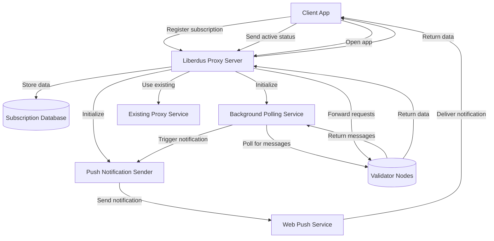

# Liberdus Proxy Server Push Notification Integration

## Architecture Diagram

## Implementation Steps

### 1. Extend Database Schema

- Add tables for storing push subscriptions
- Include fields for: user ID, subscription object, last poll timestamp
- Implement database access methods for CRUD operations

### 2. Set Up Web Push Authentication

- Generate VAPID key pair for Web Push Protocol
- Store keys securely in the proxy server configuration
- Create endpoint to serve public key to clients

### 3. Add API Endpoints

- `/api/push/register`: Register new push subscriptions
- `/api/push/vapid-public-key`: Serve public VAPID key
- `/api/user/last-active`: Update user activity status

### 4. Implement Background Polling

- Create a worker thread that runs on a fixed interval
- Query validator nodes for new messages for each subscription
- Compare with last poll timestamp to identify new messages
- Leverage existing load balancing for validator selection

### 5. Add Push Notification Sender

- Implement Web Push Protocol for notification delivery
- Format notification payloads to match existing notification format
- Include chat count and timestamp in the payload

### 6. Integrate with Existing Proxy Logic

- Use the same validator selection logic for polling
- Maintain consistent error handling with the rest of the proxy
- Ensure proper resource management for scaling

### 7. Add Monitoring and Metrics

- Track notification delivery success/failure rates
- Monitor polling service performance
- Implement rate limiting to prevent abuse

### 8. Security Enhancements

- Encrypt sensitive data in the subscription database
- Implement proper authentication for all endpoints
- Ensure all communication uses HTTPS

## Data Flow

1. **Registration Phase**:

   - Client registers service worker
   - Client subscribes to push notifications
   - Subscription sent to proxy server
   - Server stores subscription in database

2. **Background Polling Phase**:

   - Polling service queries validator nodes for new messages
   - If new messages found, push notification is triggered
   - Web Push service delivers notification to client device

3. **User Interaction Phase**:
   - User clicks notification
   - App opens and connects to proxy server
   - App requests latest messages
   - Proxy forwards request to validator nodes
   - Data returned to client

## Benefits of Integration

- **Unified Infrastructure**: Uses existing proxy server instead of separate notification server
- **Consistent Load Balancing**: Same validator selection logic for all operations
- **Reduced Complexity**: Single point of communication for clients
- **Efficient Resource Usage**: Shared resources between proxy and notification services
