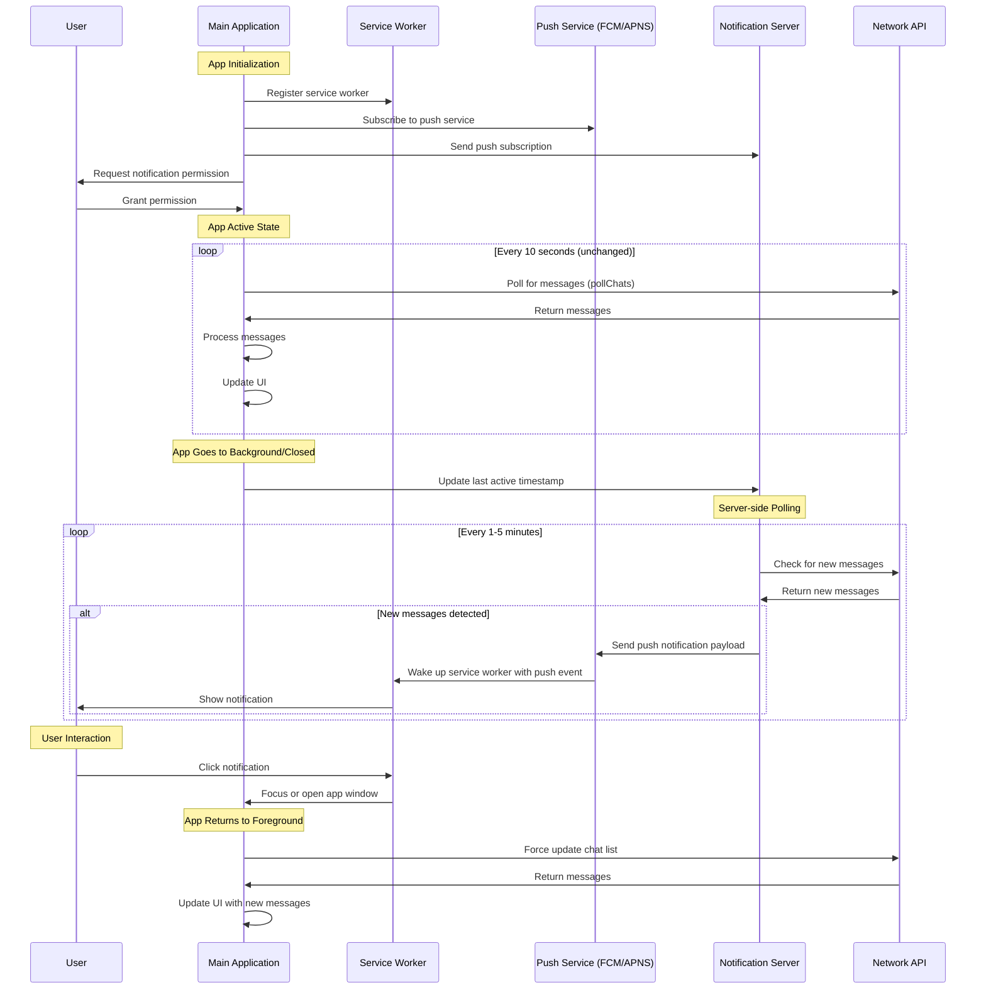

# Push Notification Integration Plan

## Overview

The current notification system works well for desktop PWAs but has limitations on mobile devices (Android and iOS) where background processes are restricted. This document outlines a plan to integrate Web Push Notifications to enhance the notification experience on mobile devices while preserving the existing notification flow.

## Current Limitations

1. **Mobile Background Restrictions**: Mobile browsers restrict background JavaScript execution, preventing the service worker from polling when the app is in the background.
2. **Battery Consumption**: Even if polling worked, it would consume significant battery.
3. **iOS Limitations**: iOS has stricter limitations on background processes for PWAs.

## Push Notification Solution

Push notifications solve these issues by:

- Using a server-initiated communication model instead of client polling
- Leveraging platform-specific notification systems (FCM for Android, APNS for iOS)
- Allowing notifications even when the app is completely closed

## Integration Architecture



## Implementation Steps

### 1. Server-Side Components

1. **Notification Server**:

   - Create a lightweight server to handle push notification delivery
   - Implement authentication to ensure secure communication
   - Store user push subscriptions in a database

2. **Polling Service**:

   - Implement a service that polls the Network API for new messages on behalf of users
   - Track the last message timestamp for each user
   - Compare with previous state to detect new messages

3. **Push Notification Sender**:
   - Integrate with Firebase Cloud Messaging (FCM) for Android
   - Integrate with Apple Push Notification Service (APNS) for iOS
   - Implement payload encryption for secure message delivery

### 2. Client-Side Modifications

1. **Push Subscription**:

   ```javascript
   async function subscribeToPushNotifications() {
     try {
       const registration = await navigator.serviceWorker.ready;

       // Get existing subscription or create new one
       let subscription = await registration.pushManager.getSubscription();

       if (!subscription) {
         // Get public VAPID key from server
         const response = await fetch("/api/push/vapid-public-key");
         const vapidPublicKey = await response.text();

         // Convert VAPID key to Uint8Array
         const convertedVapidKey = urlBase64ToUint8Array(vapidPublicKey);

         // Create new subscription
         subscription = await registration.pushManager.subscribe({
           userVisibleOnly: true,
           applicationServerKey: convertedVapidKey,
         });
       }

       // Send subscription to server
       await fetch("/api/push/register", {
         method: "POST",
         headers: {
           "Content-Type": "application/json",
         },
         body: JSON.stringify({
           subscription,
           userId: myAccount.keys.address,
         }),
       });

       console.log("Push notification subscription successful");
       return true;
     } catch (error) {
       console.error("Failed to subscribe to push notifications:", error);
       return false;
     }
   }
   ```

2. **Service Worker Push Event Handler**:

   ```javascript
   // Add to service-worker.js
   self.addEventListener("push", async (event) => {
     try {
       // Ensure we wait for async operations to complete
       event.waitUntil(handlePushEvent(event));
     } catch (error) {
       console.error("Error handling push event:", error);
     }
   });

   async function handlePushEvent(event) {
     let data = {};

     // Parse data from push event
     if (event.data) {
       try {
         data = event.data.json();
       } catch (e) {
         data = { title: "New Message", body: "You have a new message" };
       }
     }

     // Extract notification details
     const { title = "New Message", body, chatCount = 1, timestamp } = data;

     // Update service worker state
     if (timestamp) {
       state.lastPollTime = parseInt(timestamp);
     }

     // Show notification using existing function
     return showNotification(chatCount);
   }
   ```

3. **Last Activity Tracking**:

   ```javascript
   // Add to app.js in the visibility change handler
   document.addEventListener("visibilitychange", async () => {
     if (document.hidden) {
       // App is being hidden/closed
       const timestamp = Date.now().toString();
       localStorage.setItem("appPaused", timestamp);

       // Send last active timestamp to server for push notification management
       try {
         await fetch("/api/user/last-active", {
           method: "POST",
           headers: {
             "Content-Type": "application/json",
           },
           body: JSON.stringify({
             userId: myAccount.keys.address,
             timestamp,
           }),
         });
       } catch (error) {
         console.error("Failed to update last active status:", error);
       }
     } else {
       // Existing code for when app becomes visible
     }
   });
   ```

### 3. Integration with Existing Flow

1. **Hybrid Approach**:

   - Keep the existing polling mechanism for desktop PWAs
   - Use push notifications for mobile devices
   - Detect platform and choose appropriate method

2. **Feature Detection**:

   ```javascript
   function determineNotificationStrategy() {
     // Check if this is a mobile device
     const isMobile = /Android|iPhone|iPad|iPod/i.test(navigator.userAgent);

     // Check if push is supported
     const pushSupported = "PushManager" in window;

     if (isMobile && pushSupported) {
       return "push";
     } else {
       return "poll";
     }
   }
   ```

3. **Conditional Initialization**:

   ```javascript
   async function initializeNotifications() {
     const strategy = determineNotificationStrategy();

     if (strategy === "push") {
       const pushSubscribed = await subscribeToPushNotifications();
       if (!pushSubscribed) {
         // Fall back to polling if push subscription fails
         setupPollingNotifications();
       }
     } else {
       setupPollingNotifications();
     }
   }
   ```

## Technical Considerations

### 1. Web Push Protocol

- Use the [Web Push Protocol](https://developers.google.com/web/fundamentals/push-notifications/web-push-protocol) for standardized push notification delivery
- Implement [VAPID (Voluntary Application Server Identification)](https://datatracker.ietf.org/doc/html/draft-thomson-webpush-vapid) for server authentication

### 2. Security Considerations

- Encrypt push notification payloads to protect user data
- Implement proper authentication for the notification server
- Use HTTPS for all communication
- Don't include sensitive information in push notification payloads

### 3. Battery and Data Usage

- Implement server-side throttling to prevent excessive notifications
- Use a reasonable polling interval on the server (1-5 minutes)
- Consider implementing batching for multiple messages

### 4. Fallback Mechanisms

- If push notifications fail, fall back to the existing polling mechanism
- Implement exponential backoff for failed push notification attempts
- Provide user settings to choose notification method

## Platform-Specific Considerations

### Android

- Register the app with Firebase Cloud Messaging (FCM)
- Implement a Firebase Cloud Functions endpoint to handle message forwarding
- Consider using the [Notification Trigger API](https://web.dev/notification-triggers/) for scheduled notifications (when supported)

### iOS

- PWAs on iOS have more limitations with push notifications
- As of iOS 16.4+, web push notifications are supported for home screen installed PWAs
- Implement specific handling for iOS limitations
- Consider providing a native app wrapper for iOS users if push notifications are critical

## Testing Plan

1. **Desktop Testing**:

   - Test existing polling mechanism continues to work
   - Verify smooth transition between polling and push when available

2. **Android Testing**:

   - Test on multiple Android versions (10+)
   - Verify push notifications work when app is in background
   - Verify push notifications work when app is closed

3. **iOS Testing**:
   - Test on iOS 16.4+ with home screen installed PWA
   - Verify limitations and fallbacks on older iOS versions

## Implementation Timeline

1. **Phase 1: Server Infrastructure** (2-3 weeks)

   - Set up notification server
   - Implement polling service
   - Create push notification sender

2. **Phase 2: Client Integration** (1-2 weeks)

   - Implement push subscription
   - Add service worker push event handler
   - Integrate with existing notification flow

3. **Phase 3: Testing and Optimization** (1-2 weeks)
   - Cross-platform testing
   - Performance optimization
   - Battery usage analysis

## Conclusion

Integrating push notifications with the existing notification system will significantly improve the user experience on mobile devices while maintaining the current functionality for desktop users. The hybrid approach allows for a smooth transition and provides fallback mechanisms for unsupported platforms.

By leveraging the existing service worker infrastructure and adding server-side components, we can implement a robust notification system that works across all platforms with minimal changes to the client-side code.
