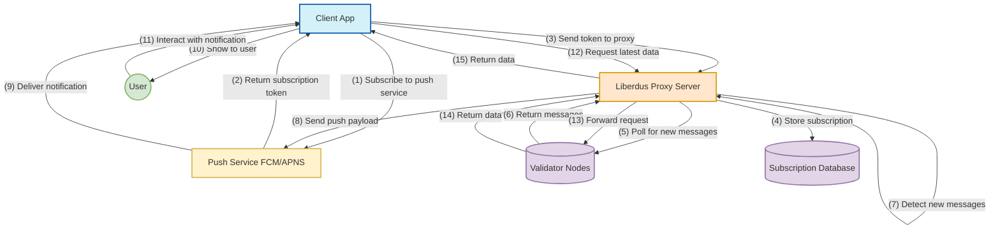

# Push Notification Service Flow

This diagram provides a focused view of how push notifications work in the Liberdus system, emphasizing the role of the push service and how it interacts with other components.

## Architecture Diagram

## Key Components

1. **Client App**: The main application that users interact with
2. **Liberdus Proxy Server**: Server component that handles push notification delivery
3. **Push Service**: Platform-specific notification service (FCM for Android, APNS for iOS)
4. **Validator Nodes**: Backend data source that provides message information
5. **Subscription Database**: Stores user push subscriptions and related data

## Push Notification Flow Explained

### Registration Phase

- The app subscribes to the platform's push service (FCM/APNS)
- The push service returns a unique subscription token
- The app sends this token to the Liberdus Proxy Server
- The proxy server stores this token for future use

### Background Polling Phase

- The proxy server periodically polls validator nodes for new messages
- When new messages are detected, the proxy prepares to send notifications

### Push Notification Delivery

- The proxy server sends a push payload to the push service (FCM/APNS)
- The push service delivers the notification to the user's device
- The app displays the notification to the user

### User Interaction

- When the user interacts with a notification, the app is activated
- The app requests the latest data from the proxy server
- The proxy forwards the request to validator nodes
- Data is returned to the app for display

## Benefits of Push Notifications

- **Server-Initiated Communication**: The server can notify the client when there's new data
- **Battery Efficiency**: No need for the app to constantly poll for updates
- **Works When App is Closed**: Notifications can be delivered even when the app isn't running
- **Cross-Platform**: Works on both Android and iOS with their respective push services

## Technical Implementation

The push notification system uses the Web Push Protocol with:

- **VAPID Authentication**: For secure server-to-push-service communication
- **Encrypted Payloads**: To protect user data in transit
- **Platform-Specific Integration**: FCM for Android and APNS for iOS
