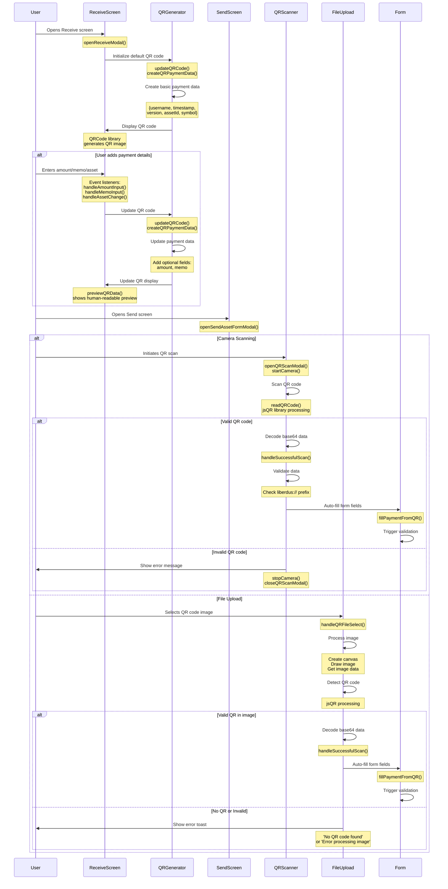

# QR Code Payment Flow

## Overview

The QR code system in Liberdus wallet enables users to:

1. Generate QR codes with payment details (recipient, amount, memo)
2. Scan QR codes to automatically fill payment form fields

## Flow Diagram



## Data Structure

```typescript
interface QRPaymentData {
  // Required fields
  username: string; // Recipient's username

  // Optional fields
  amount?: string; // Payment amount
  memo?: string; // Payment memo (max 140 chars)
  assetId?: string; // Asset ID (defaults to "liberdus")
  symbol?: string; // Asset symbol (defaults to "LIB")

  // Metadata
  timestamp: number; // Generation timestamp
  version: string; // Format version (currently "1.0")
}
```

## QR Code Format

```
liberdus://<base64-encoded-json>
```

Example:

```
liberdus://eyJ1c2VybmFtZSI6ImFsaWNlIiwiYW1vdW50IjoiMTAuNSIsIm1lbW8iOiJMdW5jaCIsInRpbWVzdGFtcCI6MTcwOTI0MDAwMDAwMCwidmVyc2lvbiI6IjEuMCJ9
```

## Implementation

### Generating QR Codes

1. **Default QR Code**

   - Generated when user opens Receive screen
   - Contains basic info: username, default asset (LIB)
   - Updates in real-time as user enters amount/memo

2. **Enhanced QR Code**
   - User can add:
     - Amount in selected asset
     - Memo/note
     - Different asset selection
   - QR code updates automatically
   - Preview shows what will be filled in send form

### Scanning QR Codes

1. **Scanner Implementation**

   - Uses jsQR library for QR code detection
   - Camera stream processing at 10fps (100ms intervals)
   - Optimized canvas context for frequent image data access
   - Supports environment-facing camera by default
   - Handles various camera access errors gracefully
   - Supports QR code scanning from uploaded image files

2. **Processing Flow**

   - Validates QR format (must start with "liberdus://")
   - Decodes base64 data
   - Validates required fields
   - Auto-fills send form fields
   - Triggers form validation

3. **File Upload Support**

   - Alternative to camera scanning
   - Accepts image files containing QR codes
   - Processes uploaded images using canvas
   - Uses same QR code detection and validation logic
   - Provides user feedback for successful/failed scans
   - Handles common error cases:
     - No QR code found in image
     - Invalid image format
     - Processing errors

4. **Fallback Handling**
   - Supports plain addresses/usernames
   - Graceful error handling for camera access issues
   - User-friendly error messages for common scenarios:
     - Camera access denied
     - No camera device found
     - Camera in use by another application
     - Security policy restrictions

### QR Code Preview

1. **Preview Display**

   - Shows human-readable format of QR data
   - Updates in real-time as QR code changes
   - Supports both expanded and minimized views
   - Displays all relevant payment information:
     - Username
     - Asset symbol
     - Amount (if specified)
     - Memo (if specified)
     - Generation timestamp

2. **Preview Format**
   - Expanded view shows detailed information
   - Minimized view shows condensed format:
     - Username • Asset • Amount • Memo
     - Truncates long memos (>20 chars)
   - Toggle between views with click

## Security

- QR codes only contain public payment info
- No private keys or sensitive data
- All scanned data is validated
- Amount/memo are suggestions only
- Username must exist on network
- Camera access requires explicit user permission
- QR data validation before form auto-fill

## Browser Support

- Chrome (desktop/Android)
  - Full camera API support
  - QR code generation and scanning
- Edge
  - Full camera API support
  - QR code generation and scanning
- Firefox
  - Full camera API support
  - QR code generation and scanning
- Safari (desktop/iOS)
  - Camera API support (requires HTTPS)
  - QR code generation and scanning
- Mobile browsers
  - Camera API support varies by platform
  - Back camera preferred on mobile devices
