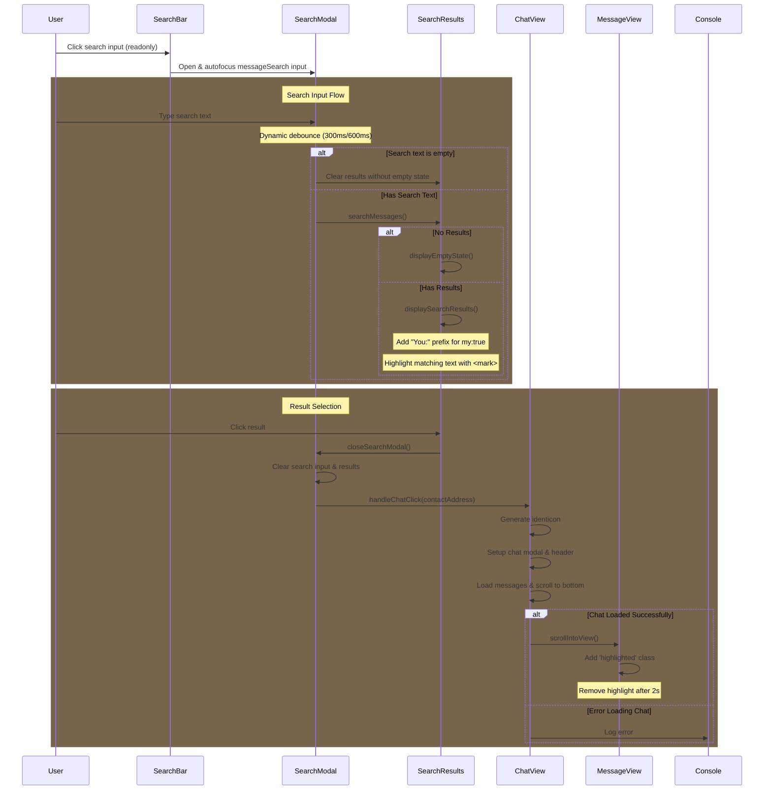

## Chat Search Implementation

Key Points:

- Search Interface:

  - Search modal with input field
  - Real-time search as user types with dynamic debounce
  - Results grouped by chat thread
  - Shows message preview and timestamp

- Data Access:
  - Searches through myData.contacts messages
  - Uses existing message data structures
  - No need for additional storage



## Implementation App.js

```javascript
// Inside of
// Load saved account data and update chat list on page load
document.addEventListener("DOMContentLoaded", async () => {
  //... existing code
  document.getElementById("refreshLogs").addEventListener("click", () => {
    updateLogsView();
  });
  // Add new search functionality
  const searchInput = document.getElementById("searchInput");
  const messageSearch = document.getElementById("messageSearch");
  const searchModal = document.getElementById("searchModal");

  // Close search modal
  document.getElementById("closeSearchModal").addEventListener("click", () => {
    searchModal.classList.remove("active");
    messageSearch.value = "";
    document.getElementById("searchResults").innerHTML = "";
  });

  // Handle search input with dynamic debounce
  messageSearch.addEventListener(
    "input",
    debounce(
      (e) => {
        const searchText = e.target.value.trim();
        if (searchText.length < 2) {
          displayEmptyState("searchResults", "No messages found");
          return;
        }

        const results = searchMessages(searchText);
        if (results.length === 0) {
          displayEmptyState("searchResults", "No messages found");
        } else {
          displaySearchResults(results);
        }
      },
      (searchText) => (searchText.length === 1 ? 600 : 300)
    ) // Dynamic wait time
  );

  document.getElementById("closeChatModal")?.addEventListener("click", () => {
    document.getElementById("chatModal").classList.remove("active");
  });
  initializeSearch();
  //... existing code
});
```

```javascript
function debounce(func, waitFn) {
  let timeout;
  return function executedFunction(...args) {
    const wait = typeof waitFn === "function" ? waitFn(args[0]) : waitFn;

    const later = () => {
      clearTimeout(timeout);
      func(...args);
    };
    clearTimeout(timeout);
    timeout = setTimeout(later, wait);
  };
}

function truncateMessage(message, maxLength = 50) {
  return message.length > maxLength
    ? message.substring(0, maxLength) + "..."
    : message;
}

// Add these search-related functions
function searchMessages(searchText) {
  if (!searchText || !myData?.contacts) return [];

  const results = [];
  const searchLower = searchText.toLowerCase();

  // Search through all contacts and their messages
  Object.entries(myData.contacts).forEach(([address, contact]) => {
    if (!contact.messages) return;

    contact.messages.forEach((message, index) => {
      if (message.message.toLowerCase().includes(searchLower)) {
        // Highlight matching text
        const messageText = message.message;
        const highlightedText = messageText.replace(
          new RegExp(searchText, "gi"),
          (match) => `<mark>${match}</mark>`
        );

        results.push({
          contactAddress: address,
          username: contact.username || address,
          messageId: index,
          message: message, // Pass the entire message object
          timestamp: message.timestamp,
          preview: truncateMessage(highlightedText, 100),
          my: message.my, // Include the my property
        });
      }
    });
  });

  return results.sort((a, b) => b.timestamp - a.timestamp);
}

function displaySearchResults(results) {
  const searchResults = document.getElementById("searchResults");
  // Create a ul element to properly contain the list items
  const resultsList = document.createElement("ul");
  resultsList.className = "chat-list";

  results.forEach(async (result) => {
    const resultElement = document.createElement("li");
    resultElement.className = "chat-item search-result-item";

    // Generate identicon for the contact
    const identicon = await generateIdenticon(result.contactAddress);

    // Format message preview with "You:" prefix if it's a sent message
    const messagePreview = result.my
      ? `You: ${result.preview}`
      : result.preview;

    resultElement.innerHTML = `
            <div class="chat-avatar">
                ${identicon}
            </div>
            <div class="chat-content">
                <div class="chat-header">
                    <div class="chat-name">${result.username}</div>
                    <div class="chat-time">${formatTime(result.timestamp)}</div>
                </div>
                <div class="chat-message">
                    ${messagePreview}
                </div>
            </div>
        `;

    resultElement.addEventListener("click", () => {
      handleSearchResultClick(result);
    });

    resultsList.appendChild(resultElement);
  });

  // Clear and append the new list
  searchResults.innerHTML = "";
  searchResults.appendChild(resultsList);
}

function displayEmptyState(containerId, message) {
  const container = document.getElementById(containerId);
  container.innerHTML = `
        <div class="no-results">
            <div>${message}</div>
            <div class="suggestion">Try different keywords</div>
        </div>
    `;
}

function handleSearchResultClick(result) {
  try {
    // Close search modal
    document.getElementById("searchModal").classList.remove("active");

    // Switch to chats view if not already there
    switchView("chats");

    // Open the chat with this contact
    handleChatClick(result.contactAddress);

    // Scroll to and highlight the message
    setTimeout(() => {
      const messageElement = document.querySelector(
        `[data-message-id="${result.messageId}"]`
      );
      if (messageElement) {
        messageElement.scrollIntoView({ behavior: "smooth", block: "center" });
        messageElement.classList.add("highlighted");
        setTimeout(() => messageElement.classList.remove("highlighted"), 2000);
      } else {
        console.error("Message not found");
        // Could add a toast notification here
      }
    }, 300);
  } catch (error) {
    console.error("Error handling search result:", error);
    // Could add error notification here
  }
}

// Add the search input handler
function initializeSearch() {
  const searchInput = document.getElementById("searchInput");
  const messageSearch = document.getElementById("messageSearch");
  const searchResults = document.getElementById("searchResults");
  const searchModal = document.getElementById("searchModal");

  // Debounced search function
  const debouncedSearch = debounce((searchText) => {
    const trimmedText = searchText.trim();

    // Just clear results if empty
    if (!trimmedText) {
      searchResults.innerHTML = ""; // Clear without showing empty state
      return;
    }

    // For single character, wait longer before showing any results
    if (trimmedText.length === 1) {
      // Show empty space initially
      searchResults.innerHTML = "";

      // Wait before showing any state
      setTimeout(() => {
        const results = searchMessages(trimmedText);
        if (results.length === 0) {
          displayEmptyState("searchResults", "No messages found");
        } else {
          displaySearchResults(results);
        }
      }, 600); // Longer delay for single character
      return;
    }

    // For multiple characters, proceed with normal search
    const results = searchMessages(trimmedText);
    if (results.length === 0) {
      displayEmptyState("searchResults", "No messages found");
    } else {
      displaySearchResults(results);
    }
  }, 300);

  // Connect search input to modal input
  searchInput.addEventListener("click", () => {
    searchModal.classList.add("active");
    messageSearch.focus();
  });

  // Handle search input
  messageSearch.addEventListener("input", (e) => {
    debouncedSearch(e.target.value);
  });
}

// Add loading state display function
function displayLoadingState() {
  const searchResults = document.getElementById("searchResults");
  searchResults.innerHTML = `
        <div class="search-loading">
            Searching messages
        </div>
    `;
}

async function handleChatClick(contactAddress) {
  // Get the contact info
  const contact = myData.contacts[contactAddress];
  if (!contact) return;

  // Open chat modal
  const chatModal = document.getElementById("chatModal");
  chatModal.classList.add("active");

  // Generate the identicon first
  const identicon = await generateIdenticon(contactAddress);

  // Update chat header with contact info and avatar - match exact structure from chat view
  const modalHeader = chatModal.querySelector(".modal-header");
  modalHeader.innerHTML = `
        <button class="back-button" id="closeChatModal"></button>
        <div class="chat-user-info">
            <div class="modal-avatar">${identicon}</div>
            <div class="modal-title">${contact.username || contactAddress}</div>
        </div>
    `;

  // Re-attach close button event listener
  document.getElementById("closeChatModal").addEventListener("click", () => {
    chatModal.classList.remove("active");
  });

  // Ensure messages container structure matches
  const messagesContainer = chatModal.querySelector(".messages-container");
  if (!messagesContainer) {
    const container = document.createElement("div");
    container.className = "messages-container";
    container.innerHTML = '<div class="messages-list"></div>';
    chatModal.appendChild(container);
  }

  // Load messages
  const messagesList = chatModal.querySelector(".messages-list");
  messagesList.innerHTML = ""; // Clear existing messages

  // Add messages if they exist
  if (contact.messages && contact.messages.length > 0) {
    contact.messages.forEach((msg, index) => {
      const messageElement = document.createElement("div");
      messageElement.className = `message ${msg.my ? "sent" : "received"}`;
      messageElement.setAttribute("data-message-id", index);
      messageElement.innerHTML = `
                <div class="message-content">${msg.message}</div>
                <div class="message-time">${formatTime(msg.timestamp)}</div>
            `;
      messagesList.appendChild(messageElement);
    });

    // Scroll to bottom of messages
    messagesList.scrollTop = messagesList.scrollHeight;
  }

  // Ensure input container exists
  const inputContainer = chatModal.querySelector(".message-input-container");
  if (!inputContainer) {
    const container = document.createElement("div");
    container.className = "message-input-container";
    container.innerHTML = `
            <textarea class="message-input" placeholder="Type a message..."></textarea>
            <button class="send-button" id="handleSendMessage">
                <svg viewBox="0 0 24 24">
                    <path d="M2.01 21L23 12 2.01 3 2 10l15 2-15 2z"></path>
                </svg>
            </button>
        `;
    chatModal.appendChild(container);
  }

  // Store current contact for message sending
  handleChatClick.currentContact = contactAddress;
}
```

## Implementation index.html

```html
<!-- Persistent search bar (stays in place) -->
  <div class="search-bar-container" id="searchBarContainer">
      <div class="search-bar">
          <span class="search-icon"></span>
          <input
              type="text"
              id="searchInput"
              class="search-input"
              placeholder="Search messages..."
              autocomplete="off"
              readonly
          />
      </div>
  </div>

  <!-- Search Modal (expands from search bar) -->
    <div class="modal search-modal" id="searchModal">
        <div class="modal-header">
            <button class="back-button" id="closeSearchModal"></button>
            <div class="modal-title">Search Messages</div>
        </div>
        <div class="form-container">
            <div class="search-bar">
                <span class="search-icon"></span>
                <input
                    type="text"
                    id="messageSearch"
                    class="search-input"
                    placeholder="Search messages..."
                    autocomplete="off"
                    autofocus
                />
            </div>
            <div id="searchResults" class="chat-list">
                <!-- Results will be populated here -->
            </div>
        </div>
    </div>
</div>
```

## Implementation styles.css

````css
:root {
  --border-color: #dee2e6;
  --background-color: white;
  --hover-background: #f8f9fa;
  --text-color: #1c1c21;
  --secondary-text-color: #65676b;
  --highlight-color: rgba(216, 119, 0, 0.444);
  --input-background: #e4e6e9;
  --hover-background-dark: #d0d2d6;
}

.header {
  display: flex;
  align-items: center;
  width: 100%;
  padding: 16px;
  background-color: white;
  // ... existing styles ...
}

/* Base chat list styles */
.chat-list {
  list-style: none;
  padding: 0;
  margin: 0;
}

/* Main chat list items */
#chatList .chat-item {
  display: flex;
  padding: 12px 16px;
  border-bottom: 1px solid var(--border-color);
  background: var(--background-color);
  cursor: pointer;
}

/* Search Results Container */
#searchResults {
  padding: 0;
  margin: 0;
}

/* Search Results List */
#searchResults .chat-list {
  padding: 0;
  margin: 0;
}

/* Search result items */
#searchResults .chat-list .chat-item {
  display: flex;
  padding: 12px 16px;
  border-bottom: 1px solid var(--border-color);
  background: var(--background-color);
  cursor: pointer;
}

/* Hover effects for both */
.chat-item:hover {
  background: var(--hover-background);
}

//... existing styles ...
  top: 0;
  background-color: white;
  z-index: 1002;
  border-bottom: 1px solid var(--border-color);
  position: relative;
}

.back-button {
  position: absolute;
  left: 16px;
  z-index: 1;
  background: none;
  border: none;
  cursor: pointer;
  // ... existing styles ...
}

.chat-user-info {
  display: flex;
  align-items: center;
  gap: 12px;
  flex: 1;
  margin-left: 8px;
}

.modal-avatar {
  width: 40px;
  height: 40px;
  display: flex;
  align-items: center;
  justify-content: center;
}

.modal-title {
  flex: 1;
  text-align: center;
  font-family: "Inter", sans-serif;
  font-size: 20px;
  font-weight: 600;
  color: var(--text-color);
  margin: 0 auto;
}

.chat-user-info {
  cursor: pointer;
}

.chat-user-info:hover {
  opacity: 0.8;
}

/* Search Bar Container */
.search-bar-container {
  padding: 8px 16px;
  background: var(--background-color);
  border-bottom: 1px solid var(--border-color);
}

/* Search Bar */
.search-bar {
  display: flex;
  align-items: center;
  padding: 8px 12px;
  background: var(--input-background);
  border-radius: 20px;
  cursor: pointer;
  transition: background-color 0.2s ease;
  border: none;
}

.search-bar:hover {
  background: var(--hover-background-dark);
}

/* Search input styles */
.search-input {
  border: none;
  background: transparent;
  width: 100%;
  color: var(--text-color);
  cursor: pointer;
  font-size: 0.9rem;
  padding: 0;
}

.search-input::placeholder {
  color: var(--secondary-text-color);
  opacity: 1;
}

.search-input:focus {
  outline: none;
}

/* Search Modal */
.search-modal {
  display: none;
}

.search-modal.active {
  display: flex;
}

/* Search Results */
.search-results {
  padding: 8px 0;
}

.search-result-item {
  display: flex;
  padding: 12px 16px;
  border-bottom: 1px solid var(--border-color) !important;
  background: var(--background-color);
  cursor: pointer;
  align-items: center;
}

.search-result-item:hover {
  background: var(--hover-background);
}

/* Use existing chat-item styles for consistency */
.search-result-item.chat-item {
  display: flex;
  padding: 12px 16px;
  border-bottom: 1px solid var(--border-color);
}

/* Remove old search result styles that conflict */
.search-result-header,
.search-result-username,
.search-result-time,
.search-result-preview {
  display: none;
}

/* Message Highlight Animation */
.message.highlighted {
  animation: highlight-message 2s ease;
}

@keyframes highlight-message {
  0%,
  100% {
    background: transparent;
  }
  20%,
  80% {
    background: var(--highlight-color);
  }
}

/* Update search modal input to match main search bar */
#messageSearch {
  border: none;
  background: var(--input-background);
  width: 100%;
  color: var(--text-color);
  font-size: 0.9rem;
  padding: 8px 12px;
  border-radius: 8px;
}

#messageSearch:focus {
  outline: none;
  background: var(--hover-background);
}

/* Add search icon to modal search input */
.form-container {
  position: relative;
}

#messageSearch {
  padding-left: 12px; /* Reset to normal padding */
}

/* Style for highlighted search matches */
mark {
  background-color: var(--highlight-color);
  color: inherit;
  padding: 0 2px;
  border-radius: 2px;
}

/* Form container spacing */
.form-container {
  padding: 16px;
}

/* Search bar spacing */
.form-container .search-bar {
  margin-bottom: 16px;
}

/* Chat list and search results styling */
.chat-list {
  list-style: none;
  padding: 0;
  margin: 0;
}

/* Individual chat/search items */
.chat-list .chat-item {
  display: flex;
  padding: 12px 16px;
  border-bottom: 1px solid var(--border-color);
  background: var(--background-color);
}

/* Specific search result item styling */
.chat-list .search-result-item {
  border-bottom: 1px solid var(--border-color) !important;
}

/* Last item border removal */
.chat-list .search-result-item:last-child {
  border-bottom: 1px solid var(--border-color) !important;
}

/* Hover effect */
.chat-list .search-result-item:hover {
  background: var(--hover-background);
}

/* Search Results Container */
#searchResults {
  padding: 0;
  margin: 0;
}

/* Search Results List */
#searchResults .chat-list {
  padding: 0;
  margin: 0;
  border-top: 1px solid var(--border-color);
}

/* Individual search result items */
#searchResults .chat-list .chat-item {
  display: flex;
  padding: 12px 16px;
  border-bottom: 1px solid var(--border-color);
  background: var(--background-color);
  margin: 0;
}

/* Ensure border shows on hover */
#searchResults .chat-list .chat-item:hover {
  background: var(--hover-background);
}


## Pseudo Implementation

```javascript
// Interface defining the structure of a search result
interface SearchResult {
    contactAddress: string    // Address of the contact
    username: string         // Display name from Contact
    messageId: number        // Position in messages array for scrolling
    messageText: string      // Full message content
    timestamp: number        // For sorting and display
    preview: string         // Truncated message for result list
}

// Core search functionality
function searchMessages(searchText: string): SearchResult[] {
    const results: SearchResult[] = [];
    const searchLower = searchText.toLowerCase();

    // Sequential search through contacts and messages
    for (const [address, contact] of myData.contacts) {
        if (!contact.messages) continue;

        contact.messages.forEach((msg, index) => {
            if (msg.type === "chat" && msg.message.toLowerCase().includes(searchLower)) {
                results.push({
                    contactAddress: address,
                    username: contact.username,
                    messageId: index,
                    messageText: msg.message,
                    timestamp: msg.timestamp,
                    preview: truncateMessage(msg.message)
                });
            }
        });
    }

    // Messages are already in timestamp order in the contacts array
    // No need to sort again
    return results;
}

// Utility function
function truncateMessage(message: string): string {
    const MAX_PREVIEW_LENGTH = 50;
    return message.length > MAX_PREVIEW_LENGTH
        ? message.substring(0, MAX_PREVIEW_LENGTH) + '...'
        : message;
}

// Modal Event Handlers
function showSearchModal() {
    // Hide any other active modals first
    document.querySelectorAll('.modal').forEach(modal => {
        modal.style.display = 'none';
    });

    // Show search modal
    const searchModal = document.getElementById('searchModal');
    searchModal.style.display = 'flex';

    // Focus search input
    document.getElementById('messageSearch').focus();
}

function closeSearchModal() {
    // Hide search modal
    document.getElementById('searchModal').style.display = 'none';

    // Clear search state
    document.getElementById('messageSearch').value = '';
    document.getElementById('searchResults').innerHTML = '';
}

// Initialize search functionality
function initializeSearch() {
    const searchButton = document.getElementById('search');
    const backButton = document.getElementById('closeSearchModal');

    // Handle search button click
    searchButton.addEventListener('click', showSearchModal);

    // Handle back button click
    backButton.addEventListener('click', closeSearchModal);
}

// Debounced search input handler
const handleSearchInput = debounce((event) => {
    const searchText = event.target.value;
    if (searchText.length < 2) {
        displayEmptyState();
        return;
    }

    const results = searchMessages(searchText);
    if (results.length === 0) {
        displayEmptyState();
    } else {
        displaySearchResults(results);
        saveRecentSearch(searchText);
    }
}, 300);

// UI feedback functions
function displayEmptyState() {
    const searchResults = document.getElementById('searchResults');
    searchResults.innerHTML = `
        <div class="no-results">
            <p>No messages found</p>
            <p class="suggestion">Try different keywords</p>
        </div>
    `;
}

// Recent searches handling
const MAX_RECENT_SEARCHES = 5;
function saveRecentSearch(searchText) {
    const recent = JSON.parse(localStorage.getItem('recentSearches') || '[]');
    recent.unshift(searchText);
    localStorage.setItem('recentSearches',
        JSON.stringify([...new Set(recent)].slice(0, MAX_RECENT_SEARCHES))
    );
}

// Result handling with error management
function handleSearchResult(result: SearchResult) {
    try {
        closeSearchModal();
        handleChatClick(result.contactAddress);

        // Add timeout to ensure chat is loaded
        setTimeout(() => {
            const messageFound = scrollToMessage(result.messageId);
            if (!messageFound) {
                console.error('Message not found');
            } else {
                highlightMessage(result.messageId);
            }
        }, 100);
    } catch (error) {
        console.error('Error handling search result:', error);
    }
}

// Visual feedback for found message
function highlightMessage(messageId) {
    const messageElement = document.querySelector(`[data-message-id="${messageId}"]`);
    if (messageElement) {
        messageElement.classList.add('highlighted');
        setTimeout(() => {
            messageElement.classList.remove('highlighted');
        }, 2000);
    }
}
````

## Search Interface Layout

```ascii
+---------------------------+
|   ←   Search Messages    |
+---------------------------+
|   🔍 Search messages...   |
+---------------------------+
|                          |
| Recent Results           |
|                          |
| +----------------------+ |
| | John Doe            | |
| | "Hey, about the..." | |
| | Yesterday, 2:30 PM  | |
| +----------------------+ |
|                          |
| +----------------------+ |
| | Alice Smith         | |
| | "Let me check the..."| |
| | Today, 9:15 AM      | |
| +----------------------+ |
|                          |
| +----------------------+ |
| | Bob Wilson          | |
| | "The meeting is..." | |
| | Today, 10:45 AM     | |
| +----------------------+ |
|                          |
+---------------------------+
```

## Updated UI Implementation

```html
<!-- Persistent search bar (stays in place) -->
<div class="search-bar-container" id="searchBarContainer">
  <div class="search-bar">
    <span class="search-icon">🔍</span>
    <input
      type="text"
      id="searchInput"
      class="search-input"
      placeholder="Search messages..."
      autocomplete="off"
    />
  </div>
</div>

<!-- Search Modal (expands from search bar) -->
<div class="modal search-modal" id="searchModal">
  <div class="modal-header">
    <button class="back-button" id="closeSearchModal"></button>
    <div class="modal-title">Search Messages</div>
  </div>
  <div class="search-results-container">
    <div id="searchResults" class="chat-list">
      <!-- Results will be populated here -->
    </div>
  </div>
</div>
```

## CSS Implementation

```css
/* Search bar styling */
.search-bar-container {
  position: sticky;
  top: 0;
  z-index: 10;
  padding: 8px 16px;
  background: var(--background-color);
  border-bottom: 1px solid var(--border-color);
}

.search-bar {
  display: flex;
  align-items: center;
  padding: 8px 12px;
  background: var(--input-background);
  border: 1px solid var(--border-color);
  border-radius: 8px;
}

/* Modal expansion */
.search-modal {
  display: none;
}

.search-modal.active {
  display: flex;
}

/* Keep search bar visible in modal */
.search-modal.active ~ .search-bar-container {
  position: fixed;
  top: var(--header-height);
  left: 0;
  right: 0;
}

/* Modal is already styled in main CSS, only need search-specific styles */

/* Search Results Styles */
#searchResults {
  flex: 1;
  overflow-y: auto;
  padding: 10px;
}

.search-result {
  display: flex;
  flex-direction: column;
  padding: 12px;
  border-bottom: 1px solid var(--border-color);
  cursor: pointer;
  transition: background-color 0.2s;
}

.search-result:hover {
  background-color: var(--hover-background);
}

.contact-name {
  font-weight: bold;
  margin-bottom: 4px;
  color: var(--text-color);
}

.message-preview {
  color: var(--secondary-text-color);
  font-size: 14px;
  margin-bottom: 4px;
}

.timestamp {
  color: var(--tertiary-text-color);
  font-size: 12px;
}

/* Message Highlight Animation */
.highlighted {
  animation: highlight-fade 2s ease-out;
}

@keyframes highlight-fade {
  0% {
    background-color: var(--highlight-color);
  }
  100% {
    background-color: transparent;
  }
}

/* Empty State */
.no-results {
  text-align: center;
  padding: 20px;
  color: var(--secondary-text-color);
  font-size: 14px;
}

/* Loading State */
.search-loading {
  text-align: center;
  padding: 20px;
  color: var(--secondary-text-color);
}

.search-loading::after {
  content: "...";
  animation: loading-dots 1.5s infinite;
}

@keyframes loading-dots {
  0% {
    content: ".";
  }
  33% {
    content: "..";
  }
  66% {
    content: "...";
  }
}
```

## Additional Considerations

1. Performance Optimizations:

```javascript
// Enhanced debounce with dynamic wait time
function debounce(func, waitFn) {
  let timeout;
  return function executedFunction(...args) {
    const wait = typeof waitFn === "function" ? waitFn(args[0]) : waitFn;

    const later = () => {
      clearTimeout(timeout);
      func(...args);
    };
    clearTimeout(timeout);
    timeout = setTimeout(later, wait);
  };
}

// Usage with dynamic wait time based on input length
const debouncedSearch = debounce(handleSearchInput, (searchText) =>
  searchText.length === 1 ? 600 : 300
);
```

2. Error States:

```javascript
function handleSearchResult(result: SearchResult) {
  try {
    closeSearchModal();
    handleChatClick(result.contactAddress);

    // Add timeout to ensure chat is loaded
    setTimeout(() => {
      const messageFound = scrollToMessage(result.messageId);
      if (!messageFound) {
        console.error("Message not found");
        // Could show toast notification
      }
    }, 100);
  } catch (error) {
    console.error("Error handling search result:", error);
    // Show error to user
  }
}
```

3. User Experience Enhancements:

```javascript
// Save recent searches
const MAX_RECENT_SEARCHES = 5;
function saveRecentSearch(searchText) {
  const recent = JSON.parse(localStorage.getItem("recentSearches") || "[]");
  recent.unshift(searchText);
  localStorage.setItem(
    "recentSearches",
    JSON.stringify([...new Set(recent)].slice(0, MAX_RECENT_SEARCHES))
  );
}

// Show empty state
function displayEmptyState() {
  const searchResults = document.getElementById("searchResults");
  searchResults.innerHTML = `
        <div class="no-results">
            <p>No messages found</p>
            <p class="suggestion">Try different keywords</p>
        </div>
    `;
}
```

4. Accessibility Considerations:

```html
<!-- Add ARIA labels and roles -->
<input
  type="text"
  id="messageSearch"
  aria-label="Search messages"
  role="searchbox"
  placeholder="Search messages..."
/>

<div id="searchResults" role="list" aria-live="polite">
  <!-- Results here -->
</div>
```

5. Search Filters (Future Enhancement):

```typescript
interface SearchFilters {
  dateRange?: { start: Date; end: Date };
  contactFilter?: string[];
  messageTypes?: ("text" | "media")[];
}

function searchMessages(
  searchText: string,
  filters?: SearchFilters
): SearchResult[] {
  // Implementation with filters
}
```

6. Transition Animations (Future Enhancement):

```css
/* Smooth transition between search bar and modal */
.search-bar {
  transition: all 0.3s ease-out;
}

.search-modal-enter {
  animation: modalEnter 0.3s ease-out;
}

@keyframes modalEnter {
  from {
    transform: translateY(-20px);
    opacity: 0;
  }
  to {
    transform: translateY(0);
    opacity: 1;
  }
}

/* Position tracking for seamless transition */
.search-bar.transitioning {
  position: fixed;
  width: 100%;
  z-index: 1000;
}
```

## Updated Header and Search Implementation

1. HTML Structure (modify existing header):

```html
<header class="header" id="header">
  <div id="logo"></div>
  <div class="app-name">Liberdus</div>
  <div class="header-icons">
    <!-- Remove search button -->
    <button class="icon-button" id="toggleMenu"></button>
  </div>
</header>

<!-- Add persistent search bar below header -->
<div class="search-bar-container" id="searchBarContainer">
  <div class="search-bar">
    <span class="search-icon">🔍</span>
    <input
      type="text"
      id="searchBarInput"
      placeholder="Search messages..."
      readonly
    />
  </div>
</div>

<!-- Search Modal (shown when search bar is clicked) -->
<div class="modal" id="searchModal">
  <div class="modal-header">
    <button class="back-button" id="closeSearchModal"></button>
    <div class="modal-title">Search Messages</div>
  </div>
  <div class="form-container">
    <input
      type="text"
      id="messageSearch"
      class="form-control"
      placeholder="Search messages..."
      oninput="handleSearchInput(event)"
      autofocus
    />
    <div id="searchResults" class="chat-list">
      <!-- Results will be populated here -->
    </div>
  </div>
</div>
```

2. Additional CSS:

```css
.search-bar-container {
  display: none; /* Hidden by default */
  padding: 8px 16px;
  background: var(--background-color);
  border-bottom: 1px solid var(--border-color);
}

.search-bar-container.visible {
  display: block;
}

.search-bar {
  display: flex;
  align-items: center;
  padding: 8px 12px;
  background: var(--input-background);
  border: 1px solid var(--border-color);
  border-radius: 8px;
  cursor: pointer;
}

.search-bar:hover {
  background: var(--hover-background);
}

.search-icon {
  margin-right: 8px;
  color: var(--secondary-text-color);
}

#searchBarInput {
  border: none;
  background: transparent;
  width: 100%;
  color: var(--text-color);
  cursor: pointer;
}

#searchBarInput:focus {
  outline: none;
}
```

3. Update CSS Variables:

```css
:root {
  /* ... existing variables ... */
  --search-height: 56px; /* Height of search container */
}
```

4. Update JavaScript for view management:

```javascript
function switchView(view) {
  // ... existing view switching code ...

  // Toggle search bar visibility
  const searchBarContainer = document.getElementById("searchBarContainer");

  if (view === "chats" || view === "contacts") {
    searchBarContainer.classList.add("visible");
  } else {
    searchBarContainer.classList.remove("visible");
  }
}

// Initialize search functionality
function initializeSearch() {
  const searchBar = document.querySelector(".search-bar");
  const searchBarInput = document.getElementById("searchBarInput");
  const closeButton = document.getElementById("closeSearchModal");

  // Show modal when search bar is clicked
  searchBar.addEventListener("click", () => {
    showSearchModal();
    // Focus the modal's search input
    document.getElementById("messageSearch").focus();
  });

  // Handle back button click
  closeButton.addEventListener("click", closeSearchModal);
}
```

# Chat Search Implementation Checklist

## HTML Structure

- [x] Add persistent search bar to header
- [x] Create search modal with results container
- [x] Add empty state for no results
- [x] Add loading state for search in progress

## CSS Updates

- [x] Style persistent search bar in header
- [x] Style search modal and transitions
- [x] Style search results list
- [x] Add animations for modal open/close
- [x] Style empty and loading states

## JavaScript Implementation

- [x] Add search bar click handler to open modal
- [x] Implement real-time search as user types
- [x] Add debounce to search input
- [x] Create search results rendering logic
- [x] Handle empty states and loading states
- [x] Implement modal close behavior
- [x] Persist search state between view changes

## Search Logic

- [x] Create message search function
- [ ] Implement contact search function
- [x] Add highlight matching text in results
- [x] Sort results by relevance (by timestamp)
- [ ] Cache recent searches

```html
<!-- Persistent search bar (stays in place) -->
<div class="search-bar-container" id="searchBarContainer">
  <div class="search-bar">
    <span class="search-icon">🔍</span>
    <input
      type="text"
      id="searchInput"
      class="search-input"
      placeholder="Search messages..."
      autocomplete="off"
    />
  </div>
</div>

<!-- Search Modal (expands from search bar) -->
<div class="modal search-modal" id="searchModal">
  <div class="modal-header">
    <button class="back-button" id="closeSearchModal"></button>
    <div class="modal-title">Search Messages</div>
  </div>
  <div class="search-results-container">
    <div id="searchResults" class="chat-list">
      <!-- Results will be populated here -->
    </div>
  </div>
</div>
```
