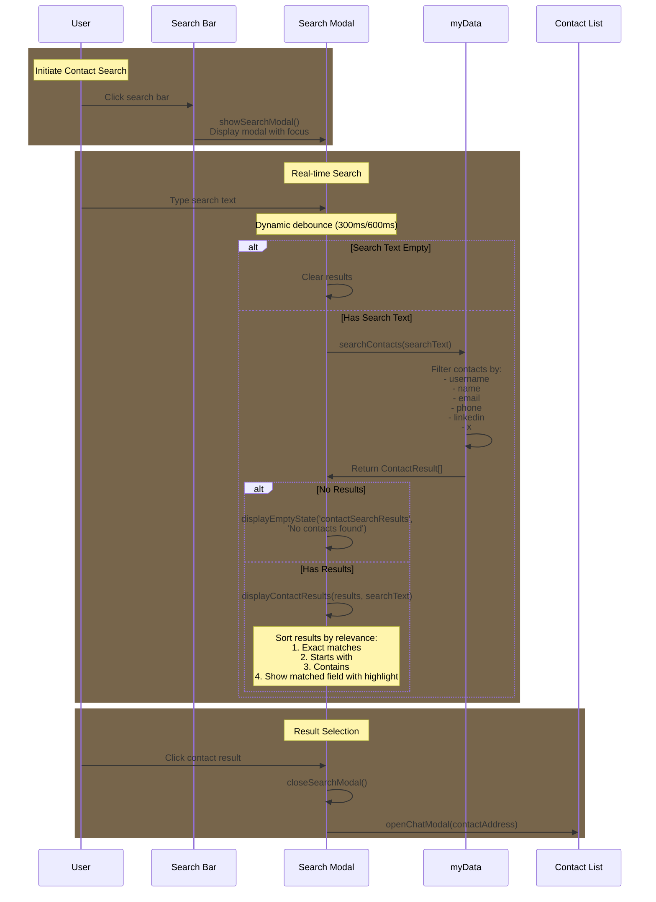

# Contact Search Implementation Flow

Last edited: 2025-02-19 17:04:00

# This document outlines the implementation flow for the contact search feature in the app.



## Reusable Functions from Chat Search

- `debounce(func, waitFn)`: Controls function execution frequency with dynamic wait time
- `displayEmptyState()`: Shows "no results found" UI
- `displayLoadingState()`: Shows loading indicator
- `initializeSearch()`: Sets up search event listeners
- Modal control functions:
  - `closeSearchModal()`
  - Event listeners for modal open/close
- Basic UI utilities:
  - `generateIdenticon(address)`
  - `formatTime(timestamp)`

## Considerations After Implementation

### Should be Refactored for Reusability

1. Search Function Architecture:

```javascript
function search(searchText, options) {
  // options = {
  //   dataSource: 'messages' | 'contacts',
  //   searchFields: ['message' | 'username' | 'email' etc],
  //   sortFunction: (a, b) => {...},
  //   highlightMatches: boolean
  // }
}
```

2. Result Display Components:

```javascript
function displaySearchResults(results, displayOptions) {
  // displayOptions = {
  //   itemTemplate: (item) => HTML,
  //   containerClass: string,
  //   onItemClick: (item) => void
  // }
}
```

3. Result Handling Strategy:

```javascript
const resultHandlers = {
  messages: handleMessageResult,
  contacts: handleContactResult,
};
```

### Keep Separate

1. Contact-specific search logic:

   - Field prioritization (username > email > other fields)
   - Exact/partial match scoring
   - Contact-specific result formatting

2. Contact-specific UI:

   - Contact card templates
   - Contact highlight behavior
   - Contact list scroll behavior

3. Contact data structure handling:
   - Contact validation
   - Contact field normalization
   - Contact-specific error handling

### Contact Info Display Handling

1. Handle missing senderInfo gracefully:

```javascript
function getContactDisplayInfo(contact, address) {
  // Provide default info structure when senderInfo is missing
  return (
    contact.senderInfo || {
      username: contact.username || address,
      name: "",
      email: "",
      phone: "",
      linkedin: "",
      x: "",
    }
  );
}
```

2. Consistent contact info display:

   - Use same info structure across chat/search/contact views
   - Fallback to address when username unavailable
   - Show placeholder text for empty fields
   - Handle undefined/null values safely

3. Contact verification:
   - Verify username matches contact address
   - Mark unverified contact info
   - Allow manual verification
   - Cache verification status

## Implementation Code

```javascript
// Inside App.js DOMContentLoaded event listener
document.addEventListener("DOMContentLoaded", async () => {
  // ... existing code ...

  // Add contact search functionality
  const contactSearchInput = document.getElementById("contactSearchInput");
  const contactSearch = document.getElementById("contactSearch");
  const contactSearchModal = document.getElementById("contactSearchModal");

  // Close contact search modal
  document
    .getElementById("closeContactSearchModal")
    .addEventListener("click", () => {
      contactSearchModal.classList.remove("active");
      contactSearch.value = "";
      document.getElementById("contactSearchResults").innerHTML = "";
    });

  // Handle contact search input with dynamic debounce
  contactSearch.addEventListener(
    "input",
    debounce(
      (e) => {
        const searchText = e.target.value.trim();

        if (!searchText) {
          document.getElementById("contactSearchResults").innerHTML = "";
          return;
        }

        const results = searchContacts(searchText);
        if (results.length === 0) {
          displayEmptyState("contactSearchResults", "No contacts found");
        } else {
          displayContactResults(results, searchText);
        }
      },
      (searchText) => (searchText.length === 1 ? 600 : 300)
    ) // Dynamic wait time
  );

  initializeContactSearch();
});

// Contact search functions
function searchContacts(searchText) {
  if (!searchText || !myData?.contacts) return [];

  const results = [];
  const searchLower = searchText.toLowerCase();
  const searchFields = ["username", "name", "email", "phone", "linkedin", "x"];

  Object.entries(myData.contacts).forEach(([address, contact]) => {
    let matched = false;
    let matchType = 0;
    let matchField = "";
    let matchValue = "";

    for (const field of searchFields) {
      const value = contact[field];
      if (!value) continue;

      const valueLower = value.toLowerCase();
      if (valueLower === searchLower) {
        matchType = 3; // Exact match
        matchField = field;
        matchValue = value;
        matched = true;
        break;
      } else if (valueLower.startsWith(searchLower)) {
        matchType = 2; // Starts with
        matchField = field;
        matchValue = value;
        matched = true;
      } else if (valueLower.includes(searchLower) && matchType < 2) {
        matchType = 1; // Contains
        matchField = field;
        matchValue = value;
        matched = true;
      }
    }

    if (matched) {
      results.push({
        address,
        username: contact.username || address,
        matchField,
        matchValue,
        matchType,
        preview: generateMatchPreview(matchValue, searchText),
      });
    }
  });

  return results.sort((a, b) => b.matchType - a.matchType);
}

function generateMatchPreview(text, searchText) {
  const highlightedText = text.replace(
    new RegExp(searchText, "gi"),
    (match) => `<mark>${match}</mark>`
  );
  return highlightedText;
}

function displayContactResults(results, searchText) {
  const container = document.getElementById("contactSearchResults");
  const resultsList = document.createElement("ul");
  resultsList.className = "chat-list";

  results.forEach(async (result) => {
    const resultElement = document.createElement("li");
    resultElement.className = "chat-item search-result-item";

    const identicon = generateIdenticon(result.address);

    resultElement.innerHTML = `
      <div class="chat-avatar">
        ${identicon}
      </div>
      <div class="chat-content">
        <div class="chat-header">
          <div class="chat-name">${result.username}</div>
        </div>
        <div class="chat-message">
          ${result.preview}
        </div>
      </div>
    `;

    resultElement.addEventListener("click", () => {
      handleContactResultClick(result);
    });

    resultsList.appendChild(resultElement);
  });

  container.innerHTML = "";
  container.appendChild(resultsList);
}

function handleContactResultClick(result) {
  try {
    // Close search modal
    document.getElementById("contactSearchModal").classList.remove("active");

    // Open chat modal
    openChatModal(result.address);

    // Highlight matched field
    const matchedField = result.matchField.toLowerCase();
    const contactElements = document.querySelectorAll(".chat-item");
    contactElements.forEach((element) => {
      const text = element.textContent.toLowerCase();
      if (text.includes(matchedField)) {
        element.classList.add("highlighted");
        setTimeout(() => element.classList.remove("highlighted"), 2000);
      }
    });
  } catch (error) {
    console.error("Error handling contact result:", error);
  }
}

function initializeContactSearch() {
  const contactSearchInput = document.getElementById("contactSearchInput");
  const contactSearch = document.getElementById("contactSearch");
  const contactSearchModal = document.getElementById("contactSearchModal");

  // Connect search input to modal input
  contactSearchInput.addEventListener("click", () => {
    contactSearchModal.classList.add("active");
    contactSearch.focus();
  });
}
```

The key differences from chat search implementation:

1. Searches through contact fields (username, name, email, etc.) instead of messages
2. Different result display format focusing on contact information
3. Simplified sorting (no message-specific sorting logic)
4. Contact-specific highlight and scroll behavior
5. Uses the Contact data structure from core-data-structures.md

This implementation maintains the same UX patterns (debouncing, loading states, etc.) while adapting the search logic for contacts.

# Contacts Search Implementation Checklist

## HTML Structure

- [x] Add persistent search bar to contacts view
- [x] Create contact search modal with results container
- [x] Add empty state for no results
- [x] Add loading state for search in progress
- [x] Add close button for search modal

## CSS Updates

- [x] Reuse existing search bar styles from chat search
- [x] Reuse existing search modal and transitions
- [x] Style contact search results list
- [x] Reuse animations for modal open/close
- [x] Style empty and loading states
- [x] Style highlighted matching text

## JavaScript Implementation

- [x] Add search bar click handler to open modal
- [x] Implement real-time search as user types
- [x] Add debounce to search input (reuse existing)
- [x] Create contact results rendering logic
- [x] Handle empty states and loading states
- [x] Implement modal close behavior
- [x] Add single character delay for better UX
- [x] Clear results when search is empty
- [x] Add identicon generation for contacts

## Search Logic

- [x] Create contact search function
- [x] Add field prioritization (username > name > email)
- [x] Implement exact/partial match scoring
- [x] Add highlight matching text in results
- [x] Sort results by match relevance
- [x] Handle contact-specific data display
- [x] Add support for additional fields (phone, linkedin, x)
- [x] Show which field matched in results

## Data Integration

- [x] Access myData.contacts for search
- [x] Handle contact field validation
- [x] Implement contact result click behavior
- [x] Add scroll and highlight for selected contact
- [x] Show contact info on result click
- [x] Close modal after selection

#Implemented code as of 2025-02-19 17:04:00

```bash
git diff 4225051286353fb7c40bd57d1820576669f6865b c7d53ffeeeea9728dde8260a73064b7675925c58 > changes.diff
```

## Shared Functionality with Chat Search

### Core Functions

```javascript
// Shared debounce implementation
function debounce(func, waitFn) {
  let timeout;
  return function executedFunction(...args) {
    const wait = typeof waitFn === "function" ? waitFn(args[0]) : waitFn;
    const later = () => {
      clearTimeout(timeout);
      func(...args);
    };
    clearTimeout(timeout);
    timeout = setTimeout(later, wait);
  };
}

// Shared empty state display
function displayEmptyState(containerId, message) {
  const container = document.getElementById(containerId);
  container.innerHTML = `
        <div class="empty-state">
            <div class="empty-state-message">${message}</div>
        </div>
    `;
}

// Shared loading state
function displayLoadingState() {
  // Used by both search implementations
  const searchResults = document.getElementById("searchResults");
  searchResults.innerHTML = `
        <div class="search-loading">
            Searching...
        </div>
    `;
}
```

### Shared UI Components

1. Search Modal Structure:

```html
<div class="modal search-modal">
  <div class="modal-header">
    <button class="back-button"></button>
    <div class="modal-title">Search</div>
  </div>
  <div class="search-results-container">
    <div class="chat-list">
      <!-- Results populated here -->
    </div>
  </div>
</div>
```

2. Result Item Structure:

```html
<div class="chat-item search-result-item">
  <div class="chat-avatar">
    <!-- Identicon -->
  </div>
  <div class="chat-content">
    <div class="chat-header">
      <div class="chat-name"></div>
      <div class="chat-time"></div>
    </div>
    <div class="chat-message">
      <!-- Preview content -->
    </div>
  </div>
</div>
```

### Shared Styles

```css
/* Base chat list styles */
.chat-list {
  display: flex;
  flex-direction: column;
  gap: 8px;
  padding: 16px;
}

/* Search result items */
.search-result-item {
  display: flex;
  padding: 12px;
  border-radius: 8px;
  cursor: pointer;
}

/* Hover effects */
.search-result-item:hover {
  background: var(--hover-background);
}
```

### Shared Data Access

Both search implementations:

- Access `myData.contacts` for data
- Use existing data structures
- No additional storage requirements
- Real-time search through contact/message data

### Modal Control

```javascript
// Shared modal control functions
function closeSearchModal() {
  document.getElementById("searchModal").classList.remove("active");
  clearSearchInput();
  clearSearchResults();
}

function showSearchModal() {
  document.getElementById("searchModal").classList.add("active");
  focusSearchInput();
}
```

### Basic UI Utilities

```javascript
// Shared across both search implementations
async function generateIdenticon(address) {
  // Common identicon generation
}

function formatTime(timestamp) {
  // Common time formatting
}
```

The key difference between contact and chat search lies in:

1. Search target (contacts vs messages)
2. Result display format
3. Sorting logic
4. Field prioritization
5. Result handling behavior
