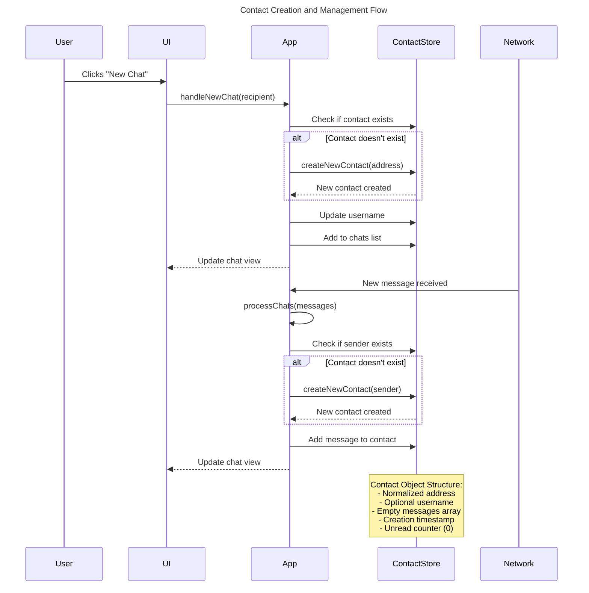
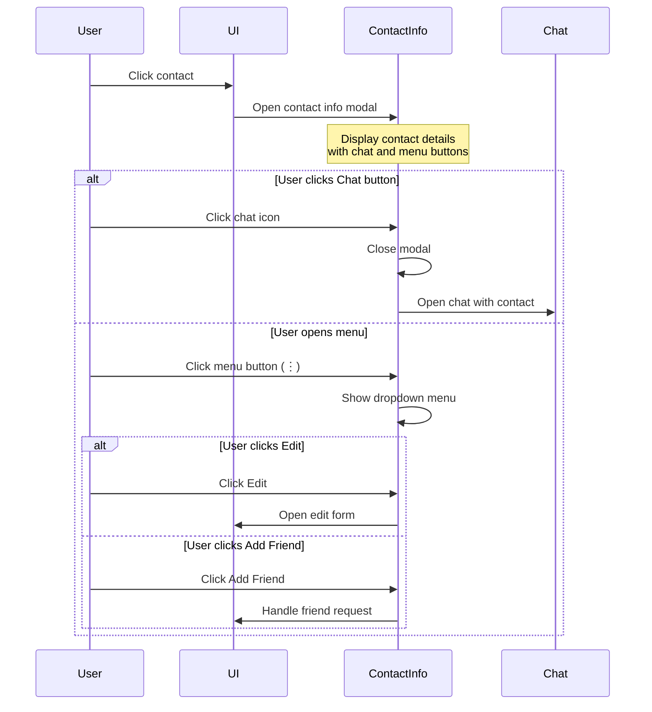
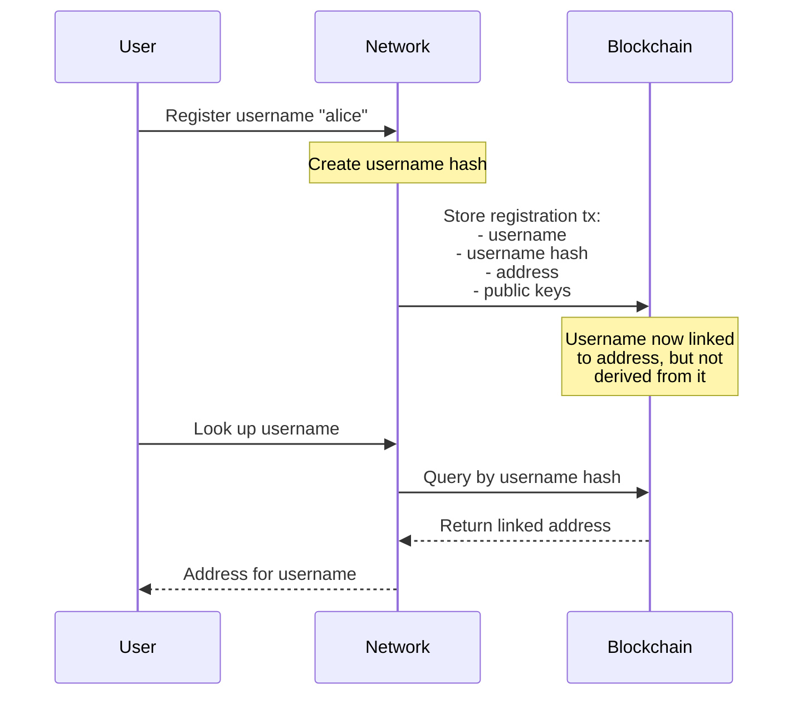
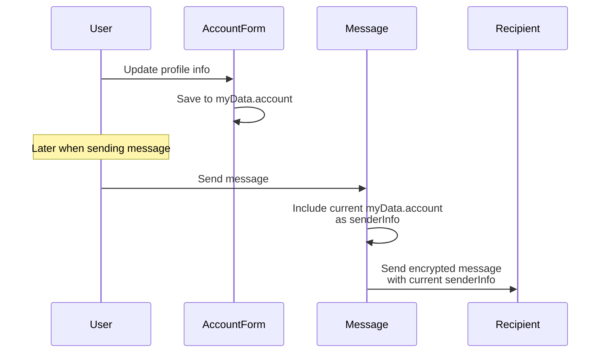

# Contact Creation Flow



This sequence diagram illustrates two main flows for contact creation:

1. Manual Contact Creation (New Chat)
   - Triggered by user initiating a new chat
   - Creates contact if doesn't exist
   - Updates chat list
2. Automatic Contact Creation (Receive Message)
   - Triggered by receiving a message
   - Creates contact for unknown sender
   - Updates messages and UI

The diagram also shows the basic contact object structure created in both flows.



## Contact Fields vs SenderInfo Fields

The Contact structure contains both direct fields (`username`, `name`) and a `senderInfo` object that appears to have overlapping fields. Here's how they differ and work together:

### Display Fields (Contact.username and Contact.name)

These fields are used throughout the UI for displaying contact identities:

```javascript
// Example of display hierarchy in UI components
${contact.name || contact.username || `${contact.address.slice(0,8)}...${contact.address.slice(-6)}`}
```

The display hierarchy is:

1. Show name if available
2. Otherwise show username
3. If neither exists, show truncated address

### Contact Info Display

When viewing contact info, the data is formatted into a display object:

```javascript
displayInfo = {
  username:
    contact.senderInfo?.username || contact.username || shortened_address,
  name: contact.senderInfo?.name || "Not provided",
  email: contact.senderInfo?.email || "Not provided",
  phone: contact.senderInfo?.phone || "Not provided",
  linkedin: contact.senderInfo?.linkedin || "Not provided",
  x: contact.senderInfo?.x || "Not provided",
  address: contact.address, // Required for chat functionality
};
```

The contact info modal provides:

- Full profile information display
- Direct chat access via chat button
- Menu options for Edit and Add Friend
- Consistent fallbacks for missing data

### SenderInfo Updates

When receiving messages, SenderInfo can update Contact fields, but only conditionally:

```javascript
// In processChats when receiving messages
if (!contact.username && contact.senderInfo.username) {
  contact.username = contact.senderInfo.username;
}
```

Key points:

- Only updates Contact.username if it's not already set
- Preserves any manually set or existing username
- Acts as a one-time population of the display fields

### SenderInfo Dynamic Updates

When a sender edits their profile information, the updates are handled as follows:

```javascript
// In processChats when receiving a new message
if (payload.senderInfo) {
  // Always overwrite the entire senderInfo object with the latest version
  contact.senderInfo = JSON.parse(JSON.stringify(payload.senderInfo)); // make a copy

  // But only update the display username if not already set
  if (!contact.username && contact.senderInfo.username) {
    contact.username = contact.senderInfo.username;
  }
}
```

Key points about senderInfo updates:

- The complete senderInfo object is **always** overwritten with the latest version
- This means profile updates (name, email, phone, etc.) are automatically reflected
- However, the contact's display fields (username/name) remain stable once set
- This design allows profile info to stay current while maintaining UI consistency

This creates two layers of contact information:

1. **Stable Display Layer**: `contact.username` and `contact.name` - set once, stays consistent
2. **Dynamic Profile Layer**: `contact.senderInfo` - always updated with latest profile information

### Username and Address Relationship

Important to note that usernames and addresses are independent entities:



Key points:

- Addresses are cryptographic keys
- Usernames are human-readable aliases
- They're connected through registration but not cryptographically derived
- A username lookup is a separate network query
- The display name in the UI can be different from the registered username

This means:

1. The same address can have different usernames over time
2. The display name shown in chat can be different from the registered username
3. Profile updates (senderInfo) don't affect the blockchain username registration

### Profile Updates and Message Flow

The diagram below shows how user profile information flows from account updates to messages:



Key aspects of profile information flow:

**Profile Management:**

- Users can update their profile info anytime through the Account form
- Profile includes: name, email, phone, linkedin, and x (Twitter)
- Changes are stored locally in `myData.account`
- Profile updates don't affect your blockchain-registered username

**Message Sending:**

- Each message automatically includes your current profile info as `senderInfo`
- The profile info sent is a snapshot of your `myData.account` at send time
- Previous messages retain the profile info from when they were sent
- Profile info is encrypted along with the message content

**Profile Updates:**

- Changes to your profile are reflected in all future messages
- Updating your profile doesn't modify previously sent messages
- Recipients see your latest profile info only when you send new messages
- You can update your profile before sending specific messages

**Security and Privacy:**

- Profile info is encrypted for each recipient separately
- Only the intended recipient can decrypt your profile info
- You control what profile info to include by updating your account
- Profile info is separate from your cryptographic identity (address)

### Contact Info Modal Actions

The contact info modal now provides several interaction options:

1. **Direct Chat Access**

   - Chat button in header for quick access
   - Uses stored contact address
   - Seamlessly transitions from info to chat

2. **Menu Options**

   - Edit contact information
   - Add contact as friend
   - Dropdown menu with icons
   - Green styling for Add Friend action

3. **UI/UX Improvements**
   - Compact dropdown design
   - Visual feedback on hover
   - Consistent icon styling
   - Clear action hierarchy
