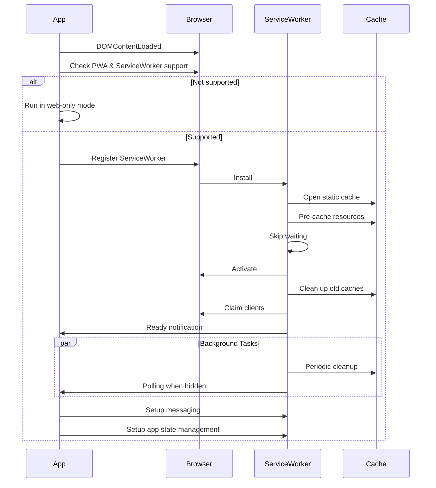

# Service Worker Startup Flow

## Chronological Summary

1. **Initial Check (DOMContentLoaded)**

   - App checks if running as installed PWA
   - Verifies service worker support in browser
   - Only proceeds if both conditions are met

2. **Service Worker Registration**

   - Checks for existing service worker registration
   - If active service worker exists:
     - Sets up messaging
     - Checks for updates
   - If no active worker:
     - Unregisters any existing registration
     - Registers new service worker with scope './'
     - Sets up update handling

3. **Service Worker Installation**

   - Opens static cache
   - Pre-caches essential resources
   - Implements fallback for failed precaching
   - Skips waiting to activate immediately

4. **Service Worker Activation**

   - Cleans up old caches
   - Claims control of all clients
   - Verifies cache contents
   - Sets up periodic cache cleanup
   - Initializes app state management

5. **App State Management Setup**

   - Initializes app state in localStorage
   - Sets up visibility change handling
   - Manages polling based on app visibility

6. **Messaging System Setup**

   - Establishes communication channel
   - Handles various message types:
     - Error reporting
     - Offline mode detection
     - Cache updates
     - New content notifications

7. **Ongoing Operations**
   - Periodic cache cleanup (every 24 hours)
   - Polling management when app is in background
   - Update detection and notification
   - Offline support

## Sequence Diagram

## Key Features

- **Offline Support**: Implements various caching strategies (cache-first, network-first, network-only)
- **Background Polling**: Maintains app state when in background
- **Update Management**: Handles service worker updates and notifies users
- **Cache Management**: Implements periodic cleanup and version control
- **Error Handling**: Comprehensive error catching and reporting
- **State Persistence**: Manages app state across sessions
