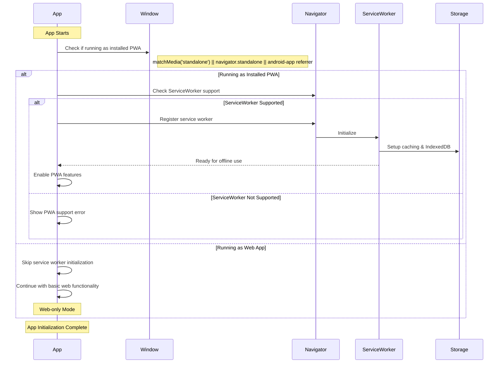

## Implementation Checklist

### 1. PWA Installation Detection ✅

- [x] Add installed PWA detection at app startup

```javascript
const isInstalledPWA =
  window.matchMedia("(display-mode: standalone)").matches ||
  window.navigator.standalone ||
  document.referrer.includes("android-app://");
```

### 2. Conditional Service Worker Registration ✅

- [x] Modify service worker registration to only run in installed PWA mode

```javascript
if (isInstalledPWA && "serviceWorker" in navigator) {
  await registerServiceWorker();
  setupServiceWorkerMessaging();
  setupAppStateManagement();
}
```

### 3. Connectivity & Feature Control ✅

- [x] Control offline functionality through connectivity detection

```javascript
function setupConnectivityDetection() {
  // Only setup offline detection if running as installed PWA
  if (!checkIsInstalledPWA()) {
    isOnline = true; // Always consider online in web mode
    return;
  }
  // ... rest of connectivity setup
}
```

### Best Practices

1. Keep the web version lightweight and fast
2. Maintain feature parity where possible
3. Encourage PWA installation for better features
4. Use progressive enhancement approach

### Testing Requirements

- [ ] Test installed PWA detection across browsers
- [ ] Verify behavior in both modes
- [ ] Ensure smooth transition when installing PWA
- [ ] Test offline behavior only triggers in installed PWA mode
